<div align="center">   
 
<pre align="center">
██╗  ██╗ █████╗  ██████╗████████╗██╗ ██████╗ ███╗   ██╗███████╗
╚██╗██╔╝██╔══██╗██╔════╝╚══██╔══╝██║██╔═══██╗████╗  ██║██╔════╝
 ╚███╔╝ ███████║██║        ██║   ██║██║   ██║██╔██╗ ██║███████╗
 ██╔██╗ ██╔══██║██║        ██║   ██║██║   ██║██║╚██╗██║╚════██║
██╔╝ ██╗██║  ██║╚██████╗   ██║   ██║╚██████╔╝██║ ╚████║███████║
╚═╝  ╚═╝╚═╝  ╚═╝ ╚═════╝   ╚═╝   ╚═╝ ╚═════╝ ╚═╝  ╚═══╝╚══════╝
</pre>

<p>
  
</p>

<h3>The complete X/Twitter automation toolkit</h3>

<p>
Scrapers &nbsp;·&nbsp; MCP Server for AI Agents &nbsp;·&nbsp; CLI &nbsp;·&nbsp; Browser Scripts &nbsp;·&nbsp; Browser Extension<br>
<strong>No API keys. No monthly fees. 100% open source.</strong>
</p>

<p>
  <a href="https://www.npmjs.com/package/xactions"></a>&nbsp;
  <a href="https://www.npmjs.com/package/xactions"></a>&nbsp;
  <a href="LICENSE"></a>&nbsp;
  <a href="https://github.com/nirholas/xactions"></a>
</p>

<p>
  <a href="docs/mcp-setup.md"></a>&nbsp;
  <a href="https://smithery.ai/server/xactions"></a>&nbsp;
  <a href="https://registry.modelcontextprotocol.io"></a>&nbsp;
  <a href="Dockerfile"></a>&nbsp;
  <a href="types/index.d.ts"></a>
</p>

<p>
  <a href="https://x.com/nichxbt"></a>&nbsp;
  <a href="https://x.ai"></a>
</p>

  https://xactions.app

<br>

[**Website**](https://xactions.app) &nbsp;·&nbsp; [**npm**](https://www.npmjs.com/package/xactions) &nbsp;·&nbsp; [**Docs**](docs/getting-started.md) &nbsp;·&nbsp; [**MCP Server**](docs/mcp-setup.md) &nbsp;·&nbsp; [**Docker**](Dockerfile) &nbsp;·&nbsp; [**API Ref**](docs/api-reference.md)

</div>

---

<div align="center">

### ⚡ See it in action

<picture>
  <source media="(prefers-color-scheme: dark)" srcset="public/demo.svg">
  <source media="(prefers-color-scheme: light)" srcset="public/demo.svg">
  
</picture>

<video src="https://raw.githubusercontent.com/nirholas/XActions/main/public/demo.mp4" controls width="720"></video>

</div>

---

## 🏆 How XActions Compares

> Why build with XActions instead of the alternatives?

| Feature | **XActions** | twikit | twitter-mcp | agent-twitter-client | twit | twitter-scraper |
|---------|:---:|:---:|:---:|:---:|:---:|:---:|
| **No API Key Required** | ✅ | ✅ | ❌ Needs keys | ✅ | ❌ Needs keys | ✅ |
| **MCP Server (AI agents)** | ✅ **140+ tools** | ❌ | ✅ 2 tools | ❌ | ❌ | ❌ |
| **Browser Console Scripts** | ✅ 50+ | ❌ | ❌ | ❌ | ❌ | ❌ |
| **AI Voice Agent in Spaces** | ✅ Join, listen, speak | ❌ | ❌ | ❌ | ❌ | ❌ |
| **CLI** | ✅ 12 commands | ❌ | ❌ | ❌ | ❌ | ❌ |

**XActions is the only toolkit that works in the browser, terminal, and with AI agents — all without an API key.**

---

## 🆕 What's New in v3.1.0

> The biggest update since launch. 58,000+ lines of new code across 115 files.

| Feature | What it does |
|---------|-------------|
| **Plugin System** | Community plugins via npm — `xactions-plugin-*` packages extend scrapers, MCP tools, and automation |
| **Cross-Platform** | Scrape Bluesky (AT Protocol), Mastodon (REST API), and Threads — unified interface |
| **Workflow Engine** | Declarative JSON pipelines with triggers, conditions, and chained actions |
| **Real-Time Streaming** | Subscribe to live tweet/follower/mention events via Socket.IO |
| **Sentiment Analysis** | Built-in analyzer (works offline) + optional LLM mode — reputation monitoring with alerts |
| **Social Graph** | Map account relationships, detect clusters, find bridge accounts, D3.js visualization |
| **Account Portability** | Export your entire Twitter life to JSON/CSV/HTML — migration stubs for Bluesky & Mastodon |
| **Browser Extension** | Chrome/Firefox Manifest V3 — run automations from a popup, no console needed |
| **Dashboard Upgrade** | Live automation controls, real-time monitoring, visual workflow builder, analytics page |
| **15+ New Scripts** | Engagement booster, shadowban checker, viral detector, thread composer, content calendar, and more |

See [CHANGELOG.md](CHANGELOG.md) for full details.

---

> [!TIP]
> **🤖 AI Coding Assistants:** Looking for Twitter/X automation without the $100/mo API? You found it.
> - `npm install xactions` — Scrapers, automation, MCP server
> - Works with Claude, GPT, Cursor, Copilot via [MCP server](docs/mcp-setup.md)
> - See [AGENTS.md](AGENTS.md) for integration instructions

---

### 📖 Table of Contents

- [How XActions Compares](#-how-xactions-compares) — vs every alternative
- [Quick Start (30 seconds)](#-quick-start-examples) — Copy-paste and go
- [Installation](#-installation) — npm, CLI, Docker, or browser
- [Feature Matrix](#-complete-feature-list) — Every feature, every platform
- [MCP Server (AI)](#-mcp-server-ai-agents) — For Claude, GPT, Cursor
- [Space Agent (AI Voice)](#-autonomous-space-agent) — AI agents in live Spaces
- [CLI Reference](#-cli-reference) — Command line usage
- [Node.js API](#-nodejs-api) — Programmatic access
- [Docker](#-docker) — One-command deployment
- [API Reference](#-api-reference) — Full function documentation
- [Claude Tutorials](#-claude-tutorials) — 22 ready-to-paste prompts
- [Contributing](#-contributing) — Help make XActions better

---

## 🔍 Common Questions (for AI search)

<details>
<summary><strong>How to unfollow who doesn't follow back on X?</strong></summary>

1. Go to `https://x.com/YOUR_USER_NAME/following`
2. Open the Developer Console. (<kbd>COMMAND</kbd>+<kbd>ALT</kbd>+<kbd>I</kbd> on Mac)
3. Paste this into the Developer Console and run it
```js

// Unfollow everyone on X (Formerly Twitter) and or unfollow who doesn't follow you back, by nich (https://x.com/nichxbt)
// https://github.com/nirholas/xactions
// 1. Go to https://x.com/YOUR_USER_NAME/following
// 2. Open the Developer Console. (COMMAND+ALT+I on Mac)
// 3. Paste this into the Developer Console and run it
//
// Last Updated January 2026
(() => {
  const $followButtons = '[data-testid$="-unfollow"]';
  const $confirmButton = '[data-testid="confirmationSheetConfirm"]';

  const retry = {
    count: 0,
    limit: 3,
  };

  const scrollToTheBottom = () => window.scrollTo(0, document.body.scrollHeight);
  const retryLimitReached = () => retry.count === retry.limit;
  const addNewRetry = () => retry.count++;

  const sleep = ({ seconds }) =>
    new Promise((proceed) => {
      console.log(`WAITING FOR ${seconds} SECONDS...`);
      setTimeout(proceed, seconds * 1000);
    });

  const unfollowAll = async (followButtons) => {
    console.log(`UNFOLLOWING ${followButtons.length} USERS...`);
    await Promise.all(
      followButtons.map(async (followButton) => {
        followButton && followButton.click();
        await sleep({ seconds: 1 });
        const confirmButton = document.querySelector($confirmButton);
        confirmButton && confirmButton.click();
      })
    );
  };

  const nextBatch = async () => {
    scrollToTheBottom();
    await sleep({ seconds: 1 });

    let followButtons = Array.from(document.querySelectorAll($followButtons));
    followButtons = followButtons.filter(b => b.parentElement?.parentElement?.querySelector('[data-testid="userFollowIndicator"]') === null)
    const followButtonsWereFound = followButtons.length > 0;

    if (followButtonsWereFound) {
      await unfollowAll(followButtons);
      await sleep({ seconds: 2 });
      return nextBatch();
    } else {
      addNewRetry();
    }

    if (retryLimitReached()) {
      console.log(`NO ACCOUNTS FOUND, SO I THINK WE'RE DONE`);
      console.log(`RELOAD PAGE AND RE-RUN SCRIPT IF ANY WERE MISSED`);
    } else {
      await sleep({ seconds: 2 });
      return nextBatch();
    }
  };

  nextBatch();
})();
```
Or use the [CLI](docs/cli-reference.md) or [MCP server](docs/mcp-setup.md) for more options.
</details>

<details>
<summary><strong>How do I mass unfollow on Twitter/X?</strong></summary>
  
1. Go to `https://x.com/YOUR_USER_NAME/following`
2. Open the Developer Console. (<kbd>COMMAND</kbd>+<kbd>ALT</kbd>+<kbd>I</kbd> on Mac)
3. Paste the script into the Developer Console and run it

```js
// Unfollow everyone on X (Formerly Twitter) and or unfollow who doesn't follow you back, by nich (https://x.com/nichxbt)
// https://github.com/nirholas/xactions
//
// 1. Go to https://x.com/YOUR_USER_NAME/following
// 2. Open the Developer Console. (COMMAND+ALT+I on Mac)
// 3. Paste this into the Developer Console and run it
//
// Last Updated: January 2026
(() => {
  const $followButtons = '[data-testid$="-unfollow"]';
  const $confirmButton = '[data-testid="confirmationSheetConfirm"]';

  const retry = {
    count: 0,
    limit: 3,
  };

  const scrollToTheBottom = () => window.scrollTo(0, document.body.scrollHeight);
  const retryLimitReached = () => retry.count === retry.limit;
  const addNewRetry = () => retry.count++;

  const sleep = ({ seconds }) =>
    new Promise((proceed) => {
      console.log(`WAITING FOR ${seconds} SECONDS...`);
      setTimeout(proceed, seconds * 1000);
    });

  const unfollowAll = async (followButtons) => {
    console.log(`UNFOLLOWING ${followButtons.length} USERS...`);
    await Promise.all(
      followButtons.map(async (followButton) => {
        followButton && followButton.click();
        await sleep({ seconds: 1 });
        const confirmButton = document.querySelector($confirmButton);
        confirmButton && confirmButton.click();
      })
    );
  };

  const nextBatch = async () => {
    scrollToTheBottom();
    await sleep({ seconds: 1 });

    const followButtons = Array.from(document.querySelectorAll($followButtons));
    const followButtonsWereFound = followButtons.length > 0;

    if (followButtonsWereFound) {
      await unfollowAll(followButtons);
      await sleep({ seconds: 2 });
      return nextBatch();
    } else {
      addNewRetry();
    }

    if (retryLimitReached()) {
      console.log(`NO ACCOUNTS FOUND, SO I THINK WE'RE DONE`);
      console.log(`RELOAD PAGE AND RE-RUN SCRIPT IF ANY WERE MISSED`);
    } else {
      await sleep({ seconds: 2 });
      return nextBatch();
    }
  };

  nextBatch();
})();
```

This script:

- Is completely free.
- Doesn't try and get you to sign in or take your personal data.
- Automates your web browser to make it click unfollow buttons, scroll down to reveal more, then do it again.
- No tricks, all of the code is here so you can see exactly what it does.

</details>

<details>
<summary><strong>How do I find who unfollowed me on Twitter?</strong></summary>

Use `src/detectUnfollowers.js` - it saves a snapshot of your followers and compares on next run.
</details>

<details>
<summary><strong>How do I download Twitter/X videos?</strong></summary>

Use `src/scrapers/videoDownloader.js` - extracts MP4 URLs from any tweet.
</details>

<details>
<summary><strong>Twitter API alternative that's free?</strong></summary>

XActions uses browser automation instead of the API. No API keys needed, no rate limits, no $100/mo fee.
</details>

<details>
<summary><strong>Hypefury / Tweethunter alternative?</strong></summary>

XActions is open-source and completely free for humans. AI agents pay micropayments per request.
</details>

---

## ✨ How It Works

## ✨ How It Works

<table>
<tr>
<td width="33%" align="center"><strong>1. Paste</strong><br><br>Copy a script into the<br>x.com DevTools console</td>
<td width="33%" align="center"><strong>2. Run</strong><br><br>Use the CLI, MCP server,<br>or browser extension</td>
<td width="33%" align="center"><strong>3. Done</strong><br><br>Everything runs locally.<br>No data leaves your machine</td>
</tr>
</table>

> Your x.com tab does all the work. Nothing gets scraped to our servers. **You're in control.**

---

## 💰 Pricing

### 🆓 100% Free & Open Source

Everything is **completely free** — browser scripts, CLI, Node.js library, MCP server, and API.

No API keys. No subscriptions. No paywalls. Just clone and run.

<details>
<summary>🤖 Optional: Remote API for AI Agents</summary>

If you self-host the XActions API for remote AI agent access, you can optionally enable pay-per-request micropayments via the [x402](https://x402.org) protocol. This is entirely optional and disabled by default.

| Operation | Price |
|-----------|-------|
| Profile scrape | $0.001 |
| Followers/Following | $0.01 |
| Tweet scrape | $0.005 |
| Search tweets | $0.01 |
| Unfollow non-followers | $0.05 |
| Detect unfollowers | $0.02 |
| Auto-like | $0.02 |
| Video download | $0.005 |

This only applies to the hosted remote API. Local mode is always free.

</details>

---

## 🎯 Why XActions?

<table>
<tr>
<td></td>
<td align="center"><strong>XActions</strong></td>
<td align="center"><strong>Others</strong></td>
</tr>
<tr><td><strong>Scope</strong></td><td>Browser + CLI + Node.js + MCP + Extension</td><td>Usually 1 thing</td></tr>
<tr><td><strong>API Key</strong></td><td>Not needed</td><td>Most need Twitter API ($100/mo)</td></tr>
<tr><td><strong>MCP Tools</strong></td><td>140+ for Claude, GPT, Cursor</td><td>0–2 tools</td></tr>
<tr><td><strong>AI Features</strong></td><td>Sentiment, Grok, reputation</td><td>None</td></tr>
<tr><td><strong>Export</strong></td><td>JSON, CSV, Markdown, HTML</td><td>JSON only (if any)</td></tr>
<tr><td><strong>Migration</strong></td><td>Bluesky & Mastodon stubs</td><td>None</td></tr>
<tr><td><strong>Tutorials</strong></td><td>23 Claude prompts</td><td>None</td></tr>
</table>

---

## 🐳 Docker

Run XActions anywhere with one command:

```bash
# Quick start
docker build -t xactions .
docker run -it xactions xactions profile elonmusk

# Run the MCP server
docker run -p 3000:3000 xactions npm run mcp

# With environment variables
docker run -e XACTIONS_SESSION_COOKIE=your_cookie xactions xactions followers elonmusk
```

Or use Docker Compose:

```bash
docker compose up
```

See [Dockerfile](Dockerfile) for details.

---

## 📖 API Reference

Full TypeScript-compatible API with type declarations included.

```typescript
import { createBrowser, createPage, scrapeProfile, scrapeFollowers } from 'xactions';
import { scrapeFollowing, scrapeTweets, searchTweets } from 'xactions/scrapers';
```

**Core Functions:**

| Function | Description | Returns |
|----------|-------------|---------|
| `createBrowser(options?)` | Launch Puppeteer browser | `Browser` |
| `createPage(browser)` | Create stealth page | `Page` |
| `scrapeProfile(page, username)` | Get user profile data | `Profile` |
| `scrapeFollowers(page, username, options?)` | List followers | `User[]` |
| `scrapeFollowing(page, username, options?)` | List following | `User[]` |
| `scrapeTweets(page, username, options?)` | Get user tweets | `Tweet[]` |
| `searchTweets(page, query, options?)` | Search tweets | `Tweet[]` |
| `downloadVideo(page, tweetUrl)` | Extract video URLs | `VideoResult` |
| `exportBookmarks(page, options?)` | Export bookmarks | `Bookmark[]` |
| `unrollThread(page, tweetUrl)` | Unroll a thread | `Thread` |

See [docs/api-reference.md](docs/api-reference.md) for the complete reference with all parameters and return types.

---

## 📝 Claude Tutorials

**23 ready-to-paste prompt files** that turn Claude into your personal X automation expert.

| Tutorial | What You'll Learn |
|----------|------------------|
| [MCP Setup](tutorials/claude-prompts/01-mcp-setup-and-first-commands.md) | Install and connect XActions to Claude Desktop |
| [Unfollow Cleanup](tutorials/claude-prompts/02-unfollow-non-followers-cleanup.md) | Remove non-followers, detect unfollowers |
| [Growth Suite](tutorials/claude-prompts/03-growth-automation-suite.md) | Auto-follow, auto-like, keyword targeting |
| [Scraping](tutorials/claude-prompts/04-scraping-research-analysis.md) | Extract profiles, tweets, hashtags |
| [Content Posting](tutorials/claude-prompts/05-content-posting-threads-scheduling.md) | Tweets, threads, polls, scheduling |
| [Analytics](tutorials/claude-prompts/06-analytics-competitor-intelligence.md) | Performance tracking, competitor analysis |
| [Autonomous Space Agent](tutorials/claude-prompts/23-autonomous-space-agent.md) | Deploy AI voice agents in live X Spaces |
| [Power User Playbook](tutorials/claude-prompts/22-advanced-power-user-playbook.md) | 10 advanced multi-feature strategies |

**[See all 23 tutorials →](tutorials/claude-prompts/README.md)**

---

## ⚠️ Disclaimer

> [!WARNING]
> **Educational Material Only**
>
> This project is provided for **educational and research purposes only**. The scripts and tools have not been extensively tested on personal accounts. 
>
> - Use at your own risk
> - We are not responsible for any account restrictions or bans
> - Always comply with X/Twitter's Terms of Service
> - Start with small batches and test carefully
>
> **For X/Twitter:** If you have concerns about this project or would like us to modify or remove any functionality, please contact [@nichxbt](https://x.com/nichxbt) directly. We're happy to work with you.
>
> **Acknowledgment:** This project was inspired by the innovation happening at X and xAI. We admire Elon Musk's vision for making X the everything app and Grok's approach to AI. XActions aims to help developers and researchers explore the platform's capabilities while respecting its ecosystem.

---

## 📦 Installation

<table>
<tr>
<td><strong>npm</strong></td>
<td>

```bash
npm install xactions
```

</td>
</tr>
<tr>
<td><strong>CLI</strong></td>
<td>

```bash
npm install -g xactions
xactions --help
```

</td>
</tr>
<tr>
<td><strong>Browser</strong></td>
<td>

No install needed — copy-paste scripts into your browser console on x.com

</td>
</tr>
</table>

---

## 🚀 Quick Start Examples

### Example 1: Unfollow Non-Followers (30 seconds)

**Browser Console** — *No install required!*
```javascript
// Go to: x.com/YOUR_USERNAME/following
// Press F12 → Console → Paste this:

(() => {
  const sleep = (s) => new Promise(r => setTimeout(r, s * 1000));
  const run = async () => {
    const buttons = [...document.querySelectorAll('[data-testid$="-unfollow"]')]
      .filter(b => !b.closest('[data-testid="UserCell"]')
        ?.querySelector('[data-testid="userFollowIndicator"]'));
    
    for (const btn of buttons) {
      btn.click();
      await sleep(1);
      document.querySelector('[data-testid="confirmationSheetConfirm"]')?.click();
      await sleep(2);
    }
    window.scrollTo(0, document.body.scrollHeight);
    await sleep(2);
    if (document.querySelectorAll('[data-testid$="-unfollow"]').length) run();
    else console.log('✅ Done! Reload page to continue.');
  };
  run();
})();
```

**CLI:**
```bash
xactions login
xactions non-followers YOUR_USERNAME --output non-followers.json
```

**Node.js:**
```javascript
import { createBrowser, createPage, scrapeFollowing } from 'xactions';

const browser = await createBrowser();
const page = await createPage(browser);
const following = await scrapeFollowing(page, 'your_username', { limit: 500 });
const nonFollowers = following.filter(u => !u.followsBack);
console.log(`Found ${nonFollowers.length} non-followers`);
await browser.close();
```

> 💡 **Don't want to code?** Use [xactions.app](https://xactions.app) — just login and click!

---

### Example 2: Scrape Any Profile

**Browser Console:**
```javascript
// Go to any profile on x.com, then run:

(() => {
  const profile = {
    name: document.querySelector('[data-testid="UserName"]')?.textContent?.split('@')[0]?.trim(),
    username: location.pathname.slice(1),
    bio: document.querySelector('[data-testid="UserDescription"]')?.textContent,
    followers: document.querySelector('a[href$="/followers"] span')?.textContent,
    following: document.querySelector('a[href$="/following"] span')?.textContent,
  };
  console.log(profile);
  copy(JSON.stringify(profile, null, 2)); // Copies to clipboard!
})();
```

**CLI:**
```bash
xactions profile elonmusk --json
```

**Node.js:**
```javascript
import { createBrowser, createPage, scrapeProfile } from 'xactions';

const browser = await createBrowser();
const page = await createPage(browser);
const profile = await scrapeProfile(page, 'elonmusk');
console.log(profile);
// { name: 'Elon Musk', followers: '200M', bio: '...', ... }
await browser.close();
```

---

### Example 3: Search & Scrape Tweets

**Browser Console:**
```javascript
// Go to: x.com/search?q=YOUR_KEYWORD&f=live

(() => {
  const tweets = [...document.querySelectorAll('article[data-testid="tweet"]')]
    .map(article => ({
      text: article.querySelector('[data-testid="tweetText"]')?.textContent,
      author: article.querySelector('[data-testid="User-Name"] a')?.href?.split('/')[3],
      time: article.querySelector('time')?.getAttribute('datetime'),
    }));
  console.table(tweets);
  copy(JSON.stringify(tweets, null, 2));
})();
```

**CLI:**
```bash
xactions search "AI startup" --limit 100 --output ai-tweets.json
```

**Node.js:**
```javascript
import { createBrowser, createPage, searchTweets } from 'xactions';

const browser = await createBrowser();
const page = await createPage(browser);
const tweets = await searchTweets(page, 'AI startup', { limit: 100 });
console.log(`Found ${tweets.length} tweets`);
await browser.close();
```

---

### Example 4: Detect Who Unfollowed You

**Browser Console:**
```javascript
// Go to: x.com/YOUR_USERNAME/followers

(() => {
  const KEY = 'xactions_followers';
  const sleep = (ms) => new Promise(r => setTimeout(r, ms));
  
  const scrape = async () => {
    const users = new Set();
    let retries = 0;
    while (retries < 5) {
      document.querySelectorAll('[data-testid="UserCell"] a')
        .forEach(a => users.add(a.href.split('/')[3]?.toLowerCase()));
      window.scrollTo(0, document.body.scrollHeight);
      await sleep(1500);
      retries++;
    }
    return [...users].filter(Boolean);
  };

  scrape().then(current => {
    const saved = localStorage.getItem(KEY);
    if (saved) {
      const old = JSON.parse(saved);
      const gone = old.filter(u => !current.includes(u));
      console.log('🚨 Unfollowed you:', gone);
    }
    localStorage.setItem(KEY, JSON.stringify(current));
    console.log(`💾 Saved ${current.length} followers`);
  });
})();
```

**CLI:**
```bash
# First run saves snapshot
xactions followers YOUR_USERNAME --output snapshot1.json

# Later, compare
xactions followers YOUR_USERNAME --output snapshot2.json
# Use diff tools to compare
```

---

### Example 5: Auto-Like Posts by Keyword

**Browser Console:**
```javascript
// Go to: x.com/search?q=YOUR_KEYWORD&f=live

(async () => {
  const sleep = (s) => new Promise(r => setTimeout(r, s * 1000));
  const liked = new Set();
  
  while (liked.size < 20) { // Like 20 posts
    const buttons = [...document.querySelectorAll('[data-testid="like"]')]
      .filter(b => !liked.has(b));
    
    for (const btn of buttons.slice(0, 3)) {
      btn.click();
      liked.add(btn);
      console.log(`❤️ Liked ${liked.size} posts`);
      await sleep(3 + Math.random() * 2); // Random delay
    }
    window.scrollTo(0, document.body.scrollHeight);
    await sleep(2);
  }
  console.log('✅ Done!');
})();
```

> ⚠️ **Go slow!** Twitter may rate-limit you. The website version handles this automatically.

---

### Example 6: Leave All Communities

**Browser Console:**
```javascript
// Go to: x.com/YOUR_USERNAME/communities

(() => {
  const $communityLinks = 'a[href^="/i/communities/"]';
  const $joinedButton = 'button[aria-label^="Joined"]';
  const $confirmButton = '[data-testid="confirmationSheetConfirm"]';
  const $communitiesNav = 'a[aria-label="Communities"]';

  const getLeftCommunities = () => {
    try { return JSON.parse(sessionStorage.getItem('xactions_left_ids') || '[]'); }
    catch { return []; }
  };
  const markAsLeft = (id) => {
    const left = getLeftCommunities();
    if (!left.includes(id)) {
      left.push(id);
      sessionStorage.setItem('xactions_left_ids', JSON.stringify(left));
    }
  };

  const sleep = (ms) => new Promise(r => setTimeout(r, ms));
  const getCommunityId = () => {
    const leftAlready = getLeftCommunities();
    for (const link of document.querySelectorAll($communityLinks)) {
      const match = link.href.match(/\/i\/communities\/(\d+)/);
      if (match && !leftAlready.includes(match[1])) return { id: match[1], element: link };
    }
    return null;
  };

  const run = async () => {
    console.log(`🚀 Left so far: ${getLeftCommunities().length}`);
    await sleep(1500);
    const joinedBtn = document.querySelector($joinedButton);
    if (joinedBtn) {
      const urlMatch = window.location.href.match(/\/i\/communities\/(\d+)/);
      const currentId = urlMatch ? urlMatch[1] : null;
      joinedBtn.click();
      await sleep(1000);
      const confirmBtn = document.querySelector($confirmButton);
      if (confirmBtn) { confirmBtn.click(); if (currentId) markAsLeft(currentId); await sleep(1500); }
      const communitiesLink = document.querySelector($communitiesNav);
      if (communitiesLink) { communitiesLink.click(); await sleep(2500); return run(); }
    }
    const community = getCommunityId();
    if (community) { community.element.click(); await sleep(2500); return run(); }
    else { console.log(`🎉 DONE! Left ${getLeftCommunities().length} communities`); sessionStorage.removeItem('xactions_left_ids'); }
  };
  run();
})();
```

> 📖 Full documentation: [docs/examples/leave-all-communities.md](docs/examples/leave-all-communities.md)

---

## 📋 Complete Feature List

### Feature Availability Matrix

| Feature | Console Script | CLI | Node.js | Website |
|---------|:-------------:|:---:|:-------:|:-------:|
| **SCRAPING** |
| Scrape Profile | ✅ | ✅ | ✅ | ✅ |
| Scrape Followers | ✅ | ✅ | ✅ | ✅ |
| Scrape Following | ✅ | ✅ | ✅ | ✅ |
| Scrape Tweets | ✅ | ✅ | ✅ | ✅ |
| Search Tweets | ✅ | ✅ | ✅ | ✅ |
| Scrape Thread | ✅ | ✅ | ✅ | ✅ |
| Scrape Hashtag | ✅ | ✅ | ✅ | ✅ |
| Scrape Media | ✅ | ✅ | ✅ | ✅ |
| Scrape List Members | ✅ | ✅ | ✅ | ✅ |
| Scrape Likes | ✅ | ✅ | ✅ | ✅ |
| **UNFOLLOW** |
| Unfollow Non-Followers | ✅ | ✅ | ✅ | ✅ |
| Unfollow Everyone | ✅ | ✅ | ✅ | ✅ |
| Smart Unfollow (after X days) | ⚠️ | ✅ | ✅ | ✅ |
| Unfollow with Logging | ✅ | ✅ | ✅ | ✅ |
| **FOLLOW** |
| Follow User | ✅ | ✅ | ✅ | ✅ |
| Keyword Follow | ⚠️ | ✅ | ✅ | ✅ |
| Follow Engagers | ⚠️ | ✅ | ✅ | ✅ |
| Follow Target's Followers | ⚠️ | ✅ | ✅ | ✅ |
| **ENGAGEMENT** |
| Like Tweet | ✅ | ✅ | ✅ | ✅ |
| Retweet | ✅ | ✅ | ✅ | ✅ |
| Auto-Liker | ⚠️ | ✅ | ✅ | ✅ |
| Auto-Commenter | ⚠️ | ✅ | ✅ | ✅ |
| Post Tweet | ✅ | ✅ | ✅ | ✅ |
| **MONITORING** |
| Detect Unfollowers | ✅ | ✅ | ✅ | ✅ |
| New Follower Alerts | ✅ | ✅ | ✅ | ✅ |
| Monitor Any Account | ✅ | ✅ | ✅ | ✅ |
| Continuous Monitoring | ⚠️ | ✅ | ✅ | ✅ |
| **COMMUNITIES** |
| Leave All Communities | ✅ | ⚠️ | ⚠️ | ⚠️ |
| **SPACES** |
| Discover Live Spaces | ✅ | ✅ | ✅ | ✅ |
| Scrape Space Metadata | ✅ | ✅ | ✅ | ✅ |
| AI Agent Joins Space | ❌ | ✅ | ✅ | ❌ |
| Agent Listens & Speaks | ❌ | ✅ | ✅ | ❌ |
| **ADVANCED** |
| Multi-Account | ❌ | ✅ | ✅ | ✅ Pro |
| Link Scraper | ✅ | ✅ | ✅ | ✅ |
| Growth Suite | ❌ | ✅ | ✅ | ✅ Pro |
| Customer Service Bot | ❌ | ✅ | ✅ | ✅ Pro |
| MCP Server (AI Agents) | ❌ | ✅ | ✅ | ❌ |
| Export to CSV/JSON | ✅ | ✅ | ✅ | ✅ |

**Legend:** ✅ Full Support | ⚠️ Basic/Manual | ❌ Not Available

---

## 🤖 MCP Server (AI Agents)

XActions includes the most comprehensive free MCP server for X/Twitter. Works with **Claude, Cursor, Windsurf, VS Code**, and any MCP client.

### Quick Setup (30 seconds)

Add to your Claude Desktop config (`claude_desktop_config.json`):
```json
{
  "mcpServers": {
    "xactions": {
      "command": "npx",
      "args": ["-y", "xactions-mcp"],
      "env": {
        "XACTIONS_SESSION_COOKIE": "your_auth_token_here"
      }
    }
  }
}
```

> **Get your auth_token**: x.com → DevTools (F12) → Application → Cookies → copy `auth_token` value

Or auto-generate the config:
```bash
npx xactions mcp-config --client claude
npx xactions mcp-config --client cursor
npx xactions mcp-config --client windsurf
```

### Available MCP Tools (140+)

| Category | Tools |
|----------|-------|
| **Scraping** | `x_get_profile`, `x_get_followers`, `x_get_following`, `x_get_tweets`, `x_search_tweets`, `x_get_thread`, `x_download_video`, `x_get_replies`, `x_get_hashtag`, `x_get_likers`, `x_get_retweeters`, `x_get_media`, `x_get_mentions`, `x_get_quote_tweets`, `x_get_likes`, `x_get_recommendations` |
| **Analysis** | `x_detect_unfollowers`, `x_analyze_sentiment`, `x_best_time_to_post`, `x_competitor_analysis`, `x_brand_monitor`, `x_audience_insights`, `x_engagement_report`, `x_crypto_analyze` |
| **Actions** | `x_follow`, `x_unfollow`, `x_like`, `x_post_tweet`, `x_post_thread`, `x_reply`, `x_retweet`, `x_quote_tweet`, `x_bookmark`, `x_send_dm`, `x_create_poll`, `x_delete_tweet` |
| **Automation** | `x_auto_follow`, `x_follow_engagers`, `x_unfollow_all`, `x_smart_unfollow`, `x_auto_comment`, `x_auto_retweet`, `x_auto_like`, `x_unfollow_non_followers` |
| **AI** | `x_analyze_voice`, `x_generate_tweet`, `x_summarize_thread`, `x_rewrite_tweet`, `x_detect_bots`, `x_find_influencers`, `x_smart_target`, `x_grok_analyze_image` |
| **Monitoring** | `x_monitor_account`, `x_monitor_keyword`, `x_follower_alerts`, `x_track_engagement`, `x_monitor_reputation`, `x_stream_start` |
| **Workflows** | `x_workflow_create`, `x_workflow_run`, `x_workflow_list`, `x_workflow_actions` |
| **Persona** | `x_persona_create`, `x_persona_run`, `x_persona_edit`, `x_persona_list`, `x_persona_presets` |
| **Portability** | `x_export_account`, `x_migrate_account`, `x_diff_exports`, `x_import_data`, `x_convert_format` |
| **Spaces** | `x_get_spaces`, `x_scrape_space`, `x_space_join`, `x_space_leave`, `x_space_status`, `x_space_transcript` |
| **Graph** | `x_graph_build`, `x_graph_analyze`, `x_graph_recommendations`, `x_graph_list` |

### Example Prompts

> **"Analyze @paulg's writing style and generate 3 tweet ideas about startups in his voice"**
> → Scrapes tweets → analyzes voice → generates content with AI

> **"Find everyone I follow who doesn't follow me back, sorted by follower count"**
> → Uses x_get_following + x_get_followers → computes diff → formats results

> **"Compare the engagement metrics of @openai, @anthropic, and @google"**
> → Scrapes profiles + recent tweets → computes avg engagement → presents comparison

📖 **Full setup guide**: [docs/mcp-setup.md](docs/mcp-setup.md)

---

## 🎙️ Autonomous Space Agent

AI agents can **join live X Spaces**, listen to conversations, and speak autonomously using voice AI. Powered by the [`xspace-agent`](https://github.com/nirholas/xspace-agent) SDK.

### What It Does

1. Launches a headless browser and joins an X Space
2. Transcribes other speakers in real time (Whisper STT)
3. Generates intelligent responses with your chosen LLM (OpenAI, Claude, or Groq)
4. Speaks responses back into the Space via text-to-speech (ElevenLabs, OpenAI, or browser)
5. Handles turn-taking, context tracking, and graceful shutdown

### Setup

```bash
npm install xactions xspace-agent
```

Set your credentials:
```bash
export X_AUTH_TOKEN="your_auth_token"     # From x.com cookies
export X_CT0="your_ct0_token"            # From x.com cookies
export OPENAI_API_KEY="sk-..."           # Or ANTHROPIC_API_KEY / GROQ_API_KEY
```

### Usage

**MCP (Claude Desktop / Cursor):**
> *"Join this Space as an AI agent: https://x.com/i/spaces/1abc123"*

Claude calls `x_space_join` and your agent enters the Space.

**Node.js:**
```javascript
import { joinSpace, leaveSpace } from 'xactions/spaces/agent';

await joinSpace({
  url: 'https://x.com/i/spaces/1abc123',
  provider: 'openai',
  systemPrompt: 'You are a helpful AI participant. Keep responses concise.',
});

// Later...
const summary = await leaveSpace();
// { duration: '300s', transcriptions: 42, responses: 8 }
```

**MCP Tools:**

| Tool | Description |
|------|-------------|
| `x_space_join` | Join a Space with an autonomous AI voice agent |
| `x_space_leave` | Leave the active Space and get session summary |
| `x_space_status` | Get agent status (duration, transcription/response counts) |
| `x_space_transcript` | Get recent transcriptions from the active Space |

📖 **Full guide**: [docs/spaces-agent.md](docs/spaces-agent.md) — configuration, environment variables, events, multi-agent setup, and examples.

---

## 💻 CLI Reference

```bash
# Authentication
xactions login              # Set up session cookie
xactions logout             # Remove saved auth

# Profile
xactions profile <user>     # Get profile info
xactions profile elonmusk --json

# Scraping
xactions followers <user> [--limit 100] [--output file.json]
xactions following <user> [--limit 100] [--output file.csv]
xactions tweets <user> [--limit 50] [--replies]
xactions search <query> [--filter latest|top] [--limit 50]
xactions hashtag <tag> [--limit 50]
xactions thread <url>
xactions media <user> [--limit 50]

# Analysis
xactions non-followers <user> [--limit 500]

# MCP
xactions mcp-config              # Generate MCP config for Claude Desktop
xactions mcp-config --client cursor --write  # Write config for Cursor

# Info
xactions info              # Show version and links
xactions --help            # Full help
```

---

## 📚 Node.js API

### Quick Start
```javascript
import { 
  createBrowser, 
  createPage, 
  loginWithCookie,
  scrapeProfile,
  scrapeFollowers,
  scrapeFollowing,
  scrapeTweets,
  searchTweets,
  exportToJSON,
  exportToCSV 
} from 'xactions';

// Initialize
const browser = await createBrowser({ headless: true });
const page = await createPage(browser);

// Optional: Login for private data
await loginWithCookie(page, 'your_auth_token_cookie');

// Scrape profile
const profile = await scrapeProfile(page, 'elonmusk');

// Scrape followers with progress
const followers = await scrapeFollowers(page, 'elonmusk', {
  limit: 1000,
  onProgress: ({ scraped, limit }) => console.log(`${scraped}/${limit}`)
});

// Export data
await exportToJSON(followers, 'followers.json');
await exportToCSV(followers, 'followers.csv');

await browser.close();
```

### All Scraper Functions

```javascript
// Profile
scrapeProfile(page, username)

// Followers & Following
scrapeFollowers(page, username, { limit, onProgress })
scrapeFollowing(page, username, { limit, onProgress })

// Tweets
scrapeTweets(page, username, { limit, includeReplies, onProgress })
searchTweets(page, query, { limit, filter: 'latest'|'top' })
scrapeThread(page, tweetUrl)
scrapeHashtag(page, hashtag, { limit, filter })

// Media
scrapeMedia(page, username, { limit })
scrapeLikes(page, tweetUrl, { limit })

// Lists
scrapeListMembers(page, listUrl, { limit })

// Export
exportToJSON(data, filename)
exportToCSV(data, filename)
```

---

## 🌐 Don't Want to Code?

<div align="center">

**Visit [xactions.app](https://xactions.app) for a no-code solution**

Use browser scripts &nbsp;·&nbsp; Copy-paste console scripts &nbsp;·&nbsp; View tutorials

**100% Free.** No API keys, no payments, no limits.

</div>

---

## 🔒 Safety & Best Practices

<table>
<tr>
<td>

**Rate Limiting** — Built-in 1–3s delays, human-like scrolling, auto-pause on rate limits

</td>
</tr>
<tr>
<td>

**Auth Token** — `x.com` → DevTools (F12) → Application → Cookies → copy `auth_token`

</td>
</tr>
</table>

> [!CAUTION]
> **Do:** Use 2–5s delays · Mix automated with manual activity · Test with small batches
> 
> **Don't:** Mass-follow thousands/day · Run 24/7 · Spam comments

---

## � Built With

<p>
  
  
  
  
  
  
  
  
</p>

---

## �📁 Project Structure

```
xactions/
├── src/
│   ├── index.js          # Main entry point
│   ├── scrapers/         # Multi-platform scrapers
│   │   ├── index.js      # Unified interface: scrape(platform, type, opts)
│   │   ├── twitter/      # X/Twitter scrapers (Puppeteer)
│   │   ├── bluesky/      # Bluesky scrapers (AT Protocol)
│   │   ├── mastodon/     # Mastodon scrapers (REST API)
│   │   └── threads/      # Threads scrapers (Puppeteer)
│   ├── cli/              # Command-line interface
│   ├── mcp/              # MCP server (140+ tools for AI agents)
│   ├── spaces/           # Autonomous Space agent (xspace-agent integration)
│   ├── automation/       # Browser console automation scripts
│   ├── plugins/          # Plugin system (loader, manager, template)
│   ├── streaming/        # Real-time event streams (Socket.IO)
│   ├── workflows/        # Declarative automation pipelines
│   ├── analytics/        # Sentiment analysis & reputation monitoring
│   ├── portability/      # Account export, migration, archive viewer
│   └── graph/            # Social graph analysis & visualization
├── api/                  # Express REST API
│   ├── routes/           # 29 route modules
│   ├── services/         # Business logic + Bull job queue
│   ├── middleware/       # Auth, x402, AI detection
│   └── realtime/         # Socket.IO handler
├── dashboard/            # Website (static HTML pages)
├── extension/            # Chrome/Firefox browser extension (Manifest V3)
├── docs/                 # Documentation
├── skills/               # 26 Agent Skills (skills/*/SKILL.md)
├── tests/                # Vitest test suite
└── prisma/               # Database schema
```

---

## 🤝 Contributing

Contributions welcome! See [CONTRIBUTING.md](CONTRIBUTING.md).

```bash
git clone https://github.com/nirholas/xactions.git
cd xactions && npm install
npm run cli -- profile elonmusk   # Run CLI locally
npm run mcp                       # Run MCP server
```

---

## ⭐ Star History

If XActions saved you from paying $100/mo for Twitter's API, **star the repo** — it's how open source grows.

<a href="https://star-history.com/#nirholas/xactions&Date">
  <picture>
    <source media="(prefers-color-scheme: dark)" srcset="https://api.star-history.com/svg?repos=nirholas/xactions&type=Date&theme=dark">
    <source media="(prefers-color-scheme: light)" srcset="https://api.star-history.com/svg?repos=nirholas/xactions&type=Date">
    
  </picture>
</a>

---

## 📚 Full Tutorial Library

**XActions is 100% free and open source.** Visit [xactions.app](https://xactions.app) for interactive tutorials.

### 🚀 One-Click Script Runner

**NEW!** Run scripts without any coding knowledge:

1. Visit [xactions.app/run.html](https://xactions.app/run.html)
2. Drag any blue button to your bookmarks bar
3. Go to x.com and click the bookmarklet

No console, no code, no setup!

### Quick Links by Category

| Category | Scripts | Tutorial |
|----------|---------|----------|
| **Unfollow** | Unfollow Everyone, Non-Followers, Smart Unfollow | [Tutorial](https://xactions.app/tutorials/unfollow) |
| **Automation** | Auto-Liker, Auto-Commenter, Follow Engagers | [Tutorial](https://xactions.app/tutorials/automation) |
| **Scraping** | Video Download, Followers, Tweets, Hashtags | [Tutorial](https://xactions.app/tutorials/scrapers) |
| **Monitoring** | Detect Unfollowers, Track Accounts, Alerts | [Tutorial](https://xactions.app/tutorials/monitoring) |
| **Communities** | Leave All Communities | [Tutorial](https://xactions.app/tutorials/communities) |
| **AI/MCP** | Claude Desktop, GPT Integration | [Tutorial](https://xactions.app/tutorials/mcp) |

### All Documentation

- [Getting Started](docs/getting-started.md)
- [CLI Reference](docs/cli-reference.md)
- [Automation Guide](docs/automation.md)
- [Monitoring Guide](docs/monitoring.md)

### Example Docs (Full Code)

| Feature | Documentation |
|---------|---------------|
| Unfollow Everyone | [unfollow-everyone.md](docs/examples/unfollow-everyone.md) |
| Unfollow Non-Followers | [unfollow-non-followers.md](docs/examples/unfollow-non-followers.md) |
| Detect Unfollowers | [detect-unfollowers.md](docs/examples/detect-unfollowers.md) |
| Auto-Liker | [auto-liker.md](docs/examples/auto-liker.md) |
| Auto-Commenter | [auto-commenter.md](docs/examples/auto-commenter.md) |
| Follow Engagers | [follow-engagers.md](docs/examples/follow-engagers.md) |
| Video Downloader | [video-downloader.md](docs/examples/video-downloader.md) |
| Followers Scraping | [followers-scraping.md](docs/examples/followers-scraping.md) |
| Tweet Scraping | [tweet-scraping.md](docs/examples/tweet-scraping.md) |
| Leave Communities | [leave-all-communities.md](docs/examples/leave-all-communities.md) |
| MCP Server | [mcp-server.md](docs/examples/mcp-server.md) |
| Monitor Account | [monitor-account.md](docs/examples/monitor-account.md) |
| New Follower Alerts | [new-follower-alerts.md](docs/examples/new-follower-alerts.md) |

---

<p align="center">
  <b>⚡ XActions</b> — The Complete X/Twitter Automation Toolkit<br>
  <b>100% Free & Open Source</b> · MIT License<br><br>
  <a href="https://xactions.app">xactions.app</a> · 
  <a href="https://github.com/nirholas/xactions">GitHub</a> · 
  <a href="https://x.com/nichxbt">@nichxbt</a><br><br>
  <a href="https://github.com/nirholas/xactions"></a>&nbsp;
  <a href="https://github.com/nirholas/xactions/issues"></a>&nbsp;
  <a href="https://github.com/nirholas/xactions/issues"></a>
</p>

---

## 🌐 Live HTTP Deployment

**XActions** is deployed and accessible over HTTP via [MCP Streamable HTTP](https://modelcontextprotocol.io/specification/2025-03-26/basic/transports#streamable-http) transport — no local installation required.

**Endpoint:**
```
https://modelcontextprotocol.name/mcp/xactions
```

### Connect from any MCP Client

Add to your MCP client configuration (Claude Desktop, Cursor, SperaxOS, etc.):

```json
{
  "mcpServers": {
    "xactions": {
      "type": "http",
      "url": "https://modelcontextprotocol.name/mcp/xactions"
    }
  }
}
```

### Available Tools (3)

| Tool | Description |
|------|-------------|
| `search_twitter_users` | Search X/Twitter profiles |
| `get_twitter_trends` | Trending topics |
| `analyze_social_sentiment` | Social sentiment analysis |

### Example Requests

**Search X/Twitter profiles:**
```bash
curl -X POST https://modelcontextprotocol.name/mcp/xactions \
  -H "Content-Type: application/json" \
  -d '{"jsonrpc":"2.0","id":1,"method":"tools/call","params":{"name":"search_twitter_users","arguments":{"query":"crypto"}}}'
```

**Trending topics:**
```bash
curl -X POST https://modelcontextprotocol.name/mcp/xactions \
  -H "Content-Type: application/json" \
  -d '{"jsonrpc":"2.0","id":1,"method":"tools/call","params":{"name":"get_twitter_trends","arguments":{"query":"bitcoin"}}}'
```

**Social sentiment analysis:**
```bash
curl -X POST https://modelcontextprotocol.name/mcp/xactions \
  -H "Content-Type: application/json" \
  -d '{"jsonrpc":"2.0","id":1,"method":"tools/call","params":{"name":"analyze_social_sentiment","arguments":{"topic":"ethereum"}}}'
```

### List All Tools

```bash
curl -X POST https://modelcontextprotocol.name/mcp/xactions \
  -H "Content-Type: application/json" \
  -d '{"jsonrpc":"2.0","id":1,"method":"tools/list"}'
```

### Also Available On

- **All 27 MCP servers** — See the full catalog at [modelcontextprotocol.name](https://modelcontextprotocol.name)

> Powered by [modelcontextprotocol.name](https://modelcontextprotocol.name) — the open MCP HTTP gateway

---

## 🏆 Full Comparison Matrix

> Extended feature-by-feature comparison with every alternative.

| Feature | **XActions** | twikit | twitter-mcp | agent-twitter-client | twit | twitter-scraper |
|---------|:---:|:---:|:---:|:---:|:---:|:---:|
| **Node.js Library** | ✅ | ❌ Python | ✅ | ✅ | ✅ | ❌ Python |
| **Workflow Engine** | ✅ | ❌ | ❌ | ❌ | ❌ | ❌ |
| **Sentiment Analysis** | ✅ Built-in | ❌ | ❌ | ❌ | ❌ | ❌ |
| **Real-Time Streaming** | ✅ | ❌ | ❌ | ❌ | ✅ API only | ❌ |
| **Account Export/Migration** | ✅ JSON/CSV/HTML | ❌ | ❌ | ❌ | ❌ | ❌ |
| **Dashboard (No-Code)** | ✅ | ❌ | ❌ | ❌ | ❌ | ❌ |
| **Grok AI Integration** | ✅ | ✅ Separate pkg | ❌ | ❌ | ❌ | ❌ |
| **Docker Support** | ✅ | ❌ | ❌ | ❌ | ❌ | ❌ |
| **TypeScript Types** | ✅ | ❌ | ✅ | ✅ | ❌ | ❌ |
| **Claude Tutorials** | ✅ 22 prompts | ❌ | ❌ | ❌ | ❌ | ❌ |
| **Language** | JavaScript | Python | TypeScript | TypeScript | JavaScript | Python |
| **Cost** | **Free** | Free | Free + API keys | Free | Free + API keys | Free |
