<p align="center"> 
  
   
  
   
  
  
</p>

<h1 align="center">🐦 Xeepy</h1> 
<h3 align="center">The Most Comprehensive Python Toolkit for X/Twitter Automation</h3>


<h2> <p align="center">
  <a href="https://docs.xeepy.xyz/">xeepy docs @ docs.xeepy.xyz</a> </h2>
</p>

<p align="center">
  <strong>154 Python files • 44,000+ lines of code • 100+ classes • 500+ methods</strong>
</p>

<p align="center">
  
</p>

<p align="center">
  <a href="#-installation">Installation</a> •
  <a href="#-quick-start">Quick Start</a> •
  <a href="#-scrapers">Scrapers</a> •
  <a href="#-follow--unfollow">Follow/Unfollow</a> •
  <a href="#-engagement">Engagement</a> •
  <a href="#-ai-features">AI Features</a> •
  <a href="#-monitoring">Monitoring</a> •
  <a href="#-analytics">Analytics</a> •
  <a href="#-cli">CLI</a> •
  <a href="#-api-server">API</a>
</p>

---

> ⚠️ **EDUCATIONAL PURPOSES ONLY** - This toolkit is designed for learning about automation, browser automation, and AI integration. It should not be used to violate X/Twitter's Terms of Service.

---

## 📋 Table of Contents

<details>
<summary>Click to expand full table of contents</summary>

- [Why Xeepy?](#-why-xeepy)
- [Installation](#-installation)
  - [Quick Install](#quick-install)
  - [Development Install](#development-install)
  - [Platform-Specific](#platform-specific-instructions)
- [Quick Start](#-quick-start)
- [Core Features](#-core-features)
  - [Browser Manager](#browser-manager)
  - [Authentication](#authentication)
  - [Rate Limiting](#rate-limiting)
  - [Configuration](#configuration)
- [Scrapers (16 Types)](#-scrapers)
  - [Replies Scraper](#1-replies-scraper)
  - [Profile Scraper](#2-profile-scraper)
  - [Followers Scraper](#3-followers-scraper)
  - [Following Scraper](#4-following-scraper)
  - [Tweets Scraper](#5-tweets-scraper)
  - [Hashtag Scraper](#6-hashtag-scraper)
  - [Search Scraper](#7-search-scraper)
  - [Likes Scraper](#8-likes-scraper)
  - [Lists Scraper](#9-lists-scraper)
  - [Thread Scraper](#10-thread-scraper)
  - [Media Scraper](#11-media-scraper)
  - [Media Downloader](#12-media-downloader)
  - [Recommendations Scraper](#13-recommendations-scraper)
  - [Spaces Scraper](#14-spaces-scraper)
  - [Mentions Scraper](#15-mentions-scraper)
  - [Bookmarks Scraper](#16-bookmarks-scraper)
- [Follow Operations](#-follow-operations)
  - [Follow User](#follow-user)
  - [Auto Follow](#auto-follow)
  - [Follow by Hashtag](#follow-by-hashtag)
  - [Follow by Keyword](#follow-by-keyword)
  - [Follow Engagers](#follow-engagers)
  - [Follow Target's Followers](#follow-targets-followers)
- [Unfollow Operations](#-unfollow-operations)
  - [Unfollow Non-Followers](#unfollow-non-followers)
  - [Unfollow All](#unfollow-all-mass-unfollow)
  - [Smart Unfollow](#smart-unfollow)
  - [Unfollow by Criteria](#unfollow-by-criteria)
- [Engagement Automation](#-engagement-automation)
  - [Like Operations](#like-operations)
  - [Comment Operations](#comment-operations)
  - [Retweet Operations](#retweet-operations)
  - [Bookmark Operations](#bookmark-operations)
  - [Quote Tweet](#quote-tweet)
- [Direct Messages](#-direct-messages)
- [Scheduling](#-scheduling)
- [Polls](#-polls)
- [AI Features](#-ai-features)
  - [Content Generator](#content-generator)
  - [Sentiment Analyzer](#sentiment-analyzer)
  - [Spam/Bot Detector](#spambot-detector)
  - [Smart Targeting](#smart-targeting)
  - [Crypto Analyzer](#crypto-analyzer)
  - [Influencer Finder](#influencer-finder)
  - [AI Providers](#ai-providers)
- [Monitoring](#-monitoring)
  - [Unfollower Detector](#unfollower-detector)
  - [Keyword Monitor](#keyword-monitor)
  - [Account Monitor](#account-monitor)
  - [Follower Alerts](#follower-alerts)
  - [Engagement Tracker](#engagement-tracker)
- [Analytics](#-analytics)
  - [Engagement Analytics](#engagement-analytics)
  - [Growth Tracker](#growth-tracker)
  - [Best Time Analyzer](#best-time-analyzer)
  - [Audience Insights](#audience-insights)
  - [Competitor Analyzer](#competitor-analyzer)
- [Notifications](#-notifications)
  - [Discord Webhook](#discord-webhook)
  - [Telegram Bot](#telegram-bot)
  - [Email Notifications](#email-notifications)
  - [Slack Webhook](#slack-webhook)
- [Data Export](#-data-export)
  - [CSV Export](#csv-export)
  - [JSON Export](#json-export)
  - [SQLite Export](#sqlite-export)
- [Storage](#-storage)
  - [Database](#database)
  - [Follow Tracker](#follow-tracker)
  - [Snapshots](#snapshots)
- [CLI Reference](#-cli-reference)
- [REST API Server](#-rest-api-server)
- [GraphQL API](#-graphql-api)
- [Data Models](#-data-models)
- [Configuration](#-configuration-reference)
- [Rate Limits](#-rate-limits)
- [Error Handling](#-error-handling)
- [Cookbook](#-cookbook)
  - [Growth Hacking](#-growth-hacking)
    - [Viral Content Detection](#viral-content-detection)
    - [Engagement Pod Automation](#engagement-pod-automation)
    - [Follower Surge Strategy](#follower-surge-strategy)
  - [Automation Workflows](#-automation-workflows)
    - [Content Calendar Automation](#content-calendar-automation)
    - [Smart Auto-Engagement Pipeline](#smart-auto-engagement-pipeline)
    - [Notification-Driven Workflow](#notification-driven-workflow)
    - [Account Cleanup Workflow](#account-cleanup-workflow)
  - [Data Science](#-data-science)
    - [Sentiment Analysis Dashboard](#sentiment-analysis-dashboard)
    - [Network Analysis](#network-analysis)
    - [Engagement Prediction Model](#engagement-prediction-model)
  - [Business Intelligence](#-business-intelligence)
    - [Competitor Intelligence Dashboard](#competitor-intelligence-dashboard)
    - [Lead Generation Pipeline](#lead-generation-pipeline)
  - [Research](#-research)
    - [Trend Analysis](#trend-analysis)
    - [Academic Research Data Collection](#academic-research-data-collection)
- [FAQ](#-faq)
- [Comparison](#-comparison-with-alternatives)
- [Contributing](#-contributing)
- [License](#-license)

</details>

---

## 🔥 Why Xeepy?

### The Problem

| Issue | Impact |
|-------|--------|
| Twitter API costs **$100-5000/month** | Most developers can't afford it |
| Tweepy `api.search()` is **deprecated** | Old code no longer works |
| Can't get tweet replies via API | Major limitation |
| No AI integration in existing tools | Missing modern features |
| Complex setup and authentication | Frustrating developer experience |

### The Solution: Xeepy

| Feature | Xeepy | Tweepy | Snscrape | Twint |
|---------|--------|--------|----------|-------|
| **No API Required** | ✅ | ❌ | ✅ | ✅ |
| **Currently Working (2026)** | ✅ | ⚠️ | ❌ | ❌ |
| **Get Tweet Replies** | ✅ | ❌ | ❌ | ❌ |
| **Async Support** | ✅ | ✅ | ❌ | ❌ |
| **Mass Unfollow** | ✅ | ❌ | ❌ | ❌ |
| **AI Integration** | ✅ | ❌ | ❌ | ❌ |
| **16 Scrapers** | ✅ | ⚠️ | ⚠️ | ⚠️ |
| **Active Development** | ✅ | ⚠️ | ❌ | ❌ |
| **CLI Tool** | ✅ | ❌ | ⚠️ | ✅ |
| **REST API** | ✅ | ❌ | ❌ | ❌ |
| **GraphQL Support** | ✅ | ❌ | ❌ | ❌ |

---

## 📦 Installation

<p align="center">
  
</p>

### Quick Install

```bash
# Install Xeepy
pip install xeepy

# Install browser (required)
playwright install chromium
```

### Development Install

```bash
# Clone repository
git clone https://github.com/nirholas/Get-Tweet-Replies-With-Python-Tweepy.git
cd Get-Tweet-Replies-With-Python-Tweepy

# Install in development mode
pip install -e ".[dev,ai]"

# Install browser
playwright install chromium
```

### Using Makefile

```bash
make dev        # Install with dev dependencies
make browser    # Install Playwright browser
make test       # Run tests
make lint       # Run linter
make build      # Build package
```

### Platform-Specific Instructions

<details>
<summary><strong>macOS</strong></summary>

```bash
# Install Python 3.10+ if needed
brew install python@3.11

# Install Xeepy
pip3 install xeepy
playwright install chromium
```
</details>

<details>
<summary><strong>Windows</strong></summary>

```powershell
# Install Python from python.org or:
winget install Python.Python.3.11

# Install Xeepy
pip install xeepy
playwright install chromium
```
</details>

<details>
<summary><strong>Linux (Ubuntu/Debian)</strong></summary>

```bash
sudo apt update
sudo apt install python3.11 python3-pip

pip3 install xeepy
playwright install chromium
playwright install-deps chromium
```
</details>

<details>
<summary><strong>Docker</strong></summary>

```dockerfile
FROM mcr.microsoft.com/playwright/python:v1.40.0-jammy
WORKDIR /app
COPY . .
RUN pip install .
RUN playwright install chromium
ENTRYPOINT ["xeepy"]
```
</details>

---

## 🚀 Quick Start

### Basic Usage Pattern

```python
from xeepy import Xeepy

async def main():
    async with Xeepy() as x:
        # All operations go here
        pass

# Run with asyncio
import asyncio
asyncio.run(main())
```

### Get Tweet Replies (Fixes Original Repo!)

<p align="center">
  
</p>

```python
from xeepy import Xeepy

async with Xeepy() as x:
    # This is what the original repo was supposed to do!
    replies = await x.scrape.replies(
        "https://x.com/elonmusk/status/1234567890",
        limit=100
    )
    
    for reply in replies:
        print(f"@{reply.username}: {reply.text}")
        print(f"  ❤️ {reply.likes} | 🔁 {reply.retweets} | 💬 {reply.replies}")
    
    # Export to CSV
    x.export.to_csv(replies, "replies.csv")
```

### Unfollow Non-Followers

<p align="center">
  
</p>

```python
from xeepy import Xeepy

async with Xeepy() as x:
    # Preview first (dry run)
    result = await x.unfollow.non_followers(
        max_unfollows=100,
        whitelist=["friend1", "friend2"],
        dry_run=True
    )
    print(f"Would unfollow: {len(result.would_unfollow)} users")
    
    # Execute for real
    result = await x.unfollow.non_followers(
        max_unfollows=100,
        whitelist=["friend1", "friend2"],
        dry_run=False
    )
    print(f"Unfollowed: {result.unfollowed_count} users")
```

### Auto-Like by Keywords

<p align="center">
  
</p>

```python
from xeepy import Xeepy

async with Xeepy() as x:
    result = await x.engage.auto_like(
        keywords=["python", "javascript", "typescript"],
        limit=50,
        delay_range=(2, 5)
    )
    print(f"Liked {result.liked_count} tweets")
```

### Generate AI Reply

<p align="center">
  
</p>

```python
from xeepy import Xeepy
from xeepy.ai import ContentGenerator

async with Xeepy() as x:
    ai = ContentGenerator(provider="openai", api_key="sk-...")
    
    reply = await ai.generate_reply(
        tweet_text="Just launched my startup! 🚀",
        style="supportive",
        max_length=280
    )
    print(reply)
    # Output: "Congrats on the launch! 🎉 What problem are you solving?"
```

---

## ⚙️ Core Features

### Browser Manager

The `BrowserManager` handles all Playwright browser operations.

```python
from xeepy.core import BrowserManager

async with BrowserManager(headless=True) as browser:
    # Get a new page
    page = await browser.new_page()
    
    # Navigate
    await page.goto("https://x.com")
    
    # Take screenshot
    await browser.screenshot(page, "screenshot.png")
    
    # Get multiple pages for parallel operations
    pages = await browser.get_pages(count=3)
```

**Features:**
- Headless and headed modes
- Page pool for parallel operations
- Session persistence
- Screenshot capture
- Cookie management
- Proxy support

### Authentication

```python
from xeepy import Xeepy

async with Xeepy() as x:
    # Method 1: Interactive login (opens browser)
    await x.auth.login()
    
    # Method 2: Login with credentials
    await x.auth.login(username="user", password="pass")
    
    # Method 3: Load saved session
    await x.auth.load_session("session.json")
    
    # Method 4: Import cookies
    await x.auth.import_cookies("cookies.json")
    
    # Save session for later
    await x.auth.save_session("session.json")
    
    # Export cookies
    await x.auth.export_cookies("cookies.json")
    
    # Check if logged in
    is_logged_in = await x.auth.is_authenticated()
    
    # Get current user info
    user = await x.auth.get_current_user()
```

### Rate Limiting

Xeepy includes intelligent rate limiting to protect your account.

```python
from xeepy.core import RateLimiter, ActionRateLimiter

# Generic rate limiter
limiter = RateLimiter(
    max_requests=100,
    window_seconds=3600  # 100 requests per hour
)

# Action-specific rate limiter
action_limiter = ActionRateLimiter()

# Check if action is allowed
if await action_limiter.can_perform("follow"):
    await x.follow.user("username")
    await action_limiter.record("follow")
```

**Default Rate Limits:**

| Action | Delay | Per Hour | Per Day |
|--------|-------|----------|---------|
| Follow | 3-8 sec | 20 | 100 |
| Unfollow | 2-6 sec | 25 | 150 |
| Like | 1-3 sec | 50 | 500 |
| Comment | 30-90 sec | 10 | 50 |
| Retweet | 2-5 sec | 30 | 300 |
| DM | 60-120 sec | 5 | 50 |

### Configuration

```python
from xeepy import Xeepy
from xeepy.config import XeepyConfig

config = XeepyConfig(
    # Browser settings
    headless=True,
    slow_mo=0,
    timeout=30000,
    
    # Rate limiting
    follow_delay=(3, 8),
    unfollow_delay=(2, 6),
    like_delay=(1, 3),
    
    # Daily limits
    max_follows_per_day=100,
    max_unfollows_per_day=150,
    max_likes_per_day=500,
    
    # Storage
    database_path="~/.xeepy/data.db",
    session_path="~/.xeepy/session.json",
    
    # AI
    openai_api_key="sk-...",
    anthropic_api_key="sk-ant-...",
    
    # Notifications
    discord_webhook="https://discord.com/api/webhooks/...",
    telegram_bot_token="...",
    telegram_chat_id="..."
)

async with Xeepy(config=config) as x:
    # Use configured Xeepy
    pass
```

**Environment Variables:**

```bash
# .env file
XEEPY_HEADLESS=true
XEEPY_DATABASE_PATH=~/.xeepy/data.db
OPENAI_API_KEY=sk-...
ANTHROPIC_API_KEY=sk-ant-...
DISCORD_WEBHOOK=https://...
TELEGRAM_BOT_TOKEN=...
TELEGRAM_CHAT_ID=...
```

---

## 🔍 Scrapers

Xeepy includes **16 specialized scrapers** for extracting data from X/Twitter.

### 1. Replies Scraper

Scrape all replies to a tweet.

```python
from xeepy import Xeepy

async with Xeepy() as x:
    replies = await x.scrape.replies(
        url="https://x.com/elonmusk/status/1234567890",
        limit=500,
        include_author=False  # Exclude OP's own replies
    )
    
    for reply in replies:
        print(f"@{reply.username}: {reply.text}")
        print(f"  Posted: {reply.created_at}")
        print(f"  Likes: {reply.likes}")
        print(f"  Retweets: {reply.retweets}")
        print(f"  Reply count: {reply.replies}")
        print(f"  URL: {reply.url}")
        print()
```

**Response Model:**

```python
@dataclass
class Tweet:
    id: str
    text: str
    username: str
    user_id: str
    created_at: datetime
    likes: int
    retweets: int
    replies: int
    url: str
    media: list[Media] | None
    is_reply: bool
    is_retweet: bool
    quoted_tweet: Tweet | None
    conversation_id: str | None
```

### 2. Profile Scraper

<p align="center">
  
</p>

Get detailed user profile information.

```python
async with Xeepy() as x:
    user = await x.scrape.profile("elonmusk")
    
    print(f"Name: {user.name}")
    print(f"Username: @{user.username}")
    print(f"Bio: {user.bio}")
    print(f"Location: {user.location}")
    print(f"Website: {user.website}")
    print(f"Joined: {user.created_at}")
    print(f"Followers: {user.followers_count:,}")
    print(f"Following: {user.following_count:,}")
    print(f"Tweets: {user.tweet_count:,}")
    print(f"Verified: {user.verified}")
    print(f"Blue verified: {user.blue_verified}")
    print(f"Profile image: {user.profile_image_url}")
    print(f"Banner: {user.banner_url}")
```

**Response Model:**

```python
@dataclass
class User:
    id: str
    username: str
    name: str
    bio: str | None
    location: str | None
    website: str | None
    created_at: datetime
    followers_count: int
    following_count: int
    tweet_count: int
    likes_count: int
    media_count: int
    verified: bool
    blue_verified: bool
    protected: bool
    profile_image_url: str | None
    banner_url: str | None
    pinned_tweet_id: str | None
```

### 3. Followers Scraper

Scrape a user's followers with full details.

```python
async with Xeepy() as x:
    followers = await x.scrape.followers(
        username="elonmusk",
        limit=1000
    )
    
    print(f"Scraped {len(followers)} followers")
    
    # Analyze followers
    verified_count = sum(1 for f in followers if f.verified)
    avg_followers = sum(f.followers_count for f in followers) / len(followers)
    
    print(f"Verified: {verified_count}")
    print(f"Average follower count: {avg_followers:,.0f}")
    
    # Export
    x.export.to_csv(followers, "followers.csv")
```

### 4. Following Scraper

Scrape who a user is following.

```python
async with Xeepy() as x:
    following = await x.scrape.following(
        username="elonmusk",
        limit=500
    )
    
    for user in following:
        print(f"@{user.username} - {user.followers_count:,} followers")
```

### 5. Tweets Scraper

Scrape a user's tweet history.

```python
async with Xeepy() as x:
    tweets = await x.scrape.tweets(
        username="elonmusk",
        limit=200,
        include_replies=False,
        include_retweets=True
    )
    
    # Find most liked tweet
    most_liked = max(tweets, key=lambda t: t.likes)
    print(f"Most liked: {most_liked.text[:100]}...")
    print(f"Likes: {most_liked.likes:,}")
    
    # Calculate engagement rate
    total_engagement = sum(t.likes + t.retweets + t.replies for t in tweets)
    print(f"Total engagement: {total_engagement:,}")
```

### 6. Hashtag Scraper

Scrape tweets containing a hashtag.

```python
async with Xeepy() as x:
    # Top tweets
    top_tweets = await x.scrape.hashtag(
        tag="#Python",
        limit=100,
        mode="top"
    )
    
    # Latest tweets
    latest_tweets = await x.scrape.hashtag(
        tag="#Python",
        limit=100,
        mode="latest"
    )
    
    print(f"Top tweets: {len(top_tweets)}")
    print(f"Latest tweets: {len(latest_tweets)}")
```

### 7. Search Scraper

Multi-type search supporting tweets, people, and media.

```python
async with Xeepy() as x:
    # Search tweets
    tweets = await x.scrape.search(
        query="python programming",
        limit=100,
        mode="latest",  # or "top"
        search_type="tweets"
    )
    
    # Search people
    users = await x.scrape.search(
        query="python developer",
        limit=50,
        search_type="people"
    )
    
    # Search with filters
    filtered = await x.scrape.search(
        query="python -filter:retweets min_faves:100",
        limit=100
    )
    
    # Advanced search
    advanced = await x.scrape.search(
        query="from:elonmusk since:2024-01-01 until:2024-06-01",
        limit=200
    )
```

**Search Operators:**

| Operator | Description | Example |
|----------|-------------|---------|
| `from:` | Tweets from user | `from:elonmusk` |
| `to:` | Replies to user | `to:elonmusk` |
| `@` | Mentions user | `@elonmusk` |
| `since:` | After date | `since:2024-01-01` |
| `until:` | Before date | `until:2024-06-01` |
| `min_faves:` | Minimum likes | `min_faves:100` |
| `min_retweets:` | Minimum retweets | `min_retweets:50` |
| `-filter:retweets` | Exclude retweets | `-filter:retweets` |
| `filter:media` | Only media | `filter:media` |
| `filter:links` | Only links | `filter:links` |
| `lang:` | Language | `lang:en` |

### 8. Likes Scraper

Scrape a user's liked tweets.

```python
async with Xeepy() as x:
    likes = await x.scrape.likes(
        username="elonmusk",
        limit=100
    )
    
    print(f"Scraped {len(likes)} liked tweets")
    
    for tweet in likes:
        print(f"Liked: {tweet.text[:50]}... by @{tweet.username}")
```

### 9. Lists Scraper

Scrape members of a Twitter list.

```python
async with Xeepy() as x:
    members = await x.scrape.list_members(
        list_id="1234567890",
        limit=500
    )
    
    # Or by URL
    members = await x.scrape.list_members(
        url="https://x.com/i/lists/1234567890",
        limit=500
    )
    
    print(f"List has {len(members)} members")
```

### 10. Thread Scraper

Scrape complete tweet threads.

```python
async with Xeepy() as x:
    thread = await x.scrape.thread(
        url="https://x.com/user/status/1234567890"
    )
    
    print(f"Thread has {len(thread)} tweets")
    
    for i, tweet in enumerate(thread, 1):
        print(f"{i}. {tweet.text[:100]}...")
```

### 11. Media Scraper

Scrape a user's media posts (images and videos).

```python
async with Xeepy() as x:
    media_tweets = await x.scrape.media(
        username="elonmusk",
        limit=50
    )
    
    for tweet in media_tweets:
        if tweet.media:
            for m in tweet.media:
                print(f"Type: {m.type}")
                print(f"URL: {m.url}")
                if m.type == "video":
                    print(f"Duration: {m.duration_ms}ms")
```

### 12. Media Downloader

Download media (images/videos) from tweets.

```python
async with Xeepy() as x:
    # Download single tweet media
    files = await x.scrape.download_media(
        url="https://x.com/user/status/1234567890",
        output_dir="./downloads",
        quality="high"  # high, medium, low
    )
    
    print(f"Downloaded {len(files)} files")
    
    # Batch download from user
    files = await x.scrape.download_user_media(
        username="elonmusk",
        limit=50,
        output_dir="./elonmusk_media",
        media_types=["image", "video"]  # or just ["image"]
    )
```

### 13. Recommendations Scraper

Scrape trending topics and recommended users.

```python
async with Xeepy() as x:
    # Get trending topics
    trends = await x.scrape.trends()
    
    for trend in trends:
        print(f"{trend.name}: {trend.tweet_count:,} tweets")
    
    # Get recommended users ("Who to follow")
    recommended = await x.scrape.recommended_users(limit=20)
    
    for user in recommended:
        print(f"@{user.username} - {user.bio[:50]}...")
    
    # Get users similar to a specific user
    similar = await x.scrape.similar_users("elonmusk", limit=10)
```

### 14. Spaces Scraper

Scrape Twitter Spaces (audio rooms).

```python
async with Xeepy() as x:
    # Get live spaces
    live_spaces = await x.scrape.spaces(
        query="tech",
        state="live"  # live, scheduled, ended
    )
    
    for space in live_spaces:
        print(f"Title: {space.title}")
        print(f"Host: @{space.host_username}")
        print(f"Listeners: {space.participant_count}")
        print(f"Speakers: {len(space.speakers)}")
    
    # Get space details
    space = await x.scrape.space_details(
        space_id="1234567890"
    )
    
    # Get chat messages (if available)
    chat = await x.scrape.space_chat(space_id="1234567890")
```

### 15. Mentions Scraper

Scrape mentions of a user.

```python
async with Xeepy() as x:
    mentions = await x.scrape.mentions(
        username="elonmusk",
        limit=100
    )
    
    for tweet in mentions:
        print(f"@{tweet.username} mentioned @elonmusk:")
        print(f"  {tweet.text[:100]}...")
```

### 16. Bookmarks Scraper

Scrape your bookmarked tweets.

```python
async with Xeepy() as x:
    bookmarks = await x.scrape.bookmarks(limit=200)
    
    print(f"You have {len(bookmarks)} bookmarks")
    
    # Export bookmarks
    x.export.to_json(bookmarks, "my_bookmarks.json")
```

---

## ➕ Follow Operations

### Follow User

Follow a single user.

```python
async with Xeepy() as x:
    # Simple follow
    success = await x.follow.user("username")
    
    # Follow with filters
    success = await x.follow.user(
        "username",
        skip_if_private=True,
        skip_if_no_bio=True,
        min_followers=100
    )
```

### Auto Follow

Automated following with rules and scheduling.

```python
async with Xeepy() as x:
    result = await x.follow.auto(
        # Source strategies
        strategies=[
            {"type": "hashtag", "value": "#Python", "limit": 20},
            {"type": "keyword", "value": "machine learning", "limit": 20},
            {"type": "followers_of", "value": "elonmusk", "limit": 30},
        ],
        
        # Filters
        min_followers=100,
        max_followers=100000,
        min_tweets=10,
        min_account_age_days=30,
        must_have_bio=True,
        must_have_profile_image=True,
        skip_private=True,
        skip_verified=False,
        
        # Blacklist
        blacklist=["spam_account", "bot_account"],
        
        # Limits
        max_follows=50,
        delay_range=(3, 8),
        
        # Schedule
        schedule="09:00-17:00",  # Only during these hours
        timezone="America/New_York"
    )
    
    print(f"Followed: {result.followed_count}")
    print(f"Skipped: {result.skipped_count}")
    print(f"Errors: {result.error_count}")
```

### Follow by Hashtag

Follow users who tweet with specific hashtags.

```python
async with Xeepy() as x:
    result = await x.follow.by_hashtag(
        hashtag="#Python",
        limit=50,
        min_followers=100,
        max_followers=50000,
        must_have_bio=True
    )
    
    print(f"Followed {result.followed_count} #Python users")
```

### Follow by Keyword

Follow users from search results.

```python
async with Xeepy() as x:
    result = await x.follow.by_keyword(
        keyword="data scientist",
        limit=30,
        search_type="people",  # or "tweets" to get users from tweet results
        min_followers=500
    )
```

### Follow Engagers

Follow users who engaged with a specific tweet.

```python
async with Xeepy() as x:
    result = await x.follow.engagers(
        tweet_url="https://x.com/user/status/1234567890",
        engagement_types=["like", "retweet", "reply"],
        limit=50
    )
    
    print(f"Followed {result.followed_count} engagers")
```

### Follow Target's Followers

Follow the followers or following of a target account.

```python
async with Xeepy() as x:
    # Follow a competitor's followers
    result = await x.follow.followers_of(
        username="competitor_account",
        limit=100,
        min_followers=500,
        mutual_only=False  # Set True to only follow if they follow target
    )
    
    # Follow who target is following
    result = await x.follow.following_of(
        username="influencer_account",
        limit=50
    )
```

---

## ➖ Unfollow Operations

### Unfollow Non-Followers

Unfollow users who don't follow you back.

```python
async with Xeepy() as x:
    # Preview first (ALWAYS do this!)
    result = await x.unfollow.non_followers(
        dry_run=True
    )
    
    print(f"Would unfollow: {len(result.would_unfollow)} users")
    for user in result.would_unfollow[:10]:
        print(f"  - @{user}")
    
    # Execute with whitelist
    result = await x.unfollow.non_followers(
        max_unfollows=100,
        whitelist=[
            "friend1",
            "friend2", 
            "important_brand",
        ],
        min_following_days=7,  # Don't unfollow if followed < 7 days
        dry_run=False
    )
    
    print(f"Unfollowed: {result.unfollowed_count}")
    print(f"Skipped (whitelist): {len(result.skipped_whitelist)}")
```

### Unfollow All (Mass Unfollow)

⚠️ **Nuclear option** - unfollows everyone.

```python
async with Xeepy() as x:
    # ALWAYS preview first!
    result = await x.unfollow.everyone(
        dry_run=True
    )
    
    print(f"Would unfollow: {len(result.would_unfollow)} users")
    print("Are you SURE? This is irreversible!")
    
    # Execute (requires explicit confirmation)
    result = await x.unfollow.everyone(
        whitelist=["keep_this_one", "and_this_one"],
        batch_size=50,
        delay_between_batches=300,  # 5 min between batches
        dry_run=False,
        confirm=True  # Must be True to execute
    )
```

### Smart Unfollow

Intelligent unfollow based on tracking data and engagement.

```python
async with Xeepy() as x:
    result = await x.unfollow.smart(
        # Time-based criteria
        no_followback_days=14,  # Didn't follow back in 14 days
        
        # Engagement criteria
        min_engagement_rate=0.01,  # Less than 1% engagement
        inactive_days=90,  # Haven't tweeted in 90 days
        
        # Limits
        max_unfollows=50,
        
        # Whitelist
        whitelist=["friend1", "brand1"],
        
        dry_run=True
    )
```

### Unfollow by Criteria

Custom criteria-based unfollowing.

```python
async with Xeepy() as x:
    result = await x.unfollow.by_criteria(
        # Follower count criteria
        min_followers=None,
        max_followers=10,  # Unfollow if they have < 10 followers
        
        # Account criteria
        no_bio=True,  # Unfollow if no bio
        no_profile_image=True,  # Unfollow if default avatar
        
        # Activity criteria
        no_tweets=True,  # Unfollow if 0 tweets
        inactive_days=180,  # Unfollow if no activity in 6 months
        
        # Keywords
        bio_contains=["spam", "follow4follow", "f4f"],
        
        max_unfollows=30,
        dry_run=True
    )
```

---

## 💬 Engagement Automation

### Like Operations

```python
async with Xeepy() as x:
    # Like single tweet
    await x.engage.like("https://x.com/user/status/1234567890")
    
    # Unlike
    await x.engage.unlike("https://x.com/user/status/1234567890")
    
    # Auto-like by keywords
    result = await x.engage.auto_like(
        keywords=["python", "programming"],
        limit=50,
        delay_range=(2, 5),
        skip_retweets=True,
        min_likes=10,  # Only like tweets with 10+ likes
        max_likes=10000  # Skip viral tweets
    )
    
    # Like by hashtag
    result = await x.engage.like_by_hashtag(
        hashtag="#Python",
        limit=30,
        mode="latest"
    )
    
    # Like user's tweets
    result = await x.engage.like_user_tweets(
        username="friend",
        limit=10,
        skip_replies=True
    )
```

### Comment Operations

```python
async with Xeepy() as x:
    # Simple comment
    await x.engage.comment(
        url="https://x.com/user/status/1234567890",
        text="Great post! 🔥"
    )
    
    # Comment with media
    await x.engage.comment(
        url="https://x.com/user/status/1234567890",
        text="Check this out!",
        media_path="./image.png"
    )
    
    # Auto-comment with templates
    result = await x.engage.auto_comment(
        keywords=["python tutorial"],
        templates=[
            "Great tutorial! Thanks for sharing 🙏",
            "This is really helpful! {emoji}",
            "Bookmarking this for later 📚"
        ],
        limit=10,
        delay_range=(30, 90)
    )
    
    # AI-powered auto-comment
    result = await x.engage.auto_comment_ai(
        keywords=["startup launch"],
        style="supportive",
        limit=10,
        ai_provider="openai"
    )
```

### Retweet Operations

```python
async with Xeepy() as x:
    # Simple retweet
    await x.engage.retweet("https://x.com/user/status/1234567890")
    
    # Undo retweet
    await x.engage.unretweet("https://x.com/user/status/1234567890")
    
    # Auto-retweet
    result = await x.engage.auto_retweet(
        keywords=["breaking news"],
        limit=10,
        min_likes=100,
        delay_range=(5, 15)
    )
```

### Quote Tweet

```python
async with Xeepy() as x:
    # Quote tweet
    await x.engage.quote(
        url="https://x.com/user/status/1234567890",
        text="This is so true! My thoughts: ..."
    )
    
    # Quote with AI-generated commentary
    await x.engage.quote_ai(
        url="https://x.com/user/status/1234567890",
        style="insightful",
        ai_provider="openai"
    )
```

### Bookmark Operations

```python
async with Xeepy() as x:
    # Add bookmark
    await x.engage.bookmark("https://x.com/user/status/1234567890")
    
    # Remove bookmark
    await x.engage.unbookmark("https://x.com/user/status/1234567890")
    
    # Get all bookmarks
    bookmarks = await x.engage.get_bookmarks(limit=500)
    
    # Export bookmarks
    await x.engage.export_bookmarks(
        output="bookmarks.json",
        format="json"  # or "csv"
    )
    
    # Bulk bookmark from search
    result = await x.engage.bulk_bookmark(
        keywords=["python tips"],
        limit=50
    )
```

---

## 📩 Direct Messages

<p align="center">
  
</p>

Full DM operations support.

```python
async with Xeepy() as x:
    # Send DM
    await x.dm.send(
        username="friend",
        text="Hey! How are you?"
    )
    
    # Send DM with media
    await x.dm.send(
        username="friend",
        text="Check out this meme!",
        media_path="./meme.jpg"
    )
    
    # Get inbox
    inbox = await x.dm.get_inbox(limit=50)
    
    for convo in inbox.conversations:
        print(f"Chat with @{convo.participants[0].username}")
        print(f"  Last message: {convo.messages[-1].text}")
        print(f"  Unread: {convo.unread_count}")
    
    # Get conversation
    messages = await x.dm.get_conversation(
        username="friend",
        limit=100
    )
    
    for msg in messages:
        print(f"[{msg.timestamp}] @{msg.sender}: {msg.text}")
    
    # Delete conversation
    await x.dm.delete_conversation(username="spam_account")
    
    # Bulk DM (use carefully!)
    result = await x.dm.bulk_send(
        usernames=["user1", "user2", "user3"],
        text="Hey! Check out my new project...",
        delay_range=(60, 120)  # 1-2 min between DMs
    )
```

---

## 📅 Scheduling

Schedule tweets and manage drafts.

```python
async with Xeepy() as x:
    # Schedule a tweet
    scheduled = await x.schedule.tweet(
        text="Good morning everyone! ☀️",
        scheduled_time=datetime(2024, 12, 25, 9, 0),
        timezone="America/New_York"
    )
    
    print(f"Scheduled tweet ID: {scheduled.id}")
    
    # Schedule with media
    scheduled = await x.schedule.tweet(
        text="Check out this image!",
        media_paths=["./image1.jpg", "./image2.jpg"],
        scheduled_time=datetime(2024, 12, 25, 12, 0)
    )
    
    # Schedule a thread
    scheduled = await x.schedule.thread(
        tweets=[
            "1/ Here's an important thread about...",
            "2/ First point: ...",
            "3/ Second point: ...",
            "4/ In conclusion..."
        ],
        scheduled_time=datetime(2024, 12, 25, 15, 0)
    )
    
    # Get scheduled tweets
    scheduled_tweets = await x.schedule.get_scheduled()
    
    for tweet in scheduled_tweets:
        print(f"Scheduled for: {tweet.scheduled_time}")
        print(f"Text: {tweet.text[:50]}...")
    
    # Cancel scheduled tweet
    await x.schedule.cancel(tweet_id="1234567890")
    
    # Create draft
    draft = await x.schedule.create_draft(
        text="Draft tweet for later..."
    )
    
    # Get drafts
    drafts = await x.schedule.get_drafts()
    
    # Delete draft
    await x.schedule.delete_draft(draft_id="1234567890")
```

---

## 🗳️ Polls

Create and interact with polls.

```python
async with Xeepy() as x:
    # Create poll
    poll = await x.poll.create(
        question="What's your favorite programming language?",
        options=["Python", "JavaScript", "Rust", "Go"],
        duration_hours=24
    )
    
    print(f"Poll created: {poll.url}")
    
    # Vote on poll
    await x.poll.vote(
        tweet_url="https://x.com/user/status/1234567890",
        option_index=0  # Vote for first option
    )
    
    # Get poll results
    results = await x.poll.get_results(
        tweet_url="https://x.com/user/status/1234567890"
    )
    
    for option in results.options:
        print(f"{option.text}: {option.votes} votes ({option.percentage}%)")
    
    print(f"Total votes: {results.total_votes}")
```

---

## 🤖 AI Features

Xeepy includes comprehensive AI integration for intelligent automation.

### Content Generator

Generate tweets, replies, and threads with AI.

```python
from xeepy.ai import ContentGenerator

# Initialize with OpenAI
ai = ContentGenerator(
    provider="openai",
    api_key="sk-...",
    model="gpt-4"
)

# Or Anthropic
ai = ContentGenerator(
    provider="anthropic",
    api_key="sk-ant-...",
    model="claude-3-opus-20240229"
)

# Or local Ollama
ai = ContentGenerator(
    provider="ollama",
    model="llama2",
    base_url="http://localhost:11434"
)
```

#### Generate Reply

```python
reply = await ai.generate_reply(
    tweet_text="Just launched my startup after 2 years of work!",
    style="supportive",  # supportive, witty, professional, crypto, sarcastic
    context="I'm a fellow entrepreneur",
    max_length=280,
    include_emoji=True
)

print(reply)
# "Huge congrats on the launch! 🚀 2 years of grinding finally paying off. What problem are you solving?"
```

#### Generate Tweet

```python
tweet = await ai.generate_tweet(
    topic="Python tips for beginners",
    style="educational",
    hashtags=["#Python", "#CodingTips"],
    max_length=280
)

print(tweet)
# "🐍 Python tip: Use list comprehensions instead of loops for cleaner code!
# 
# ❌ result = []
# for x in items:
#     result.append(x*2)
#
# ✅ result = [x*2 for x in items]
#
# #Python #CodingTips"
```

#### Generate Thread

```python
thread = await ai.generate_thread(
    topic="Why Python is great for beginners",
    num_tweets=5,
    style="educational",
    include_hook=True,  # Engaging first tweet
    include_cta=True    # Call to action at end
)

for i, tweet in enumerate(thread, 1):
    print(f"{i}/ {tweet}\n")
```

#### Improve Draft

```python
improved = await ai.improve_draft(
    draft="python is good because its easy to learn and has many libraries",
    style="professional",
    fix_grammar=True,
    enhance=True
)

print(improved)
# "Python stands out for its beginner-friendly syntax and extensive library ecosystem. 
# Whether you're building web apps, analyzing data, or automating tasks, 
# Python's versatility makes it an excellent first language. 🐍"
```

#### Generate Hashtags

```python
hashtags = await ai.generate_hashtags(
    text="Just published my article about machine learning in Python",
    count=5,
    include_trending=True
)

print(hashtags)
# ["#MachineLearning", "#Python", "#AI", "#DataScience", "#MLEngineering"]
```

### Sentiment Analyzer

Analyze sentiment and detect toxicity.

```python
from xeepy.ai import SentimentAnalyzer

analyzer = SentimentAnalyzer(provider="openai", api_key="sk-...")

# Analyze single tweet
result = await analyzer.analyze(
    "This product is absolutely amazing! Best purchase ever!"
)

print(f"Sentiment: {result.sentiment}")  # positive, negative, neutral
print(f"Score: {result.score}")          # -1.0 to 1.0
print(f"Confidence: {result.confidence}")
print(f"Emotions: {result.emotions}")    # {"joy": 0.8, "anger": 0.0, ...}

# Batch analysis
tweets = ["Great product!", "Worst experience ever", "It's okay I guess"]
results = await analyzer.analyze_batch(tweets)

for tweet, result in zip(tweets, results):
    print(f"{tweet}: {result.sentiment} ({result.score:.2f})")

# Toxicity detection
toxicity = await analyzer.get_toxicity(
    "Some potentially offensive text"
)

print(f"Toxic: {toxicity.is_toxic}")
print(f"Categories: {toxicity.categories}")  # hate, threat, insult, etc.
print(f"Scores: {toxicity.scores}")
```

### Spam/Bot Detector

Detect bots, spam, and fake accounts.

```python
from xeepy.ai import SpamDetector

detector = SpamDetector(provider="openai", api_key="sk-...")

# Check if tweet is spam
is_spam = await detector.is_spam(tweet)
print(f"Is spam: {is_spam.result}")
print(f"Confidence: {is_spam.confidence}")
print(f"Reasons: {is_spam.reasons}")

# Check if account is bot
is_bot = await detector.is_bot(user)
print(f"Is bot: {is_bot.result}")
print(f"Probability: {is_bot.probability}")
print(f"Indicators: {is_bot.indicators}")
# Indicators: ["posting_frequency", "content_similarity", "account_age"]

# Check for fake account
is_fake = await detector.is_fake_account(user)
print(f"Is fake: {is_fake.result}")
print(f"Red flags: {is_fake.red_flags}")

# Behavioral analysis
behavior = await detector.analyze_behavior(
    username="suspicious_account",
    tweet_count=100
)

print(f"Automation score: {behavior.automation_score}")
print(f"Patterns detected: {behavior.patterns}")
```

### Smart Targeting

AI-powered targeting recommendations.

```python
from xeepy.ai import SmartTargeting

targeting = SmartTargeting(provider="openai", api_key="sk-...")

# Find ideal targets to follow
targets = await targeting.find_targets(
    niche="Python programming",
    criteria={
        "min_followers": 1000,
        "max_followers": 100000,
        "min_engagement_rate": 0.02,
        "active_days": 7
    },
    limit=50
)

for target in targets:
    print(f"@{target.username}")
    print(f"  Relevance: {target.relevance_score}")
    print(f"  Engagement rate: {target.engagement_rate}")
    print(f"  Recommendation: {target.recommendation}")

# Analyze niche
analysis = await targeting.analyze_niche("AI/ML")

print(f"Top hashtags: {analysis.top_hashtags}")
print(f"Key influencers: {analysis.influencers}")
print(f"Best posting times: {analysis.best_times}")
print(f"Content trends: {analysis.trends}")

# Get personalized recommendations
recs = await targeting.get_recommendations(
    username="your_username",
    goal="increase_engagement"  # or "grow_followers", "build_authority"
)

for rec in recs:
    print(f"Action: {rec.action}")
    print(f"Reason: {rec.reason}")
    print(f"Expected impact: {rec.expected_impact}")
```

### Crypto Analyzer

Specialized AI for crypto Twitter analysis.

```python
from xeepy.ai import CryptoAnalyzer

crypto = CryptoAnalyzer(provider="openai", api_key="sk-...")

# Analyze crypto sentiment
sentiment = await crypto.analyze_sentiment(
    token="$BTC",
    timeframe="24h"
)

print(f"Overall sentiment: {sentiment.overall}")
print(f"Bullish tweets: {sentiment.bullish_count}")
print(f"Bearish tweets: {sentiment.bearish_count}")
print(f"Key narratives: {sentiment.narratives}")

# Detect alpha (early opportunities)
alpha = await crypto.detect_alpha(
    keywords=["new token", "launching", "airdrop"],
    min_engagement=50
)

for opportunity in alpha:
    print(f"Token: {opportunity.token}")
    print(f"Mentions: {opportunity.mention_count}")
    print(f"Sentiment: {opportunity.sentiment}")
    print(f"Early: {opportunity.is_early}")

# Analyze token mentions
mentions = await crypto.analyze_token("$SOL", limit=500)

print(f"Mention velocity: {mentions.velocity}")
print(f"Influencer mentions: {mentions.influencer_count}")
print(f"Sentiment trend: {mentions.sentiment_trend}")

# Track crypto influencers
influencers = await crypto.track_influencers(
    tokens=["$BTC", "$ETH", "$SOL"],
    min_followers=10000
)

for inf in influencers:
    print(f"@{inf.username}: {inf.accuracy_score}% accuracy")
```

### Influencer Finder

Find and analyze influencers by niche.

```python
from xeepy.ai import InfluencerFinder

finder = InfluencerFinder(provider="openai", api_key="sk-...")

# Find influencers
influencers = await finder.find(
    niche="Python programming",
    min_followers=5000,
    max_followers=500000,
    limit=50
)

for inf in influencers:
    print(f"@{inf.username}")
    print(f"  Followers: {inf.followers_count:,}")
    print(f"  Engagement: {inf.engagement_rate:.2%}")
    print(f"  Niche relevance: {inf.relevance_score:.2f}")
    print(f"  Tier: {inf.tier}")  # nano, micro, mid, macro, mega

# Rank influencers
ranked = await finder.rank(
    influencers,
    criteria=["engagement_rate", "relevance", "growth_rate"]
)

# Analyze influence
analysis = await finder.analyze_influence("username")

print(f"Influence score: {analysis.score}")
print(f"Reach: {analysis.estimated_reach:,}")
print(f"Categories: {analysis.categories}")
print(f"Audience quality: {analysis.audience_quality}")
```

### AI Providers

Xeepy supports multiple AI providers with a unified interface.

```python
from xeepy.ai.providers import OpenAIProvider, AnthropicProvider, OllamaProvider

# OpenAI
openai = OpenAIProvider(
    api_key="sk-...",
    model="gpt-4",
    temperature=0.7,
    max_tokens=500
)

# Anthropic (Claude)
anthropic = AnthropicProvider(
    api_key="sk-ant-...",
    model="claude-3-opus-20240229",
    max_tokens=1000
)

# Ollama (local)
ollama = OllamaProvider(
    model="llama2",
    base_url="http://localhost:11434"
)

# Use any provider
response = await openai.generate("Write a tweet about Python")
response = await anthropic.generate("Write a tweet about Python")
response = await ollama.generate("Write a tweet about Python")

# Structured output
schema = {
    "type": "object",
    "properties": {
        "tweet": {"type": "string"},
        "hashtags": {"type": "array", "items": {"type": "string"}}
    }
}

result = await openai.generate_structured(
    "Generate a Python programming tweet with hashtags",
    schema=schema
)

print(result["tweet"])
print(result["hashtags"])
```

---

## 📊 Monitoring

<p align="center">
  
</p>

### Unfollower Detector

Track who unfollows you.

```python
async with Xeepy() as x:
    # Take initial snapshot
    await x.monitor.snapshot_followers()
    
    # Later, check for changes
    report = await x.monitor.unfollowers()
    
    print(f"New followers: {len(report.new_followers)}")
    for user in report.new_followers:
        print(f"  + @{user.username}")
    
    print(f"Unfollowers: {len(report.unfollowers)}")
    for user in report.unfollowers:
        print(f"  - @{user.username}")
    
    print(f"Current count: {report.current_count:,}")
    print(f"Previous count: {report.previous_count:,}")
    print(f"Net change: {report.net_change:+,}")
```

### Keyword Monitor

Real-time keyword and hashtag monitoring.

```python
async with Xeepy() as x:
    # Start monitoring
    monitor = await x.monitor.keywords(
        keywords=["python", "javascript"],
        hashtags=["#coding", "#programming"],
        callback=on_new_tweet  # Called for each matching tweet
    )
    
    async def on_new_tweet(tweet):
        print(f"New match: @{tweet.username}: {tweet.text[:50]}...")
    
    # Or poll manually
    while True:
        matches = await x.monitor.check_keywords(
            keywords=["python"],
            since_id=last_id
        )
        
        for tweet in matches:
            print(f"Match: {tweet.text}")
            last_id = tweet.id
        
        await asyncio.sleep(60)
```

### Account Monitor

Track changes to any account.

```python
async with Xeepy() as x:
    # Start monitoring
    changes = await x.monitor.account(
        username="competitor",
        watch=["bio", "followers", "following", "tweets", "name", "profile_image"]
    )
    
    # Check for changes
    report = await x.monitor.check_account_changes("competitor")
    
    if report.bio_changed:
        print(f"Bio changed!")
        print(f"  Old: {report.old_bio}")
        print(f"  New: {report.new_bio}")
    
    if report.followers_changed:
        print(f"Followers: {report.old_followers:,} → {report.new_followers:,}")
    
    if report.new_tweets:
        print(f"New tweets: {len(report.new_tweets)}")
```

### Follower Alerts

Get notified of new followers and milestones.

```python
async with Xeepy() as x:
    # Set up alerts
    await x.monitor.follower_alerts(
        on_new_follower=handle_new_follower,
        on_milestone=handle_milestone,
        milestones=[100, 500, 1000, 5000, 10000]
    )
    
    async def handle_new_follower(user):
        print(f"New follower: @{user.username}")
        # Auto-send welcome DM
        await x.dm.send(user.username, "Thanks for following! 🙏")
    
    async def handle_milestone(count):
        print(f"🎉 Reached {count:,} followers!")
```

### Engagement Tracker

Track engagement metrics over time.

```python
async with Xeepy() as x:
    # Track engagement on a tweet
    tracker = await x.monitor.track_engagement(
        tweet_url="https://x.com/user/status/1234567890",
        interval_minutes=30,
        duration_hours=24
    )
    
    # Get engagement report
    report = await x.monitor.engagement_report(
        tweet_url="https://x.com/user/status/1234567890"
    )
    
    print(f"Likes over time: {report.likes_timeline}")
    print(f"Retweets over time: {report.retweets_timeline}")
    print(f"Peak engagement: {report.peak_time}")
    print(f"Engagement velocity: {report.velocity}")
    
    # Compare tweets
    comparison = await x.monitor.compare_engagement([
        "https://x.com/user/status/111",
        "https://x.com/user/status/222",
        "https://x.com/user/status/333"
    ])
    
    for tweet in comparison:
        print(f"Tweet: {tweet.url}")
        print(f"  Engagement rate: {tweet.engagement_rate:.2%}")
        print(f"  Performance: {tweet.performance_rating}")
```

---

## 📈 Analytics

### Engagement Analytics

Analyze your engagement patterns.

```python
async with Xeepy() as x:
    analytics = await x.analytics.engagement(
        username="your_username",
        days=30
    )
    
    print(f"Average likes: {analytics.avg_likes:.1f}")
    print(f"Average retweets: {analytics.avg_retweets:.1f}")
    print(f"Average replies: {analytics.avg_replies:.1f}")
    print(f"Engagement rate: {analytics.engagement_rate:.2%}")
    
    print(f"\nBest performing content:")
    for tweet in analytics.top_tweets[:5]:
        print(f"  {tweet.text[:50]}... ({tweet.likes} likes)")
    
    print(f"\nContent type breakdown:")
    for content_type, stats in analytics.by_content_type.items():
        print(f"  {content_type}: {stats.engagement_rate:.2%}")
```

### Growth Tracker

Track follower growth over time.

```python
async with Xeepy() as x:
    growth = await x.analytics.growth(
        days=90
    )
    
    print(f"Starting followers: {growth.start_count:,}")
    print(f"Current followers: {growth.end_count:,}")
    print(f"Net growth: {growth.net_growth:+,}")
    print(f"Growth rate: {growth.growth_rate:.2%}")
    
    print(f"\nDaily breakdown:")
    for day in growth.daily_stats[-7:]:  # Last 7 days
        print(f"  {day.date}: {day.followers:,} ({day.change:+,})")
    
    print(f"\nProjected followers in 30 days: {growth.projection_30d:,}")
```

### Best Time Analyzer

Find optimal posting times.

```python
async with Xeepy() as x:
    best_times = await x.analytics.best_times(
        days=60
    )
    
    print("Best times to post:")
    for slot in best_times.top_slots[:5]:
        print(f"  {slot.day} {slot.hour}:00 - Avg engagement: {slot.avg_engagement:.1f}")
    
    print(f"\nBest day: {best_times.best_day}")
    print(f"Best hour: {best_times.best_hour}:00")
    
    # Heatmap data
    print("\nEngagement heatmap:")
    for day, hours in best_times.heatmap.items():
        print(f"  {day}: {hours}")
```

### Audience Insights

Analyze your audience demographics and interests.

```python
async with Xeepy() as x:
    insights = await x.analytics.audience(
        sample_size=1000
    )
    
    print("Audience demographics:")
    print(f"  Average followers: {insights.avg_followers:,.0f}")
    print(f"  Verified: {insights.verified_percentage:.1%}")
    print(f"  Active (7 days): {insights.active_percentage:.1%}")
    
    print("\nTop interests:")
    for interest, percentage in insights.interests[:10]:
        print(f"  {interest}: {percentage:.1%}")
    
    print("\nTop locations:")
    for location, count in insights.locations[:5]:
        print(f"  {location}: {count}")
    
    print(f"\nAudience quality score: {insights.quality_score:.1f}/100")
```

### Competitor Analyzer

Compare your metrics against competitors.

```python
async with Xeepy() as x:
    comparison = await x.analytics.compare_competitors(
        competitors=["competitor1", "competitor2", "competitor3"]
    )
    
    print("Competitor comparison:")
    print(f"{'Username':<20} {'Followers':<12} {'Engagement':<12} {'Growth':<10}")
    print("-" * 54)
    
    for account in comparison.accounts:
        print(f"{account.username:<20} {account.followers:>10,} {account.engagement_rate:>10.2%} {account.growth_rate:>8.1%}")
    
    print(f"\nYour ranking: #{comparison.your_rank} of {len(comparison.accounts)}")
    
    print("\nBenchmarks:")
    print(f"  Avg engagement in niche: {comparison.niche_avg_engagement:.2%}")
    print(f"  Your engagement: {comparison.your_engagement:.2%}")
    print(f"  Performance: {comparison.performance_rating}")
```

---

## 🔔 Notifications

### Discord Webhook

```python
from xeepy.notifications import DiscordNotifier

discord = DiscordNotifier(
    webhook_url="https://discord.com/api/webhooks/..."
)

# Simple message
await discord.send("New follower: @username")

# Rich embed
await discord.send_embed(
    title="🎉 Milestone Reached!",
    description="You've reached 10,000 followers!",
    color=0x00ff00,  # Green
    fields=[
        {"name": "Current", "value": "10,000", "inline": True},
        {"name": "Goal", "value": "25,000", "inline": True}
    ],
    thumbnail_url="https://..."
)
```

### Telegram Bot

```python
from xeepy.notifications import TelegramNotifier

telegram = TelegramNotifier(
    bot_token="...",
    chat_id="..."
)

# Simple message
await telegram.send("New follower: @username")

# Formatted message
await telegram.send_formatted(
    "🎉 *Milestone Reached!*\n\n"
    "You've reached *10,000* followers!\n"
    "Keep up the great work! 🚀",
    parse_mode="Markdown"
)
```

### Email Notifications

```python
from xeepy.notifications import EmailNotifier

email = EmailNotifier(
    smtp_host="smtp.gmail.com",
    smtp_port=587,
    username="your@email.com",
    password="app_password",
    from_email="your@email.com",
    to_email="alerts@email.com"
)

# Simple email
await email.send(
    subject="New Follower Alert",
    body="You have a new follower: @username"
)

# HTML email
await email.send_html(
    subject="Weekly Analytics Report",
    html="<h1>Your Weekly Report</h1>..."
)
```

### Unified Notification Manager

```python
from xeepy.notifications import NotificationManager

manager = NotificationManager()

# Add channels
manager.add_channel("discord", DiscordNotifier(...))
manager.add_channel("telegram", TelegramNotifier(...))
manager.add_channel("email", EmailNotifier(...))

# Send to all channels
await manager.broadcast("Important update!")

# Send to specific channel
await manager.send("discord", "Discord-only message")

# Configure event routing
manager.route("new_follower", ["discord", "telegram"])
manager.route("milestone", ["discord", "telegram", "email"])
manager.route("unfollower", ["discord"])

# Trigger routed notification
await manager.notify("milestone", "Reached 10K followers! 🎉")
```

---

## 📤 Data Export

<p align="center">
  
</p>

### CSV Export

```python
async with Xeepy() as x:
    followers = await x.scrape.followers("username", limit=1000)
    
    # Basic export
    x.export.to_csv(followers, "followers.csv")
    
    # With specific columns
    x.export.to_csv(
        followers,
        "followers.csv",
        columns=["username", "name", "followers_count", "bio"]
    )
    
    # Append to existing file
    x.export.to_csv(followers, "followers.csv", append=True)
    
    # Import from CSV
    data = x.export.from_csv("followers.csv")
```

### JSON Export

```python
async with Xeepy() as x:
    tweets = await x.scrape.tweets("username", limit=100)
    
    # Pretty JSON
    x.export.to_json(tweets, "tweets.json", indent=2)
    
    # Minified
    x.export.to_json(tweets, "tweets.min.json", indent=None)
    
    # NDJSON (newline-delimited)
    x.export.to_ndjson(tweets, "tweets.ndjson")
    
    # Import
    data = x.export.from_json("tweets.json")
```

### SQLite Export

```python
async with Xeepy() as x:
    followers = await x.scrape.followers("username", limit=1000)
    
    # Export to SQLite
    x.export.to_sqlite(
        followers,
        "data.db",
        table="followers"
    )
    
    # Upsert (update or insert)
    x.export.to_sqlite(
        followers,
        "data.db",
        table="followers",
        upsert=True,
        key="id"
    )
    
    # Query
    results = x.export.query_sqlite(
        "data.db",
        "SELECT * FROM followers WHERE followers_count > 1000"
    )
```

---

## 💾 Storage

### Database

Xeepy uses SQLite for local data storage.

```python
from xeepy.storage import Database

db = Database("~/.xeepy/data.db")

# Create tables
await db.create_table("followers", {
    "id": "TEXT PRIMARY KEY",
    "username": "TEXT",
    "followers_count": "INTEGER",
    "scraped_at": "TIMESTAMP"
})

# Insert
await db.insert("followers", {
    "id": "123",
    "username": "user",
    "followers_count": 1000,
    "scraped_at": datetime.now()
})

# Query
results = await db.fetch(
    "SELECT * FROM followers WHERE followers_count > ?",
    [500]
)

# Migration support
await db.migrate("v1_to_v2", migration_sql)
```

### Follow Tracker

Track follow/unfollow history.

```python
from xeepy.storage import FollowTracker

tracker = FollowTracker("~/.xeepy/follows.db")

# Track follow
await tracker.track_follow("username")

# Track unfollow
await tracker.track_unfollow("username")

# Get history
follows = await tracker.get_follows(days=30)
unfollows = await tracker.get_unfollows(days=30)

# Analytics
stats = await tracker.analytics(days=30)
print(f"Total follows: {stats.total_follows}")
print(f"Total unfollows: {stats.total_unfollows}")
print(f"Follow back rate: {stats.followback_rate:.1%}")

# Export history
await tracker.export("follow_history.csv")
```

### Snapshots

Take and compare follower snapshots.

```python
from xeepy.storage import SnapshotManager

snapshots = SnapshotManager("~/.xeepy/snapshots/")

# Take snapshot
await snapshots.take("followers", followers_list)

# Compare snapshots
diff = await snapshots.compare(
    "followers",
    date1=datetime(2024, 1, 1),
    date2=datetime(2024, 1, 15)
)

print(f"Added: {diff.added}")
print(f"Removed: {diff.removed}")
print(f"Changed: {diff.changed}")
```

---

## 🖥️ CLI Reference

Xeepy includes a comprehensive CLI.

### Installation

```bash
pip install xeepy
```

### Authentication

```bash
# Interactive login
xeepy auth login

# Check status
xeepy auth status

# Logout
xeepy auth logout
```

### Scraping Commands

```bash
# Scrape replies
xeepy scrape replies https://x.com/user/status/123 --limit 100 --output replies.csv

# Scrape followers
xeepy scrape followers username --limit 1000 --output followers.json

# Scrape following
xeepy scrape following username --limit 500

# Scrape tweets
xeepy scrape tweets username --limit 200 --include-replies

# Scrape hashtag
xeepy scrape hashtag "#Python" --limit 100 --mode latest

# Search
xeepy scrape search "python programming" --limit 50 --type tweets
```

### Follow Commands

```bash
# Follow user
xeepy follow user username

# Follow by hashtag
xeepy follow hashtag "#Python" --limit 30 --min-followers 100

# Follow by keyword
xeepy follow keyword "data scientist" --limit 20

# Auto-follow
xeepy follow auto --config auto_follow.yaml
```

### Unfollow Commands

```bash
# Unfollow non-followers (preview)
xeepy unfollow non-followers --dry-run

# Unfollow non-followers (execute)
xeepy unfollow non-followers --max 100 --whitelist friends.txt

# Smart unfollow
xeepy unfollow smart --days 14 --dry-run

# Unfollow by criteria
xeepy unfollow criteria --no-bio --no-tweets --dry-run
```

### Engagement Commands

```bash
# Like tweet
xeepy engage like https://x.com/user/status/123

# Auto-like
xeepy engage auto-like "python" --limit 50

# Comment
xeepy engage comment https://x.com/user/status/123 "Great post!"

# Retweet
xeepy engage retweet https://x.com/user/status/123

# Bookmark
xeepy engage bookmark https://x.com/user/status/123
```

### Monitoring Commands

```bash
# Check unfollowers
xeepy monitor unfollowers

# Monitor keywords
xeepy monitor keywords "python,javascript" --interval 60

# Monitor account
xeepy monitor account competitor --watch bio,followers
```

### AI Commands

```bash
# Generate reply
xeepy ai reply "Just launched my startup!" --style supportive

# Generate tweet
xeepy ai tweet "Python tips" --hashtags

# Analyze sentiment
xeepy ai sentiment "I love this product!"

# Check for bots
xeepy ai detect-bot username
```

### Analytics Commands

```bash
# Engagement report
xeepy analytics engagement --days 30

# Growth report
xeepy analytics growth --days 90

# Best times
xeepy analytics best-times

# Audience insights
xeepy analytics audience --sample 1000
```

### Configuration

```bash
# Show config
xeepy config show

# Set value
xeepy config set headless true

# Reset
xeepy config reset
```

---

## 🌐 REST API Server

Xeepy can run as a REST API server.

### Start Server

```bash
xeepy api serve --port 8000
```

Or programmatically:

```python
from xeepy.api import create_app
import uvicorn

app = create_app()
uvicorn.run(app, host="0.0.0.0", port=8000)
```

### Endpoints

#### Scraping

```
GET /api/v1/scrape/replies?url={url}&limit={limit}
GET /api/v1/scrape/profile/{username}
GET /api/v1/scrape/followers/{username}?limit={limit}
GET /api/v1/scrape/following/{username}?limit={limit}
GET /api/v1/scrape/tweets/{username}?limit={limit}
GET /api/v1/scrape/hashtag/{tag}?limit={limit}&mode={mode}
GET /api/v1/scrape/search?q={query}&limit={limit}
```

#### Follow/Unfollow

```
POST /api/v1/follow/user
POST /api/v1/follow/hashtag
POST /api/v1/follow/keyword
POST /api/v1/unfollow/user
POST /api/v1/unfollow/non-followers
GET  /api/v1/unfollow/non-followers/preview
```

#### Engagement

```
POST /api/v1/engage/like
POST /api/v1/engage/unlike
POST /api/v1/engage/comment
POST /api/v1/engage/retweet
POST /api/v1/engage/bookmark
```

#### Monitoring

```
GET /api/v1/monitor/unfollowers
GET /api/v1/monitor/keywords?keywords={keywords}
GET /api/v1/monitor/account/{username}
```

#### AI

```
POST /api/v1/ai/generate-reply
POST /api/v1/ai/generate-tweet
POST /api/v1/ai/analyze-sentiment
POST /api/v1/ai/detect-bot
```

### Example Request

```bash
curl -X GET "http://localhost:8000/api/v1/scrape/profile/elonmusk" \
  -H "Authorization: Bearer YOUR_TOKEN"
```

### OpenAPI Docs

Visit `http://localhost:8000/docs` for interactive API documentation.

---

## 🔷 GraphQL API

<p align="center">
  
</p>

Xeepy also supports GraphQL for flexible querying.

```python
from xeepy.api import GraphQLClient

client = GraphQLClient()

# Get user profile
result = await client.get_user_by_screen_name("elonmusk")

# Get tweet by ID
tweet = await client.get_tweet_detail("1234567890")

# Search tweets
tweets = await client.search_timeline("python programming", limit=100)

# Get followers
followers = await client.get_followers("elonmusk", limit=500)

# Get following
following = await client.get_following("elonmusk", limit=500)

# Like tweet
await client.favorite_tweet("1234567890")

# Unlike tweet
await client.unfavorite_tweet("1234567890")

# Follow user
await client.follow("user_id")

# Unfollow user
await client.unfollow("user_id")

# Create tweet
await client.create_tweet("Hello, world!")

# Delete tweet
await client.delete_tweet("1234567890")

# Retweet
await client.create_retweet("1234567890")

# Undo retweet
await client.delete_retweet("1234567890")

# Bookmark
await client.create_bookmark("1234567890")

# Remove bookmark
await client.delete_bookmark("1234567890")
```

---

## 📦 Data Models

### Tweet Model

```python
@dataclass
class Tweet:
    id: str
    text: str
    username: str
    user_id: str
    name: str
    created_at: datetime
    likes: int
    retweets: int
    replies: int
    quotes: int
    views: int | None
    url: str
    language: str | None
    source: str | None
    is_reply: bool
    is_retweet: bool
    is_quote: bool
    is_pinned: bool
    conversation_id: str | None
    in_reply_to_user_id: str | None
    in_reply_to_username: str | None
    quoted_tweet: Tweet | None
    retweeted_tweet: Tweet | None
    media: list[Media] | None
    urls: list[URL] | None
    hashtags: list[str] | None
    mentions: list[str] | None
    poll: Poll | None
```

### User Model

```python
@dataclass
class User:
    id: str
    username: str
    name: str
    bio: str | None
    location: str | None
    website: str | None
    created_at: datetime
    followers_count: int
    following_count: int
    tweet_count: int
    likes_count: int
    media_count: int
    listed_count: int
    verified: bool
    blue_verified: bool
    protected: bool
    default_profile: bool
    default_profile_image: bool
    profile_image_url: str | None
    profile_banner_url: str | None
    pinned_tweet_id: str | None
    professional: Professional | None
```

### Media Model

```python
@dataclass
class Media:
    type: str  # "image", "video", "gif"
    url: str
    preview_url: str | None
    width: int | None
    height: int | None
    duration_ms: int | None  # For videos
    views: int | None  # For videos
    alt_text: str | None
```

### Engagement Models

```python
@dataclass
class FollowResult:
    followed_count: int
    followed_users: list[str]
    skipped_count: int
    skipped_users: list[str]
    error_count: int
    errors: list[str]

@dataclass
class UnfollowResult:
    unfollowed_count: int
    unfollowed_users: list[str]
    would_unfollow: list[str]  # For dry_run
    skipped_whitelist: list[str]
    errors: list[str]

@dataclass
class EngagementResult:
    liked_count: int
    liked_tweets: list[str]
    commented_count: int
    retweeted_count: int
    errors: list[str]
```

---

## ⚙️ Configuration Reference

### Full Configuration Options

```python
from xeepy.config import XeepyConfig

config = XeepyConfig(
    # === Browser Settings ===
    headless=True,              # Run browser in headless mode
    slow_mo=0,                  # Slow down operations (ms)
    timeout=30000,              # Page timeout (ms)
    proxy=None,                 # Proxy URL (http://...)
    user_agent=None,            # Custom user agent
    
    # === Rate Limiting ===
    follow_delay=(3, 8),        # Random delay range (seconds)
    unfollow_delay=(2, 6),
    like_delay=(1, 3),
    comment_delay=(30, 90),
    retweet_delay=(2, 5),
    dm_delay=(60, 120),
    
    # === Daily Limits ===
    max_follows_per_day=100,
    max_unfollows_per_day=150,
    max_likes_per_day=500,
    max_comments_per_day=50,
    max_retweets_per_day=300,
    max_dms_per_day=50,
    
    # === Hourly Limits ===
    max_follows_per_hour=20,
    max_unfollows_per_hour=25,
    max_likes_per_hour=50,
    max_comments_per_hour=10,
    
    # === Storage ===
    data_dir="~/.xeepy",
    database_path="~/.xeepy/data.db",
    session_path="~/.xeepy/session.json",
    
    # === AI ===
    openai_api_key=None,
    openai_model="gpt-4",
    anthropic_api_key=None,
    anthropic_model="claude-3-opus-20240229",
    ollama_base_url="http://localhost:11434",
    ollama_model="llama2",
    default_ai_provider="openai",
    
    # === Notifications ===
    discord_webhook=None,
    telegram_bot_token=None,
    telegram_chat_id=None,
    slack_webhook=None,
    email_smtp_host=None,
    email_smtp_port=587,
    email_username=None,
    email_password=None,
    email_from=None,
    email_to=None,
    
    # === Logging ===
    log_level="INFO",
    log_file="~/.xeepy/xeepy.log",
    log_format="%(asctime)s - %(name)s - %(levelname)s - %(message)s",
    
    # === Advanced ===
    retry_attempts=3,
    retry_delay=5,
    concurrent_pages=3,
    save_screenshots_on_error=True,
    debug_mode=False,
)
```

### Environment Variables

All configuration options can be set via environment variables:

```bash
# Browser
XEEPY_HEADLESS=true
XEEPY_TIMEOUT=30000
XEEPY_PROXY=http://proxy:8080

# Rate limits
XEEPY_MAX_FOLLOWS_PER_DAY=100
XEEPY_MAX_LIKES_PER_DAY=500

# Storage
XEEPY_DATA_DIR=~/.xeepy
XEEPY_DATABASE_PATH=~/.xeepy/data.db

# AI
OPENAI_API_KEY=sk-...
ANTHROPIC_API_KEY=sk-ant-...
XEEPY_DEFAULT_AI_PROVIDER=openai

# Notifications
DISCORD_WEBHOOK=https://...
TELEGRAM_BOT_TOKEN=...
TELEGRAM_CHAT_ID=...

# Logging
XEEPY_LOG_LEVEL=INFO
XEEPY_DEBUG_MODE=false
```

### Configuration File

Create `~/.xeepy/config.yaml`:

```yaml
browser:
  headless: true
  timeout: 30000

rate_limits:
  follow_delay: [3, 8]
  unfollow_delay: [2, 6]
  like_delay: [1, 3]

daily_limits:
  max_follows: 100
  max_unfollows: 150
  max_likes: 500

ai:
  provider: openai
  model: gpt-4

notifications:
  discord:
    webhook: https://discord.com/api/webhooks/...
  telegram:
    bot_token: ...
    chat_id: ...
```

---

## 🛡️ Safety Guidelines & Daily Limits

> **Account safety is the #1 priority.** Every default is chosen to grow organically
> without triggering Twitter's automation detection. Never raise limits beyond what
> is documented here without fully understanding the risk.

### Hard Daily Caps (enforced by `SafetyMonitor`)

All action counts are **persisted in SQLite** and survive process restarts.
Exceeding a cap blocks further actions until midnight.

| Action | Hard Cap / Day | Min Delay | Notes |
|--------|---------------|-----------|-------|
| Like | 20 | 8 s | Spread across the day |
| Comment | 8 | 30 s | AI-generated only; no templates |
| Follow | 15 | 60 s | Real, active niche accounts only |
| Unfollow | 15 | 60 s | |
| Post | 3 | — | Original content only |
| Retweet | 10 | 8 s | |

### Configuring Caps via `.env`

```bash
# Copy the example and adjust
cp .env.example .env

# Key safety variables
SAFETY_MAX_LIKES_DAY=20
SAFETY_MAX_COMMENTS_DAY=8
SAFETY_MAX_FOLLOWS_DAY=15
SAFETY_MAX_POSTS_DAY=3
SAFETY_COOLDOWN_SECONDS=7200   # 2-hour pause on 429/403
SAFETY_WARNING_THRESHOLD=0.8   # Warn at 80% of cap
```

### Checking Today's Usage

```bash
python -m xeepy.safety_monitor --status
```

Example output:
```
==================================================
  XActions Safety Monitor — 2026-06-26
==================================================
  like       [████████░░░░░░░░░░░░]   8/20  (40.0%)
  comment    [████░░░░░░░░░░░░░░░░]   2/8   (25.0%)
  follow     [████████████░░░░░░░░]   6/15  (40.0%)
  unfollow   [░░░░░░░░░░░░░░░░░░░░]   0/15  ( 0.0%)
  post       [░░░░░░░░░░░░░░░░░░░░]   0/3   ( 0.0%)
  retweet    [░░░░░░░░░░░░░░░░░░░░]   0/10  ( 0.0%)

  ✅ No active cooldown
==================================================
```

### Using SafetyMonitor in Your Code

```python
from xeepy.safety_monitor import SafetyMonitor, SingleInstanceGuard

# Prevent multiple simultaneous instances
with SingleInstanceGuard():
    monitor = SafetyMonitor()

    # Check and record an action BEFORE performing it
    allowed = await monitor.record("like", target="tweet-url")
    if not allowed:
        return  # Daily cap hit — skip this action

    # Perform the action …
    success = await like_tweet(url)

    # Record the outcome
    await monitor.record_outcome("like", "tweet-url", success)

    # If you receive a 429 or 403, trigger a 2-hour global pause
    await monitor.trigger_cooldown("429 from like endpoint")
```

### Cooldown Mode

Any HTTP 429 or 403 response from X triggers a **2-hour pause** on all actions.
The cooldown is persisted to SQLite — restarting the process does not bypass it.

```bash
# Check cooldown status
python -m xeepy.safety_monitor --status

# Manually clear a cooldown (use with caution)
python -m xeepy.safety_monitor --clear-cooldown
```

### Comment Generation

Comments are generated by **Claude claude-sonnet-4-6** via the Anthropic API.

- System prompt enforces: genuine, value-adding, 1–2 sentences, no hashtags,
  no generic openers ("Great post!", "Amazing!", etc.)
- **3 variants** are generated per tweet; one is picked at random
- If the Claude API is unavailable, the comment is **skipped entirely** —
  no fallback template is ever posted
- Tweets with Twitter's sensitive-content warning are always skipped

```bash
# Required — set your Anthropic API key
export ANTHROPIC_API_KEY=sk-ant-...
```

### Single-Instance Lock

Only one instance of xeepy may run at a time. A lock file at
`/tmp/xeepy.lock` (configurable via `SAFETY_LOCK_FILE`) prevents
accidental concurrent runs that would double-count daily actions.

---

## ❌ Error Handling

Xeepy provides comprehensive error handling.

### Exception Types

```python
from xeepy.exceptions import (
    XeepyError,           # Base exception
    AuthenticationError,   # Login/session issues
    RateLimitError,        # Rate limit exceeded
    ScraperError,          # Scraping failed
    ActionError,           # Action failed (follow, like, etc.)
    NetworkError,          # Network issues
    BrowserError,          # Browser/Playwright issues
    ConfigError,           # Configuration issues
    ValidationError,       # Invalid input
)
```

### Handling Errors

```python
from xeepy import Xeepy
from xeepy.exceptions import (
    AuthenticationError,
    RateLimitError,
    ScraperError,
    ActionError
)

async with Xeepy() as x:
    try:
        await x.follow.user("username")
    
    except AuthenticationError as e:
        print(f"Login required: {e}")
        await x.auth.login()
    
    except RateLimitError as e:
        print(f"Rate limited! Wait {e.retry_after} seconds")
        await asyncio.sleep(e.retry_after)
    
    except ActionError as e:
        print(f"Action failed: {e}")
        print(f"  Reason: {e.reason}")
        print(f"  Suggestion: {e.suggestion}")
    
    except ScraperError as e:
        print(f"Scraping failed: {e}")
    
    except XeepyError as e:
        print(f"General error: {e}")
```

### Retry Logic

```python
from xeepy.utils import retry

@retry(attempts=3, delay=5)
async def follow_with_retry(x, username):
    return await x.follow.user(username)

# Or inline
result = await retry(
    x.follow.user,
    args=["username"],
    attempts=3,
    delay=5
)
```

---

## ❓ FAQ

<details>
<summary><strong>Does Xeepy require Twitter API keys?</strong></summary>

No! Xeepy uses browser automation (Playwright) instead of the Twitter API. This means:
- No API keys required
- No monthly fees ($100-5000)
- Access to data not available via API (like tweet replies)
</details>

<details>
<summary><strong>Is Xeepy safe to use?</strong></summary>

Xeepy includes built-in rate limiting to protect your account. However:
- This is for educational purposes only
- Using automation may violate X/Twitter ToS
- Use at your own risk
- We recommend using test accounts
</details>

<details>
<summary><strong>Why is Xeepy better than Tweepy?</strong></summary>

| Feature | Xeepy | Tweepy |
|---------|--------|--------|
| API Cost | $0 | $100-5000/month |
| Get Replies | ✅ | ❌ |
| Mass Unfollow | ✅ | ❌ |
| AI Integration | ✅ | ❌ |
| Working in 2024 | ✅ | ⚠️ Limited |
</details>

<details>
<summary><strong>Can I run Xeepy on a server?</strong></summary>

Yes! Use headless mode:
```python
async with Xeepy(headless=True) as x:
    pass
```
For Docker, use the official Playwright image.
</details>

<details>
<summary><strong>How do I save my login session?</strong></summary>

```python
async with Xeepy() as x:
    # Login
    await x.auth.login()
    
    # Save session
    await x.auth.save_session("session.json")

# Later, load session
async with Xeepy() as x:
    await x.auth.load_session("session.json")
```
</details>

<details>
<summary><strong>Can I use proxies?</strong></summary>

Yes:
```python
config = XeepyConfig(proxy="http://proxy:8080")
async with Xeepy(config=config) as x:
    pass
```
</details>

<details>
<summary><strong>How do I handle 2FA?</strong></summary>

Use interactive login mode which opens a visible browser:
```python
async with Xeepy(headless=False) as x:
    await x.auth.login()  # Complete 2FA manually
    await x.auth.save_session("session.json")  # Save for later
```
</details>

<details>
<summary><strong>What AI providers are supported?</strong></summary>

- OpenAI (GPT-4, GPT-3.5)
- Anthropic (Claude 3 Opus, Sonnet, Haiku)
- Ollama (local models: Llama, Mistral, etc.)
</details>

<details>
<summary><strong>Can I contribute?</strong></summary>

Yes! See [CONTRIBUTING.md](CONTRIBUTING.md) for guidelines.
</details>

---

## 🔄 Comparison with Alternatives

| Feature | Xeepy | Tweepy | Snscrape | Twint | Nitter |
|---------|--------|--------|----------|-------|--------|
| No API Required | ✅ | ❌ | ✅ | ✅ | ✅ |
| Currently Working | ✅ | ⚠️ | ❌ | ❌ | ⚠️ |
| Get Tweet Replies | ✅ | ❌ | ❌ | ❌ | ❌ |
| Async Support | ✅ | ✅ | ❌ | ❌ | ❌ |
| Follow/Unfollow | ✅ | ✅* | ❌ | ❌ | ❌ |
| Mass Unfollow | ✅ | ❌ | ❌ | ❌ | ❌ |
| Auto-Like | ✅ | ⚠️ | ❌ | ❌ | ❌ |
| AI Integration | ✅ | ❌ | ❌ | ❌ | ❌ |
| CLI Tool | ✅ | ❌ | ⚠️ | ✅ | ❌ |
| REST API | ✅ | ❌ | ❌ | ❌ | ❌ |
| GraphQL Support | ✅ | ❌ | ❌ | ❌ | ❌ |
| 16 Scrapers | ✅ | ⚠️ | ⚠️ | ⚠️ | ⚠️ |
| Active Development | ✅ | ⚠️ | ❌ | ❌ | ⚠️ |
| Python 3.10+ | ✅ | ✅ | ✅ | ❌ | N/A |

*Tweepy requires expensive API access ($100-5000/month)

---

## 🤝 Contributing

We welcome contributions! See [CONTRIBUTING.md](CONTRIBUTING.md) for:

- Code of Conduct
- Development setup
- Pull request process
- Style guidelines
- Testing requirements

### Quick Start for Contributors

```bash
# Clone
git clone https://github.com/nirholas/Get-Tweet-Replies-With-Python-Tweepy.git
cd Get-Tweet-Replies-With-Python-Tweepy

# Setup
make dev

# Test
make test

# Lint
make lint
```

---

## 📜 License

MIT License - see [LICENSE](LICENSE) for details.

---

## � Cookbook

Real-world recipes and complete workflows for common use cases.

### 🚀 Growth Hacking

#### Viral Content Detection

Find and engage with viral content in your niche before it peaks.

```python
from xeepy import Xeepy
from xeepy.ai import ContentGenerator

async def detect_viral_content(niche_keywords: list[str], min_velocity: float = 2.0):
    """
    Detect tweets gaining traction faster than normal.
    Velocity = engagement gained per hour since posting.
    """
    async with Xeepy() as x:
        viral_tweets = []
        
        for keyword in niche_keywords:
            # Search recent tweets
            tweets = await x.scrape.search(
                query=f"{keyword} -filter:retweets",
                limit=100,
                mode="latest"
            )
            
            for tweet in tweets:
                # Calculate hours since posted
                hours_old = (datetime.now() - tweet.created_at).total_seconds() / 3600
                
                if hours_old < 1:
                    hours_old = 1  # Avoid division issues
                
                # Calculate engagement velocity
                engagement = tweet.likes + (tweet.retweets * 2) + (tweet.replies * 3)
                velocity = engagement / hours_old
                
                if velocity >= min_velocity:
                    viral_tweets.append({
                        "tweet": tweet,
                        "velocity": velocity,
                        "potential": "high" if velocity > 10 else "medium"
                    })
        
        # Sort by velocity
        viral_tweets.sort(key=lambda x: x["velocity"], reverse=True)
        
        return viral_tweets[:20]  # Top 20 viral candidates

# Usage
viral = await detect_viral_content(["AI", "startup", "python"], min_velocity=3.0)
for item in viral:
    print(f"🔥 Velocity: {item['velocity']:.1f}/hr - {item['tweet'].text[:50]}...")
```

#### Engagement Pod Automation

Coordinate engagement with your network for maximum reach.

```python
async def engagement_pod_workflow(
    pod_members: list[str],
    target_tweet_url: str,
    actions: list[str] = ["like", "retweet", "comment"]
):
    """
    Coordinate engagement from pod members on a target tweet.
    Staggers actions to appear natural.
    """
    async with Xeepy() as x:
        ai = ContentGenerator(provider="openai", api_key="sk-...")
        
        # Get tweet details for context
        tweet = await x.scrape.tweet(target_tweet_url)
        
        results = {"likes": 0, "retweets": 0, "comments": 0}
        
        for i, member in enumerate(pod_members):
            # Stagger timing (appears more natural)
            delay = random.randint(30, 180) * (i + 1)
            await asyncio.sleep(delay)
            
            if "like" in actions:
                await x.engage.like(target_tweet_url)
                results["likes"] += 1
            
            if "retweet" in actions and random.random() > 0.3:
                await x.engage.retweet(target_tweet_url)
                results["retweets"] += 1
            
            if "comment" in actions and random.random() > 0.5:
                # Generate unique comment
                comment = await ai.generate_reply(
                    tweet.text,
                    style="supportive",
                    context=f"Member {member} engaging"
                )
                await x.engage.comment(target_tweet_url, comment)
                results["comments"] += 1
        
        return results
```

#### Follower Surge Strategy

Implement a targeted follower growth campaign.

```python
async def follower_surge_campaign(
    target_niche: str,
    daily_target: int = 50,
    duration_days: int = 7
):
    """
    Execute a multi-day follower growth campaign.
    Combines multiple strategies for maximum growth.
    """
    async with Xeepy() as x:
        campaign_results = {
            "total_followed": 0,
            "total_followbacks": 0,
            "daily_stats": []
        }
        
        for day in range(duration_days):
            daily_followed = 0
            
            # Strategy 1: Follow from hashtags (40%)
            hashtag_target = int(daily_target * 0.4)
            result = await x.follow.by_hashtag(
                hashtag=f"#{target_niche}",
                limit=hashtag_target,
                min_followers=100,
                max_followers=50000,
                must_have_bio=True
            )
            daily_followed += result.followed_count
            
            # Strategy 2: Follow engagers of top accounts (30%)
            influencer_target = int(daily_target * 0.3)
            top_accounts = await x.scrape.search(
                query=f"{target_niche}",
                search_type="people",
                limit=5
            )
            
            for account in top_accounts[:2]:
                tweets = await x.scrape.tweets(account.username, limit=5)
                if tweets:
                    result = await x.follow.engagers(
                        tweet_url=tweets[0].url,
                        limit=influencer_target // 2
                    )
                    daily_followed += result.followed_count
            
            # Strategy 3: Follow from search (30%)
            search_target = int(daily_target * 0.3)
            result = await x.follow.by_keyword(
                keyword=target_niche,
                limit=search_target,
                min_followers=500
            )
            daily_followed += result.followed_count
            
            campaign_results["total_followed"] += daily_followed
            campaign_results["daily_stats"].append({
                "day": day + 1,
                "followed": daily_followed
            })
            
            # Wait for next day
            if day < duration_days - 1:
                await asyncio.sleep(86400)  # 24 hours
        
        return campaign_results
```

### 🤖 Automation Workflows

#### Content Calendar Automation

Automatically schedule content based on best posting times.

```python
async def content_calendar_automation(
    content_queue: list[dict],
    days_ahead: int = 7
):
    """
    Automatically schedule content at optimal times.
    
    content_queue format:
    [{"text": "...", "media": [...], "type": "tweet|thread"}]
    """
    async with Xeepy() as x:
        # Get best posting times
        best_times = await x.analytics.best_times(days=60)
        optimal_slots = best_times.top_slots[:3]  # Top 3 time slots
        
        scheduled = []
        content_index = 0
        
        for day in range(days_ahead):
            target_date = datetime.now() + timedelta(days=day)
            
            for slot in optimal_slots:
                if content_index >= len(content_queue):
                    break
                
                content = content_queue[content_index]
                
                # Calculate exact schedule time
                schedule_time = target_date.replace(
                    hour=slot.hour,
                    minute=random.randint(0, 15)  # Slight variation
                )
                
                if content["type"] == "thread":
                    result = await x.schedule.thread(
                        tweets=content["text"],
                        scheduled_time=schedule_time
                    )
                else:
                    result = await x.schedule.tweet(
                        text=content["text"],
                        media_paths=content.get("media"),
                        scheduled_time=schedule_time
                    )
                
                scheduled.append({
                    "content": content,
                    "scheduled_for": schedule_time,
                    "id": result.id
                })
                
                content_index += 1
        
        return scheduled
```

#### Smart Auto-Engagement Pipeline

Intelligent engagement that learns and adapts.

```python
async def smart_engagement_pipeline(
    keywords: list[str],
    daily_budget: dict = {"likes": 100, "comments": 20, "follows": 30}
):
    """
    Smart engagement that tracks performance and optimizes.
    """
    async with Xeepy() as x:
        ai = ContentGenerator(provider="openai", api_key="sk-...")
        
        # Track engagement performance
        performance_log = []
        
        # Search for relevant content
        for keyword in keywords:
            tweets = await x.scrape.search(
                query=keyword,
                limit=50,
                mode="latest"
            )
            
            for tweet in tweets:
                # Score tweet for engagement potential
                score = calculate_engagement_potential(tweet)
                
                if score > 0.7 and daily_budget["likes"] > 0:
                    await x.engage.like(tweet.url)
                    daily_budget["likes"] -= 1
                    
                    # High potential tweets get comments
                    if score > 0.85 and daily_budget["comments"] > 0:
                        comment = await ai.generate_reply(
                            tweet.text,
                            style="witty",
                            max_length=200
                        )
                        await x.engage.comment(tweet.url, comment)
                        daily_budget["comments"] -= 1
                    
                    # Follow high-value users
                    if tweet.user.followers_count > 1000 and daily_budget["follows"] > 0:
                        await x.follow.user(tweet.username)
                        daily_budget["follows"] -= 1
                    
                    performance_log.append({
                        "tweet_id": tweet.id,
                        "score": score,
                        "actions": ["like"] + (["comment"] if score > 0.85 else [])
                    })
                
                # Respect rate limits
                await asyncio.sleep(random.uniform(2, 5))
        
        return performance_log

def calculate_engagement_potential(tweet) -> float:
    """Score a tweet's engagement potential (0-1)."""
    score = 0.0
    
    # Recent tweets are better
    hours_old = (datetime.now() - tweet.created_at).total_seconds() / 3600
    if hours_old < 1:
        score += 0.3
    elif hours_old < 6:
        score += 0.2
    elif hours_old < 24:
        score += 0.1
    
    # Engagement signals
    if 10 < tweet.likes < 1000:  # Sweet spot
        score += 0.2
    if tweet.replies > 5:
        score += 0.1
    
    # User quality
    if tweet.user.verified:
        score += 0.1
    if 1000 < tweet.user.followers_count < 100000:
        score += 0.15
    if tweet.user.bio:
        score += 0.05
    
    # Content quality
    if len(tweet.text) > 100:
        score += 0.1
    
    return min(score, 1.0)
```

#### Notification-Driven Workflow

React to events in real-time with automated workflows.

```python
async def notification_driven_workflow():
    """
    React to Twitter events with automated workflows.
    """
    async with Xeepy() as x:
        from xeepy.notifications import NotificationManager
        
        notifier = NotificationManager()
        notifier.add_channel("discord", DiscordNotifier(webhook_url="..."))
        
        # Monitor for new followers
        async def on_new_follower(user):
            # Send welcome DM
            await x.dm.send(
                username=user.username,
                text=f"Thanks for following, @{user.username}! 🙏"
            )
            
            # Follow back if quality account
            if user.followers_count > 100 and user.bio:
                await x.follow.user(user.username)
            
            # Notify
            await notifier.send("discord", f"New follower: @{user.username}")
        
        # Monitor for mentions
        async def on_mention(tweet):
            ai = ContentGenerator(provider="openai", api_key="sk-...")
            
            # Generate contextual reply
            reply = await ai.generate_reply(
                tweet.text,
                style="helpful",
                context="Someone mentioned me"
            )
            
            # Like and reply
            await x.engage.like(tweet.url)
            await x.engage.comment(tweet.url, reply)
            
            await notifier.send("discord", f"Replied to mention from @{tweet.username}")
        
        # Start monitoring
        await x.monitor.follower_alerts(on_new_follower=on_new_follower)
        await x.monitor.mentions(callback=on_mention)
```

#### Account Cleanup Workflow

Comprehensive account maintenance automation.

```python
async def account_cleanup_workflow(
    unfollow_inactive_days: int = 90,
    unfollow_no_followback_days: int = 14
):
    """
    Complete account cleanup: unfollow inactive, non-followers, and spam.
    """
    async with Xeepy() as x:
        cleanup_report = {
            "unfollowed_inactive": 0,
            "unfollowed_non_followers": 0,
            "unfollowed_spam": 0,
            "total": 0
        }
        
        # Step 1: Unfollow non-followers (oldest first)
        result = await x.unfollow.non_followers(
            max_unfollows=50,
            min_following_days=unfollow_no_followback_days,
            whitelist=["important_friend", "brand_partner"],
            dry_run=False
        )
        cleanup_report["unfollowed_non_followers"] = result.unfollowed_count
        
        # Step 2: Unfollow inactive accounts
        result = await x.unfollow.by_criteria(
            inactive_days=unfollow_inactive_days,
            max_unfollows=30,
            dry_run=False
        )
        cleanup_report["unfollowed_inactive"] = result.unfollowed_count
        
        # Step 3: Unfollow likely spam/bot accounts
        result = await x.unfollow.by_criteria(
            no_bio=True,
            no_profile_image=True,
            max_followers=5,
            max_unfollows=20,
            dry_run=False
        )
        cleanup_report["unfollowed_spam"] = result.unfollowed_count
        
        cleanup_report["total"] = sum([
            cleanup_report["unfollowed_inactive"],
            cleanup_report["unfollowed_non_followers"],
            cleanup_report["unfollowed_spam"]
        ])
        
        return cleanup_report
```

### 📊 Data Science

#### Sentiment Analysis Dashboard

Build a real-time sentiment tracking dashboard.

```python
async def sentiment_dashboard(
    keywords: list[str],
    interval_minutes: int = 30,
    duration_hours: int = 24
):
    """
    Track sentiment for keywords over time.
    Returns data suitable for visualization.
    """
    async with Xeepy() as x:
        from xeepy.ai import SentimentAnalyzer
        
        analyzer = SentimentAnalyzer(provider="openai", api_key="sk-...")
        
        dashboard_data = {
            "keywords": keywords,
            "timeline": [],
            "summary": {}
        }
        
        iterations = (duration_hours * 60) // interval_minutes
        
        for i in range(iterations):
            timestamp = datetime.now()
            snapshot = {"timestamp": timestamp.isoformat(), "keywords": {}}
            
            for keyword in keywords:
                # Fetch recent tweets
                tweets = await x.scrape.search(
                    query=keyword,
                    limit=50,
                    mode="latest"
                )
                
                # Analyze sentiment
                sentiments = await analyzer.analyze_batch([t.text for t in tweets])
                
                # Calculate metrics
                positive = sum(1 for s in sentiments if s.sentiment == "positive")
                negative = sum(1 for s in sentiments if s.sentiment == "negative")
                neutral = sum(1 for s in sentiments if s.sentiment == "neutral")
                avg_score = sum(s.score for s in sentiments) / len(sentiments)
                
                snapshot["keywords"][keyword] = {
                    "positive": positive,
                    "negative": negative,
                    "neutral": neutral,
                    "avg_score": avg_score,
                    "total": len(tweets),
                    "sample_tweets": [t.text[:100] for t in tweets[:3]]
                }
            
            dashboard_data["timeline"].append(snapshot)
            
            # Wait for next interval
            if i < iterations - 1:
                await asyncio.sleep(interval_minutes * 60)
        
        # Calculate summary statistics
        for keyword in keywords:
            all_scores = [
                snap["keywords"][keyword]["avg_score"] 
                for snap in dashboard_data["timeline"]
            ]
            dashboard_data["summary"][keyword] = {
                "avg_sentiment": sum(all_scores) / len(all_scores),
                "trend": "improving" if all_scores[-1] > all_scores[0] else "declining",
                "volatility": max(all_scores) - min(all_scores)
            }
        
        return dashboard_data
```

#### Network Analysis

Analyze follower networks and identify communities.

```python
async def network_analysis(
    seed_users: list[str],
    depth: int = 2,
    sample_size: int = 100
):
    """
    Build and analyze a follower network graph.
    Identifies communities, influencers, and connection patterns.
    """
    async with Xeepy() as x:
        import networkx as nx  # Requires: pip install networkx
        
        G = nx.DiGraph()
        analyzed_users = set()
        
        async def analyze_user(username: str, current_depth: int):
            if username in analyzed_users or current_depth > depth:
                return
            
            analyzed_users.add(username)
            
            # Get user profile
            try:
                profile = await x.scrape.profile(username)
                G.add_node(username, **{
                    "followers": profile.followers_count,
                    "following": profile.following_count,
                    "verified": profile.verified
                })
            except:
                return
            
            # Get followers (sampled)
            followers = await x.scrape.followers(username, limit=sample_size)
            
            for follower in followers:
                G.add_edge(follower.username, username)  # follower -> user
                
                # Recursive analysis
                if current_depth < depth:
                    await analyze_user(follower.username, current_depth + 1)
        
        # Analyze seed users
        for user in seed_users:
            await analyze_user(user, 0)
        
        # Calculate network metrics
        analysis = {
            "total_nodes": G.number_of_nodes(),
            "total_edges": G.number_of_edges(),
            "density": nx.density(G),
            
            # Top influencers by PageRank
            "influencers": sorted(
                nx.pagerank(G).items(),
                key=lambda x: x[1],
                reverse=True
            )[:10],
            
            # Hub accounts (follow many)
            "hubs": sorted(
                G.out_degree(),
                key=lambda x: x[1],
                reverse=True
            )[:10],
            
            # Authorities (followed by many)
            "authorities": sorted(
                G.in_degree(),
                key=lambda x: x[1],
                reverse=True
            )[:10],
        }
        
        # Detect communities
        if G.number_of_nodes() > 10:
            undirected = G.to_undirected()
            communities = list(nx.community.greedy_modularity_communities(undirected))
            analysis["communities"] = [
                {"size": len(c), "members": list(c)[:5]} 
                for c in sorted(communities, key=len, reverse=True)[:5]
            ]
        
        return analysis, G
```

#### Engagement Prediction Model

Build a model to predict tweet engagement.

```python
async def build_engagement_predictor(
    username: str,
    training_tweets: int = 500
):
    """
    Analyze historical tweets to predict future engagement.
    Returns insights and a simple prediction function.
    """
    async with Xeepy() as x:
        # Fetch historical tweets
        tweets = await x.scrape.tweets(username, limit=training_tweets)
        
        # Extract features
        features = []
        for tweet in tweets:
            features.append({
                "text_length": len(tweet.text),
                "has_media": bool(tweet.media),
                "has_hashtags": bool(tweet.hashtags),
                "hashtag_count": len(tweet.hashtags) if tweet.hashtags else 0,
                "has_mentions": bool(tweet.mentions),
                "mention_count": len(tweet.mentions) if tweet.mentions else 0,
                "has_links": "http" in tweet.text,
                "is_reply": tweet.is_reply,
                "is_retweet": tweet.is_retweet,
                "hour_posted": tweet.created_at.hour,
                "day_of_week": tweet.created_at.weekday(),
                "engagement": tweet.likes + tweet.retweets + tweet.replies
            })
        
        import pandas as pd
        df = pd.DataFrame(features)
        
        # Calculate correlations
        correlations = df.corr()["engagement"].sort_values(ascending=False)
        
        # Find optimal posting patterns
        by_hour = df.groupby("hour_posted")["engagement"].mean()
        by_day = df.groupby("day_of_week")["engagement"].mean()
        
        insights = {
            "avg_engagement": df["engagement"].mean(),
            "top_engagement": df["engagement"].max(),
            "feature_importance": correlations.to_dict(),
            "best_hours": by_hour.nlargest(3).to_dict(),
            "best_days": by_day.nlargest(3).to_dict(),
            "optimal_text_length": df.loc[df["engagement"].idxmax(), "text_length"],
            "media_boost": (
                df[df["has_media"]]["engagement"].mean() / 
                df[~df["has_media"]]["engagement"].mean()
            )
        }
        
        # Simple prediction function
        def predict_engagement(
            text_length: int,
            has_media: bool,
            hour: int,
            day: int
        ) -> float:
            base = insights["avg_engagement"]
            
            # Adjust for factors
            if has_media:
                base *= insights["media_boost"]
            if hour in insights["best_hours"]:
                base *= 1.3
            if day in insights["best_days"]:
                base *= 1.2
            
            return base
        
        return insights, predict_engagement
```

### 💼 Business Intelligence

#### Competitor Intelligence Dashboard

Monitor and analyze competitor activity.

```python
async def competitor_intelligence(
    competitors: list[str],
    tracking_days: int = 30
):
    """
    Comprehensive competitor monitoring and analysis.
    """
    async with Xeepy() as x:
        ai = ContentGenerator(provider="openai", api_key="sk-...")
        
        intelligence = {}
        
        for competitor in competitors:
            # Profile data
            profile = await x.scrape.profile(competitor)
            
            # Recent tweets
            tweets = await x.scrape.tweets(competitor, limit=100)
            
            # Calculate metrics
            total_engagement = sum(t.likes + t.retweets + t.replies for t in tweets)
            avg_engagement = total_engagement / len(tweets) if tweets else 0
            
            # Content analysis
            content_types = {
                "text_only": len([t for t in tweets if not t.media]),
                "with_media": len([t for t in tweets if t.media]),
                "threads": len([t for t in tweets if t.is_reply and t.in_reply_to_username == competitor]),
                "replies": len([t for t in tweets if t.is_reply and t.in_reply_to_username != competitor])
            }
            
            # Extract top performing content
            top_tweets = sorted(tweets, key=lambda t: t.likes + t.retweets, reverse=True)[:5]
            
            # AI analysis of strategy
            strategy_analysis = await ai.analyze_content_strategy(
                tweets=[t.text for t in tweets[:20]]
            )
            
            intelligence[competitor] = {
                "profile": {
                    "followers": profile.followers_count,
                    "following": profile.following_count,
                    "tweets": profile.tweet_count,
                    "bio": profile.bio
                },
                "engagement": {
                    "total": total_engagement,
                    "average": avg_engagement,
                    "rate": avg_engagement / profile.followers_count if profile.followers_count else 0
                },
                "content_mix": content_types,
                "posting_frequency": len(tweets) / tracking_days,
                "top_content": [
                    {"text": t.text[:100], "likes": t.likes, "retweets": t.retweets}
                    for t in top_tweets
                ],
                "strategy_insights": strategy_analysis,
                "hashtags_used": extract_common_hashtags(tweets),
                "posting_times": analyze_posting_times(tweets)
            }
        
        # Comparative analysis
        intelligence["comparison"] = {
            "follower_ranking": sorted(
                [(c, intelligence[c]["profile"]["followers"]) for c in competitors],
                key=lambda x: x[1],
                reverse=True
            ),
            "engagement_ranking": sorted(
                [(c, intelligence[c]["engagement"]["rate"]) for c in competitors],
                key=lambda x: x[1],
                reverse=True
            )
        }
        
        return intelligence

def extract_common_hashtags(tweets) -> list[tuple]:
    from collections import Counter
    all_hashtags = []
    for tweet in tweets:
        if tweet.hashtags:
            all_hashtags.extend(tweet.hashtags)
    return Counter(all_hashtags).most_common(10)

def analyze_posting_times(tweets) -> dict:
    from collections import Counter
    hours = Counter(t.created_at.hour for t in tweets)
    days = Counter(t.created_at.strftime("%A") for t in tweets)
    return {"hours": hours.most_common(5), "days": days.most_common(5)}
```

#### Lead Generation Pipeline

Automated lead discovery and qualification.

```python
async def lead_generation_pipeline(
    target_keywords: list[str],
    qualification_criteria: dict,
    daily_limit: int = 50
):
    """
    Find and qualify leads from Twitter activity.
    
    qualification_criteria example:
    {
        "min_followers": 1000,
        "max_followers": 100000,
        "must_have_bio": True,
        "bio_keywords": ["founder", "CEO", "startup"],
        "min_engagement_rate": 0.02
    }
    """
    async with Xeepy() as x:
        leads = []
        processed = set()
        
        for keyword in target_keywords:
            # Search for relevant tweets
            tweets = await x.scrape.search(
                query=keyword,
                limit=100,
                mode="latest"
            )
            
            for tweet in tweets:
                if tweet.user.username in processed:
                    continue
                
                processed.add(tweet.user.username)
                
                # Get full profile
                try:
                    profile = await x.scrape.profile(tweet.user.username)
                except:
                    continue
                
                # Qualify the lead
                qualification_score = qualify_lead(profile, qualification_criteria)
                
                if qualification_score > 0.6:  # 60% match threshold
                    leads.append({
                        "username": profile.username,
                        "name": profile.name,
                        "bio": profile.bio,
                        "followers": profile.followers_count,
                        "website": profile.website,
                        "qualification_score": qualification_score,
                        "source_keyword": keyword,
                        "source_tweet": tweet.text[:100]
                    })
                    
                    if len(leads) >= daily_limit:
                        break
            
            if len(leads) >= daily_limit:
                break
        
        # Sort by qualification score
        leads.sort(key=lambda x: x["qualification_score"], reverse=True)
        
        # Export to CRM format
        export_leads_to_csv(leads, f"leads_{datetime.now().strftime('%Y%m%d')}.csv")
        
        return leads

def qualify_lead(profile, criteria: dict) -> float:
    score = 0.0
    checks = 0
    
    # Follower check
    if criteria.get("min_followers"):
        checks += 1
        if profile.followers_count >= criteria["min_followers"]:
            score += 1
    
    if criteria.get("max_followers"):
        checks += 1
        if profile.followers_count <= criteria["max_followers"]:
            score += 1
    
    # Bio check
    if criteria.get("must_have_bio"):
        checks += 1
        if profile.bio:
            score += 1
    
    # Bio keywords
    if criteria.get("bio_keywords") and profile.bio:
        checks += 1
        bio_lower = profile.bio.lower()
        if any(kw.lower() in bio_lower for kw in criteria["bio_keywords"]):
            score += 1
    
    # Website check
    if criteria.get("must_have_website"):
        checks += 1
        if profile.website:
            score += 1
    
    return score / checks if checks > 0 else 0

def export_leads_to_csv(leads: list, filename: str):
    import csv
    with open(filename, 'w', newline='') as f:
        if leads:
            writer = csv.DictWriter(f, fieldnames=leads[0].keys())
            writer.writeheader()
            writer.writerows(leads)
```

### 🔬 Research

#### Trend Analysis

Analyze emerging trends and topics.

```python
async def trend_analysis(
    seed_topics: list[str],
    analysis_depth: int = 3
):
    """
    Deep analysis of trending topics and their evolution.
    """
    async with Xeepy() as x:
        ai = ContentGenerator(provider="openai", api_key="sk-...")
        
        # Get current trends
        trends = await x.scrape.trends()
        
        analysis = {
            "global_trends": [],
            "topic_analysis": {},
            "emerging_topics": [],
            "cross_topic_connections": []
        }
        
        # Analyze global trends
        for trend in trends[:10]:
            tweets = await x.scrape.search(
                query=trend.name,
                limit=50,
                mode="top"
            )
            
            # Sentiment distribution
            sentiments = await SentimentAnalyzer(provider="openai", api_key="sk-...").analyze_batch(
                [t.text for t in tweets]
            )
            
            analysis["global_trends"].append({
                "name": trend.name,
                "tweet_count": trend.tweet_count,
                "sentiment": {
                    "positive": len([s for s in sentiments if s.sentiment == "positive"]),
                    "negative": len([s for s in sentiments if s.sentiment == "negative"]),
                    "neutral": len([s for s in sentiments if s.sentiment == "neutral"])
                },
                "sample_tweets": [t.text[:100] for t in tweets[:3]]
            })
        
        # Deep dive into seed topics
        for topic in seed_topics:
            tweets = await x.scrape.search(
                query=topic,
                limit=200,
                mode="latest"
            )
            
            # Extract related hashtags and topics
            related_hashtags = extract_common_hashtags(tweets)
            
            # Identify key voices
            top_authors = identify_top_authors(tweets)
            
            # Content themes analysis
            themes = await ai.extract_themes([t.text for t in tweets[:50]])
            
            analysis["topic_analysis"][topic] = {
                "volume": len(tweets),
                "related_hashtags": related_hashtags,
                "key_voices": top_authors,
                "themes": themes,
                "velocity": calculate_velocity(tweets)
            }
        
        # Identify emerging topics (mentioned but not yet trending)
        all_hashtags = []
        for topic_data in analysis["topic_analysis"].values():
            all_hashtags.extend([h[0] for h in topic_data["related_hashtags"]])
        
        trending_names = [t.name.lower() for t in trends]
        emerging = [h for h in set(all_hashtags) if h.lower() not in trending_names]
        analysis["emerging_topics"] = emerging[:10]
        
        return analysis

def identify_top_authors(tweets) -> list[dict]:
    from collections import Counter
    authors = Counter(t.username for t in tweets)
    return [
        {"username": username, "tweet_count": count}
        for username, count in authors.most_common(10)
    ]

def calculate_velocity(tweets) -> float:
    if len(tweets) < 2:
        return 0
    time_range = (tweets[0].created_at - tweets[-1].created_at).total_seconds() / 3600
    return len(tweets) / max(time_range, 1)  # tweets per hour
```

#### Academic Research Data Collection

Collect data for research studies.

```python
async def research_data_collection(
    research_query: str,
    sample_size: int = 1000,
    include_user_data: bool = True,
    anonymize: bool = True
):
    """
    Collect and prepare data for academic research.
    Includes anonymization and ethical considerations.
    """
    async with Xeepy() as x:
        dataset = {
            "metadata": {
                "query": research_query,
                "collection_date": datetime.now().isoformat(),
                "sample_size": sample_size,
                "anonymized": anonymize
            },
            "tweets": [],
            "users": [] if include_user_data else None
        }
        
        # Collect tweets
        tweets = await x.scrape.search(
            query=research_query,
            limit=sample_size,
            mode="latest"
        )
        
        user_ids_collected = set()
        
        for tweet in tweets:
            tweet_data = {
                "id": hash(tweet.id) if anonymize else tweet.id,
                "text": tweet.text,
                "created_at": tweet.created_at.isoformat(),
                "likes": tweet.likes,
                "retweets": tweet.retweets,
                "replies": tweet.replies,
                "language": tweet.language,
                "has_media": bool(tweet.media),
                "is_reply": tweet.is_reply,
                "is_retweet": tweet.is_retweet
            }
            
            if anonymize:
                # Remove potential PII
                tweet_data["user_id"] = hash(tweet.user_id)
                tweet_data["text"] = anonymize_text(tweet.text)
            else:
                tweet_data["user_id"] = tweet.user_id
                tweet_data["username"] = tweet.username
            
            dataset["tweets"].append(tweet_data)
            
            # Collect user data
            if include_user_data and tweet.user_id not in user_ids_collected:
                user_ids_collected.add(tweet.user_id)
                
                user_data = {
                    "id": hash(tweet.user_id) if anonymize else tweet.user_id,
                    "followers_count": tweet.user.followers_count,
                    "following_count": tweet.user.following_count,
                    "tweet_count": tweet.user.tweet_count,
                    "account_age_days": (datetime.now() - tweet.user.created_at).days,
                    "verified": tweet.user.verified,
                    "has_bio": bool(tweet.user.bio),
                    "has_profile_image": not tweet.user.default_profile_image
                }
                
                dataset["users"].append(user_data)
        
        # Export in research-friendly formats
        export_research_data(dataset, f"research_{datetime.now().strftime('%Y%m%d')}")
        
        return dataset

def anonymize_text(text: str) -> str:
    """Remove @mentions and URLs for anonymization."""
    import re
    text = re.sub(r'@\w+', '@USER', text)
    text = re.sub(r'http\S+', 'URL', text)
    return text

def export_research_data(dataset: dict, base_filename: str):
    import json
    import csv
    
    # JSON export (full data)
    with open(f"{base_filename}.json", 'w') as f:
        json.dump(dataset, f, indent=2)
    
    # CSV export (tweets only)
    with open(f"{base_filename}_tweets.csv", 'w', newline='') as f:
        if dataset["tweets"]:
            writer = csv.DictWriter(f, fieldnames=dataset["tweets"][0].keys())
            writer.writeheader()
            writer.writerows(dataset["tweets"])
```

---

## �🙏 Acknowledgements

- Built with [Playwright](https://playwright.dev/)
- AI powered by [OpenAI](https://openai.com/), [Anthropic](https://anthropic.com/), [Ollama](https://ollama.ai/)
- CLI built with [Typer](https://typer.tiangolo.com/) and [Rich](https://rich.readthedocs.io/)

---

## 📞 Support

- **Issues**: [GitHub Issues](https://github.com/nirholas/Get-Tweet-Replies-With-Python-Tweepy/issues)
- **Discussions**: [GitHub Discussions](https://github.com/nirholas/Get-Tweet-Replies-With-Python-Tweepy/discussions)
- **Twitter**: [@nichxbt](https://x.com/nichxbt)

---

<p align="center">
  <strong>Built with ❤️ by <a href="https://x.com/nichxbt">@nichxbt</a></strong>
</p>

<p align="center">
  <sub>If Xeepy helped you, consider giving it a ⭐!</sub>
</p>

---

## 🔗 Related Projects

- [XActions](https://github.com/nirholas/xactions) - JavaScript/Node.js version
- [xactions.app](https://xactions.app) - Web dashboard

---

<details>
<summary>.</summary>
# ERC-8004 Keywords & SEO Terms

> Comprehensive keyword list for ERC-8004 Trustless Agents ecosystem

---

## Core Protocol Keywords

ERC-8004, ERC8004, EIP-8004, EIP8004, Trustless Agents, trustless agent, trustless AI, trustless AI agents, agent protocol, agent standard, Ethereum agent standard, blockchain agent protocol, on-chain agents, onchain agents, on-chain AI, onchain AI, decentralized agents, decentralized AI agents, autonomous agents, autonomous AI agents, AI agent protocol, AI agent standard, agent discovery, agent trust, agent reputation, agent validation, agent identity, agent registry, identity registry, reputation registry, validation registry, agent NFT, ERC-721 agent, agent tokenId, agentId, agentURI, agentWallet, agent registration, agent registration file, agent-registration.json, agent card, agent metadata, agent endpoints, agent discovery protocol, agent trust protocol, open agent protocol, open agent standard, permissionless agents, permissionless AI, censorship-resistant agents, portable agent identity, portable AI identity, verifiable agents, verifiable AI agents, accountable agents, accountable AI, agent accountability

## Blockchain & Web3 Keywords

Ethereum, Ethereum mainnet, ETH, EVM, Ethereum Virtual Machine, smart contracts, Solidity, blockchain, decentralized, permissionless, trustless, on-chain, onchain, L2, Layer 2, Base, Optimism, Polygon, Linea, Arbitrum, Scroll, Monad, Gnosis, Celo, Sepolia, testnet, mainnet, singleton contracts, singleton deployment, ERC-721, NFT, non-fungible token, tokenURI, URIStorage, EIP-712, ERC-1271, wallet signature, EOA, smart contract wallet, gas fees, gas sponsorship, EIP-7702, subgraph, The Graph, indexer, blockchain indexing, IPFS, decentralized storage, content-addressed, immutable data, public registry, public good, credibly neutral, credibly neutral infrastructure, open protocol, open standard, Web3, crypto, cryptocurrency, DeFi, decentralized finance

## AI & Agent Technology Keywords

AI agents, artificial intelligence agents, autonomous AI, AI autonomy, LLM agents, large language model agents, machine learning agents, ML agents, AI assistant, AI chatbot, intelligent agents, software agents, digital agents, virtual agents, AI automation, automated agents, agent-to-agent, A2A, A2A protocol, Google A2A, Agent2Agent, MCP, Model Context Protocol, agent communication, agent interoperability, agent orchestration, agent collaboration, multi-agent, multi-agent systems, agent capabilities, agent skills, agent tools, agent prompts, agent resources, agent completions, AgentCard, agent card, agent endpoint, agent service, AI service, AI API, agent API, AI infrastructure, agent infrastructure, agentic, agentic web, agentic economy, agentic commerce, agent economy, agent marketplace, AI marketplace, agent platform, AI platform

## Trust & Reputation Keywords

trust, trustless, reputation, reputation system, reputation protocol, reputation registry, feedback, client feedback, user feedback, on-chain feedback, on-chain reputation, verifiable reputation, portable reputation, reputation aggregation, reputation scoring, reputation algorithm, trust signals, trust model, trust verification, trust layer, recursive reputation, reviewer reputation, spam prevention, Sybil attack, Sybil resistance, anti-spam, feedback filtering, trusted reviewers, rating, rating system, quality rating, starred rating, uptime rating, success rate, response time, performance history, track record, audit trail, immutable feedback, permanent feedback, feedback response, appendResponse, giveFeedback, revokeFeedback, feedback tags, feedback value, valueDecimals, feedbackURI, feedbackHash, clientAddress, reviewer address

## Validation & Verification Keywords

validation, validation registry, validator, validator contract, cryptographic validation, cryptographic proof, cryptographic attestation, zero-knowledge, ZK, zkML, zero-knowledge machine learning, ZK proofs, trusted execution environment, TEE, TEE attestation, TEE oracle, stake-secured, staking validators, crypto-economic security, inference re-execution, output validation, work verification, third-party validation, independent validation, validation request, validation response, validationRequest, validationResponse, requestHash, responseHash, verifiable computation, verified agents, verified behavior, behavioral validation, agent verification

## Payment & Commerce Keywords

x402, x402 protocol, x402 payments, programmable payments, micropayments, HTTP payments, pay-per-request, pay-per-task, agent payments, AI payments, agent monetization, AI monetization, agent commerce, AI commerce, agentic commerce, agent economy, AI economy, agent marketplace, service marketplace, agent-to-agent payments, A2A payments, stablecoin payments, USDC, crypto payments, on-chain payments, payment settlement, programmable settlement, proof of payment, proofOfPayment, payment receipt, payment verification, Coinbase, Coinbase x402, agent pricing, API pricing, service pricing, subscription, API keys, revenue, trading yield, cumulative revenues, agent wallet, payment address, toAddress, fromAddress, txHash

## Discovery & Registry Keywords

agent discovery, service discovery, agent registry, identity registry, agent registration, register agent, mint agent, agent NFT, agent tokenId, agent browsing, agent explorer, agent scanner, 8004scan, 8004scan.io, agentscan, agentscan.info, 8004agents, 8004agents.ai, agent leaderboard, agent ranking, top agents, agent listing, agent directory, agent catalog, agent index, browse agents, search agents, find agents, discover agents, agent visibility, agent discoverability, no-code registration, agent creation, create agent, my agents, agent owner, agent operator, agent transfer, transferable agent, portable agent

## Endpoints & Integration Keywords

endpoint, agent endpoint, service endpoint, API endpoint, MCP endpoint, A2A endpoint, web endpoint, HTTPS endpoint, HTTP endpoint, DID, decentralized identifier, ENS, Ethereum Name Service, ENS name, agent.eth, vitalik.eth, email endpoint, OASF, Open Agent Specification Format, endpoint verification, domain verification, endpoint ownership, .well-known, well-known, agent-registration.json, endpoint domain, endpoint URL, endpoint URI, base64 data URI, on-chain metadata, off-chain metadata, metadata storage, JSON metadata, agent JSON, registration JSON

## SDK & Developer Tools Keywords

SDK, Agent0 SDK, Agent0, ChaosChain SDK, ChaosChain, Lucid Agents, Daydreams AI, create-8004-agent, npm, TypeScript SDK, Python SDK, JavaScript, Solidity, smart contract, ABI, contract ABI, deployed contracts, contract addresses, Hardhat, development tools, developer tools, dev tools, API, REST API, GraphQL, subgraph, The Graph, indexer, blockchain explorer, Etherscan, contract verification, open source, MIT license, CC0, public domain, GitHub, repository, code repository, documentation, docs, best practices, reference implementation

## Ecosystem & Community Keywords

ecosystem, community, builder, builders, developer, developers, contributor, contributors, partner, partners, collaborator, collaborators, co-author, co-authors, MetaMask, Ethereum Foundation, Google, Coinbase, Consensys, AltLayer, Virtuals Protocol, Olas, EigenLayer, Phala, ElizaOS, Flashbots, Polygon, Base, Optimism, Arbitrum, Scroll, Linea, Monad, Gnosis, Celo, Near Protocol, Filecoin, Worldcoin, ThirdWeb, ENS, Collab.land, DappRadar, Giza Tech, Theoriq, OpenServ, Questflow, Semantic, Semiotic, Cambrian, Nevermined, Oasis, Towns Protocol, Warden Protocol, Terminal3, Pinata Cloud, Silence Labs, Rena Labs, Index Network, Trusta Network, Turf Network

## Key People & Organizations Keywords

Marco De Rossi, MetaMask AI Lead, Davide Crapis, Ethereum Foundation AI, Head of AI, Jordan Ellis, Google engineer, Erik Reppel, Coinbase engineering, Head of Engineering, Sumeet Chougule, ChaosChain founder, YQ, AltLayer co-founder, Wee Kee, Virtuals contributor, Cyfrin audit, Nethermind audit, Ethereum Foundation Security Team, security audit, audited contracts

## Use Cases & Applications Keywords

trading bot, DeFi agent, yield optimizer, data oracle, price feed, analytics agent, research agent, coding agent, development agent, automation agent, task agent, workflow agent, portfolio management, asset management, supply chain, service agent, API service, chatbot, AI assistant, virtual assistant, personal agent, enterprise agent, B2B agent, agent-as-a-service, AaaS, SaaS agent, AI SaaS, delegated agent, proxy agent, helper agent, worker agent, coordinator agent, orchestrator agent, validator agent, auditor agent, insurance agent, scoring agent, ranking agent

## Technical Specifications Keywords

ERC-8004 specification, EIP specification, Ethereum Improvement Proposal, Ethereum Request for Comment, RFC 2119, RFC 8174, MUST, SHOULD, MAY, OPTIONAL, REQUIRED, interface, contract interface, function signature, event, emit event, indexed event, storage, contract storage, view function, external function, public function, uint256, int128, uint8, uint64, bytes32, string, address, array, struct, MetadataEntry, mapping, modifier, require, revert, transfer, approve, operator, owner, tokenId, URI, hash, keccak256, KECCAK-256, signature, deadline

## Events & Conferences Keywords

8004 Launch Day, Agentic Brunch, Builder Nights Denver, Trustless Agent Day, Devconnect, ETHDenver, community call, meetup, hackathon, workshop, conference, summit, builder program, grants, bounties, ecosystem fund

## News & Media Keywords

announcement, launch, mainnet launch, testnet launch, protocol update, upgrade, security review, audit, milestone, breaking news, ecosystem news, agent news, AI news, blockchain news, Web3 news, crypto news, DeFi news, newsletter, blog, article, press release, media coverage

## Competitor & Alternative Keywords

agent framework, agent platform, AI platform, centralized agents, closed agents, proprietary agents, gatekeeper, intermediary, platform lock-in, vendor lock-in, data silos, walled garden, open alternative, decentralized alternative, permissionless alternative, trustless alternative

## Future & Roadmap Keywords

cross-chain, multi-chain, chain agnostic, bridge, interoperability, governance, community governance, decentralized governance, DAO, protocol upgrade, upgradeable contracts, UUPS, proxy contract, ERC1967Proxy, protocol evolution, standard finalization, EIP finalization, mainnet feedback, testnet feedback, security improvements, gas optimization, feature request, enhancement, proposal

---

## Long-tail Keywords & Phrases

how to register AI agent on blockchain, how to create ERC-8004 agent, how to build trustless AI agent, how to verify agent reputation, how to give feedback to AI agent, how to monetize AI agent, how to accept crypto payments AI agent, how to discover AI agents, how to trust AI agents, how to validate AI agent output, decentralized AI agent marketplace, on-chain AI agent registry, blockchain-based AI reputation, verifiable AI agent identity, portable AI agent reputation, permissionless AI agent registration, trustless AI agent discovery, autonomous AI agent payments, agent-to-agent micropayments, AI agent service discovery, AI agent trust protocol, open source AI agent standard, Ethereum AI agent protocol, EVM AI agent standard, blockchain AI agent framework, decentralized AI agent infrastructure, Web3 AI agent ecosystem, crypto AI agent platform, DeFi AI agent integration, NFT-based agent identity, ERC-721 agent registration, on-chain agent metadata, off-chain agent data, IPFS agent storage, subgraph agent indexing, agent explorer blockchain, agent scanner Ethereum, agent leaderboard ranking, agent reputation scoring, agent feedback system, agent validation proof, zkML agent verification, TEE agent attestation, stake-secured agent validation, x402 agent payments, MCP agent endpoint, A2A agent protocol, ENS agent name, DID agent identity, agent wallet address, agent owner operator, transferable agent NFT, portable agent identity, censorship-resistant agent registry, credibly neutral agent infrastructure, public good agent data, open agent economy, agentic web infrastructure, trustless agentic commerce, autonomous agent economy, AI agent economic actors, accountable AI agents, verifiable AI behavior, auditable AI agents, transparent AI agents, decentralized AI governance, community-driven AI standards, open protocol AI agents, permissionless AI innovation

---

## Brand & Product Keywords

8004, 8004.org, Trustless Agents, trustlessagents, trustless-agents, 8004scan, 8004scan.io, agentscan, agentscan.info, 8004agents, 8004agents.ai, Agent0, agent0, sdk.ag0.xyz, ChaosChain, chaoschain, docs.chaoscha.in, Lucid Agents, lucid-agents, daydreams.systems, create-8004-agent, erc-8004-contracts, best-practices, agent0lab, subgraph

---

## Hashtags & Social Keywords

#ERC8004, #TrustlessAgents, #AIAgents, #DecentralizedAI, #OnChainAI, #AgenticWeb, #AgentEconomy, #Web3AI, #BlockchainAI, #EthereumAI, #CryptoAI, #AutonomousAgents, #AIAutonomy, #AgentDiscovery, #AgentTrust, #AgentReputation, #x402, #MCP, #A2A, #AgentProtocol, #OpenAgents, #PermissionlessAI, #VerifiableAI, #AccountableAI, #AIInfrastructure, #AgentInfrastructure, #BuildWithAgents, #AgentBuilders, #AgentDevelopers, #AgentEcosystem

---

## Statistical Keywords

10000+ agents, 10300+ agents, 10000+ testnet registrations, 20000+ feedback, 5 months development, 80+ teams, 100+ partners, January 28 2026, January 29 2026, mainnet live, production ready, audited contracts, singleton deployment, per-chain singleton, ERC-721 token, NFT minting, gas fees, $5-20 mainnet gas

---

## Additional Core Protocol Terms

ERC 8004, EIP 8004, trustless agent protocol, trustless agent standard, trustless agent framework, trustless agent system, trustless agent network, trustless agent infrastructure, trustless agent architecture, trustless agent specification, trustless agent implementation, trustless agent deployment, trustless agent integration, trustless agent ecosystem, trustless agent platform, trustless agent marketplace, trustless agent registry, trustless agent identity, trustless agent reputation, trustless agent validation, trustless agent discovery, trustless agent verification, trustless agent authentication, trustless agent authorization, trustless agent registration, trustless agent management, trustless agent operations, trustless agent services, trustless agent solutions, trustless agent technology, trustless agent innovation, trustless agent development, trustless agent research, trustless agent security, trustless agent privacy, trustless agent transparency, trustless agent accountability, trustless agent governance, trustless agent compliance, trustless agent standards, trustless agent protocols, trustless agent interfaces, trustless agent APIs, trustless agent SDKs, trustless agent tools, trustless agent utilities, trustless agent libraries, trustless agent modules, trustless agent components, trustless agent extensions

## Extended Blockchain Terms

Ethereum blockchain, Ethereum network, Ethereum protocol, Ethereum ecosystem, Ethereum infrastructure, Ethereum development, Ethereum smart contract, Ethereum dApp, Ethereum application, Ethereum transaction, Ethereum gas, Ethereum wallet, Ethereum address, Ethereum account, Ethereum signature, Ethereum verification, Ethereum consensus, Ethereum finality, Ethereum block, Ethereum chain, Ethereum node, Ethereum client, Ethereum RPC, Ethereum JSON-RPC, Ethereum Web3, Ethereum ethers.js, Ethereum viem, Ethereum wagmi, Ethereum hardhat, Ethereum foundry, Ethereum truffle, Ethereum remix, Ethereum deployment, Ethereum verification, Ethereum explorer, Ethereum scanner, Base blockchain, Base network, Base L2, Base layer 2, Base mainnet, Base testnet, Base Sepolia, Optimism blockchain, Optimism network, Optimism L2, Optimism mainnet, Optimism Sepolia, Polygon blockchain, Polygon network, Polygon PoS, Polygon zkEVM, Polygon mainnet, Polygon Mumbai, Arbitrum blockchain, Arbitrum One, Arbitrum Nova, Arbitrum Sepolia, Arbitrum Stylus, Linea blockchain, Linea network, Linea mainnet, Linea testnet, Scroll blockchain, Scroll network, Scroll mainnet, Scroll Sepolia, Monad blockchain, Monad network, Monad testnet, Gnosis Chain, Gnosis Safe, Celo blockchain, Celo network, Avalanche, Fantom, BNB Chain, BSC, Binance Smart Chain, zkSync, StarkNet, Mantle, Blast, Mode, Zora, opBNB, Manta, Taiko

## Extended AI Agent Terms

artificial intelligence agent, machine learning agent, deep learning agent, neural network agent, transformer agent, GPT agent, Claude agent, Gemini agent, Llama agent, Mistral agent, AI model agent, foundation model agent, language model agent, multimodal agent, vision agent, audio agent, speech agent, text agent, code agent, coding assistant, programming agent, developer agent, software agent, application agent, web agent, mobile agent, desktop agent, cloud agent, edge agent, IoT agent, robotic agent, automation agent, workflow agent, process agent, task agent, job agent, worker agent, assistant agent, helper agent, support agent, service agent, utility agent, tool agent, function agent, capability agent, skill agent, knowledge agent, reasoning agent, planning agent, decision agent, execution agent, monitoring agent, logging agent, analytics agent, reporting agent, notification agent, alert agent, scheduling agent, calendar agent, email agent, messaging agent, chat agent, conversation agent, dialogue agent, interactive agent, responsive agent, reactive agent, proactive agent, predictive agent, adaptive agent, learning agent, evolving agent, self-improving agent, autonomous agent system, multi-agent architecture, agent swarm, agent collective, agent network, agent cluster, agent pool, agent fleet, agent army, agent workforce, agent team, agent group, agent ensemble, agent coalition, agent federation, agent consortium, agent alliance, agent partnership, agent collaboration, agent cooperation, agent coordination, agent orchestration, agent choreography, agent composition, agent aggregation, agent integration, agent interoperability, agent compatibility, agent standardization, agent normalization, agent harmonization

## Extended Trust & Reputation Terms

trust protocol, trust system, trust network, trust infrastructure, trust layer, trust framework, trust model, trust algorithm, trust computation, trust calculation, trust score, trust rating, trust level, trust tier, trust grade, trust rank, trust index, trust metric, trust indicator, trust signal, trust factor, trust weight, trust coefficient, trust threshold, trust minimum, trust maximum, trust average, trust median, trust distribution, trust aggregation, trust normalization, trust scaling, trust decay, trust growth, trust accumulation, trust history, trust timeline, trust evolution, trust trajectory, trust prediction, trust forecast, trust estimation, trust inference, trust derivation, trust propagation, trust transfer, trust delegation, trust inheritance, trust chain, trust path, trust graph, trust network analysis, trust community detection, trust clustering, trust similarity, trust distance, trust proximity, trust relationship, trust connection, trust link, trust edge, trust node, trust vertex, reputation protocol, reputation system, reputation network, reputation infrastructure, reputation layer, reputation framework, reputation model, reputation algorithm, reputation computation, reputation calculation, reputation score, reputation rating, reputation level, reputation tier, reputation grade, reputation rank, reputation index, reputation metric, reputation indicator, reputation signal, reputation factor, reputation weight, reputation coefficient, reputation threshold, reputation minimum, reputation maximum, reputation average, reputation median, reputation distribution, reputation aggregation, reputation normalization, reputation scaling, reputation decay, reputation growth, reputation accumulation, reputation history, reputation timeline, reputation evolution, reputation trajectory, reputation prediction, reputation forecast, reputation estimation, reputation inference, reputation derivation, reputation propagation, reputation transfer, reputation delegation, reputation inheritance, reputation chain, reputation path, reputation graph, reputation network analysis, reputation community detection, reputation clustering, reputation similarity, reputation distance, reputation proximity, reputation relationship, reputation connection, reputation link, feedback protocol, feedback system, feedback network, feedback infrastructure, feedback layer, feedback framework, feedback model, feedback algorithm, feedback computation, feedback calculation, feedback score, feedback rating, feedback level, feedback tier, feedback grade, feedback rank, feedback index, feedback metric, feedback indicator, feedback signal, feedback factor, feedback weight, feedback coefficient, feedback threshold, feedback minimum, feedback maximum, feedback average, feedback median, feedback distribution, feedback aggregation, feedback normalization, feedback scaling, review system, rating system, scoring system, ranking system, evaluation system, assessment system, appraisal system, judgment system, quality assurance, quality control, quality metrics, quality standards, quality benchmarks, performance metrics, performance indicators, performance benchmarks, performance standards, performance evaluation, performance assessment, performance monitoring, performance tracking, performance analytics, performance reporting, performance dashboard

## Extended Validation & Verification Terms

validation protocol, validation system, validation network, validation infrastructure, validation layer, validation framework, validation model, validation algorithm, validation computation, validation process, validation procedure, validation workflow, validation pipeline, validation chain, validation sequence, validation step, validation stage, validation phase, validation checkpoint, validation gate, validation barrier, validation filter, validation criteria, validation rules, validation logic, validation conditions, validation requirements, validation specifications, validation standards, validation benchmarks, validation metrics, validation indicators, validation signals, validation evidence, validation proof, validation attestation, validation certification, validation confirmation, validation approval, validation acceptance, validation rejection, validation failure, validation success, validation result, validation outcome, validation report, validation log, validation audit, validation trace, validation record, validation history, verification protocol, verification system, verification network, verification infrastructure, verification layer, verification framework, verification model, verification algorithm, verification computation, verification process, verification procedure, verification workflow, verification pipeline, verification chain, verification sequence, verification step, verification stage, verification phase, verification checkpoint, verification gate, verification barrier, verification filter, verification criteria, verification rules, verification logic, verification conditions, verification requirements, verification specifications, verification standards, verification benchmarks, verification metrics, verification indicators, verification signals, verification evidence, verification proof, verification attestation, verification certification, verification confirmation, verification approval, verification acceptance, verification rejection, verification failure, verification success, verification result, verification outcome, verification report, verification log, verification audit, verification trace, verification record, verification history, cryptographic verification, mathematical verification, formal verification, automated verification, manual verification, human verification, machine verification, AI verification, hybrid verification, multi-party verification, distributed verification, decentralized verification, consensus verification, probabilistic verification, deterministic verification, real-time verification, batch verification, streaming verification, incremental verification, partial verification, complete verification, exhaustive verification, sampling verification, statistical verification, heuristic verification, rule-based verification, model-based verification, data-driven verification, evidence-based verification, proof-based verification, attestation-based verification, signature-based verification, hash-based verification, merkle verification, zero-knowledge verification, ZK verification, zkSNARK, zkSTARK, PLONK, Groth16, recursive proof, proof composition, proof aggregation, proof batching, proof compression, proof generation, proof verification, prover, verifier, trusted setup, universal setup, transparent setup, TEE verification, SGX verification, TDX verification, SEV verification, enclave verification, secure enclave, hardware security, hardware attestation, remote attestation, local attestation, platform attestation, application attestation, code attestation, data attestation, execution attestation, result attestation

## Extended Payment & Commerce Terms

payment protocol, payment system, payment network, payment infrastructure, payment layer, payment framework, payment model, payment algorithm, payment computation, payment process, payment procedure, payment workflow, payment pipeline, payment chain, payment sequence, payment step, payment stage, payment phase, payment gateway, payment processor, payment provider, payment service, payment solution, payment platform, payment application, payment interface, payment API, payment SDK, payment integration, payment compatibility, payment interoperability, payment standardization, payment normalization, payment harmonization, payment settlement, payment clearing, payment reconciliation, payment confirmation, payment verification, payment validation, payment authorization, payment authentication, payment security, payment privacy, payment transparency, payment accountability, payment compliance, payment regulation, payment governance, payment audit, payment reporting, payment analytics, payment monitoring, payment tracking, payment logging, payment history, payment record, payment receipt, payment invoice, payment statement, payment notification, payment alert, payment reminder, payment schedule, payment recurring, payment subscription, payment one-time, payment instant, payment delayed, payment batch, payment streaming, payment conditional, payment escrow, payment refund, payment chargeback, payment dispute, payment resolution, micropayment protocol, micropayment system, micropayment network, micropayment infrastructure, nanopayment, minipayment, small payment, fractional payment, partial payment, incremental payment, progressive payment, milestone payment, completion payment, success payment, performance payment, outcome payment, result payment, delivery payment, service payment, product payment, subscription payment, usage payment, consumption payment, metered payment, measured payment, tracked payment, verified payment, validated payment, confirmed payment, settled payment, cleared payment, finalized payment, irreversible payment, reversible payment, conditional payment, unconditional payment, guaranteed payment, insured payment, secured payment, unsecured payment, collateralized payment, uncollateralized payment, stablecoin payment, USDC payment, USDT payment, DAI payment, FRAX payment, LUSD payment, ETH payment, Ether payment, native token payment, ERC-20 payment, token payment, crypto payment, cryptocurrency payment, digital payment, electronic payment, online payment, internet payment, web payment, mobile payment, in-app payment, embedded payment, invisible payment, seamless payment, frictionless payment, instant payment, real-time payment, near-instant payment, fast payment, quick payment, rapid payment, speedy payment, efficient payment, low-cost payment, cheap payment, affordable payment, economical payment, cost-effective payment, value payment, premium payment, standard payment, basic payment, free payment, zero-fee payment, low-fee payment, minimal-fee payment, reduced-fee payment, discounted payment, promotional payment, incentivized payment, rewarded payment, cashback payment, rebate payment, bonus payment, tip payment, donation payment, contribution payment, support payment, funding payment, investment payment, capital payment, equity payment, debt payment, loan payment, credit payment, debit payment, prepaid payment, postpaid payment, pay-as-you-go payment, pay-per-use payment, pay-per-request payment, pay-per-call payment, pay-per-query payment, pay-per-task payment, pay-per-job payment, pay-per-result payment, pay-per-outcome payment, pay-per-success payment, pay-per-completion payment, pay-per-delivery payment, pay-per-service payment, pay-per-product payment, pay-per-access payment, pay-per-view payment, pay-per-download payment, pay-per-stream payment, pay-per-minute payment, pay-per-second payment, pay-per-byte payment, pay-per-token payment, pay-per-inference payment, pay-per-generation payment, pay-per-response payment, pay-per-answer payment, pay-per-solution payment, pay-per-recommendation payment, pay-per-prediction payment, pay-per-analysis payment, pay-per-insight payment, pay-per-report payment

## Extended Discovery & Registry Terms

discovery protocol, discovery system, discovery network, discovery infrastructure, discovery layer, discovery framework, discovery model, discovery algorithm, discovery computation, discovery process, discovery procedure, discovery workflow, discovery pipeline, discovery chain, discovery sequence, discovery step, discovery stage, discovery phase, discovery mechanism, discovery method, discovery technique, discovery approach, discovery strategy, discovery tactic, discovery pattern, discovery template, discovery schema, discovery format, discovery standard, discovery specification, discovery interface, discovery API, discovery SDK, discovery tool, discovery utility, discovery library, discovery module, discovery component, discovery extension, discovery plugin, discovery addon, discovery integration, discovery compatibility, discovery interoperability, discovery standardization, discovery normalization, discovery harmonization, registry protocol, registry system, registry network, registry infrastructure, registry layer, registry framework, registry model, registry algorithm, registry computation, registry process, registry procedure, registry workflow, registry pipeline, registry chain, registry sequence, registry step, registry stage, registry phase, registry mechanism, registry method, registry technique, registry approach, registry strategy, registry tactic, registry pattern, registry template, registry schema, registry format, registry standard, registry specification, registry interface, registry API, registry SDK, registry tool, registry utility, registry library, registry module, registry component, registry extension, registry plugin, registry addon, registry integration, registry compatibility, registry interoperability, registry standardization, registry normalization, registry harmonization, agent catalog, agent directory, agent index, agent database, agent repository, agent store, agent hub, agent center, agent portal, agent gateway, agent aggregator, agent collector, agent curator, agent organizer, agent manager, agent administrator, agent operator, agent controller, agent supervisor, agent monitor, agent tracker, agent watcher, agent observer, agent listener, agent subscriber, agent publisher, agent broadcaster, agent announcer, agent advertiser, agent promoter, agent marketer, agent distributor, agent connector, agent linker, agent bridge, agent router, agent dispatcher, agent scheduler, agent allocator, agent balancer, agent optimizer, agent enhancer, agent improver, agent upgrader, agent updater, agent maintainer, agent supporter, agent helper, agent assistant, agent advisor, agent consultant, agent expert, agent specialist, agent professional, agent practitioner, agent implementer, agent developer, agent builder, agent creator, agent designer, agent architect, agent engineer, agent programmer, agent coder, agent hacker, agent maker, agent producer, agent manufacturer, agent provider, agent supplier, agent vendor, agent seller, agent buyer, agent consumer, agent user, agent customer, agent client, agent subscriber, agent member, agent participant, agent contributor, agent collaborator, agent partner, agent ally, agent friend, agent colleague, agent peer, agent neighbor, agent community, agent ecosystem, agent network, agent cluster, agent group, agent team, agent squad, agent unit, agent division, agent department, agent organization, agent company, agent enterprise, agent business, agent startup, agent project, agent initiative, agent program, agent campaign, agent movement, agent revolution, agent evolution, agent transformation, agent innovation, agent disruption, agent advancement, agent progress, agent growth, agent expansion, agent scaling, agent multiplication, agent proliferation, agent adoption, agent acceptance, agent integration, agent incorporation, agent assimilation, agent absorption, agent merger, agent acquisition, agent partnership, agent collaboration, agent cooperation, agent coordination, agent synchronization, agent harmonization, agent alignment, agent optimization, agent maximization, agent minimization, agent efficiency, agent effectiveness, agent productivity, agent performance, agent quality, agent reliability, agent availability, agent accessibility, agent usability, agent scalability, agent flexibility, agent adaptability, agent extensibility, agent maintainability, agent sustainability, agent durability, agent longevity, agent persistence, agent continuity, agent stability, agent security, agent safety, agent privacy, agent confidentiality, agent integrity, agent authenticity, agent validity, agent accuracy, agent precision, agent correctness, agent completeness, agent consistency, agent coherence, agent clarity, agent simplicity, agent elegance, agent beauty, agent aesthetics

## Extended Technical Implementation Terms

smart contract development, smart contract programming, smart contract coding, smart contract writing, smart contract design, smart contract architecture, smart contract pattern, smart contract template, smart contract library, smart contract framework, smart contract toolkit, smart contract suite, smart contract collection, smart contract set, smart contract bundle, smart contract package, smart contract module, smart contract component, smart contract function, smart contract method, smart contract procedure, smart contract routine, smart contract subroutine, smart contract logic, smart contract algorithm, smart contract computation, smart contract calculation, smart contract operation, smart contract action, smart contract transaction, smart contract call, smart contract invocation, smart contract execution, smart contract deployment, smart contract migration, smart contract upgrade, smart contract update, smart contract patch, smart contract fix, smart contract bug, smart contract vulnerability, smart contract exploit, smart contract attack, smart contract defense, smart contract protection, smart contract security, smart contract audit, smart contract review, smart contract analysis, smart contract testing, smart contract verification, smart contract validation, smart contract certification, smart contract documentation, smart contract specification, smart contract interface, smart contract ABI, smart contract bytecode, smart contract opcode, smart contract gas, smart contract optimization, smart contract efficiency, smart contract performance, smart contract scalability, smart contract reliability, smart contract availability, smart contract maintainability, smart contract upgradeability, smart contract proxy, smart contract implementation, smart contract storage, smart contract memory, smart contract stack, smart contract heap, smart contract variable, smart contract constant, smart contract immutable, smart contract state, smart contract event, smart contract log, smart contract emit, smart contract modifier, smart contract require, smart contract assert, smart contract revert, smart contract error, smart contract exception, smart contract fallback, smart contract receive, smart contract payable, smart contract view, smart contract pure, smart contract external, smart contract internal, smart contract public, smart contract private, smart contract virtual, smart contract override, smart contract abstract, smart contract interface, smart contract library, smart contract import, smart contract inheritance, smart contract composition, smart contract delegation, smart contract proxy pattern, UUPS proxy, transparent proxy, beacon proxy, minimal proxy, clone factory, diamond pattern, EIP-2535, upgradeable contract, upgradeable proxy, upgrade mechanism, upgrade process, upgrade procedure, upgrade workflow, upgrade pipeline, upgrade chain, upgrade sequence, upgrade step, upgrade stage, upgrade phase, upgrade checkpoint, upgrade gate, upgrade barrier, upgrade filter, upgrade criteria, upgrade rules, upgrade logic, upgrade conditions, upgrade requirements, upgrade specifications, upgrade standards, upgrade benchmarks, upgrade metrics, upgrade indicators, upgrade signals, upgrade evidence, upgrade proof, upgrade attestation, upgrade certification, upgrade confirmation, upgrade approval, upgrade acceptance, upgrade rejection, upgrade failure, upgrade success, upgrade result, upgrade outcome, upgrade report, upgrade log, upgrade audit, upgrade trace, upgrade record, upgrade history

## Extended Use Case Terms

DeFi agent, DeFi bot, DeFi automation, DeFi yield, DeFi farming, DeFi staking, DeFi lending, DeFi borrowing, DeFi trading, DeFi arbitrage, DeFi liquidation, DeFi governance, DeFi voting, DeFi proposal, DeFi treasury, DeFi vault, DeFi pool, DeFi liquidity, DeFi swap, DeFi exchange, DeFi DEX, DeFi AMM, DeFi orderbook, DeFi perpetual, DeFi options, DeFi futures, DeFi derivatives, DeFi insurance, DeFi prediction, DeFi oracle, DeFi bridge, DeFi cross-chain, DeFi multichain, DeFi aggregator, DeFi router, DeFi optimizer, DeFi maximizer, DeFi compounder, DeFi harvester, DeFi rebalancer, DeFi hedger, DeFi protector, DeFi guardian, DeFi sentinel, DeFi watchdog, DeFi monitor, DeFi tracker, DeFi analyzer, DeFi reporter, DeFi alerter, DeFi notifier, trading agent, trading bot, trading automation, trading algorithm, trading strategy, trading signal, trading indicator, trading pattern, trading trend, trading momentum, trading volume, trading liquidity, trading spread, trading slippage, trading execution, trading order, trading limit, trading market, trading stop, trading take-profit, trading stop-loss, trading position, trading portfolio, trading balance, trading equity, trading margin, trading leverage, trading risk, trading reward, trading return, trading profit, trading loss, trading performance, trading history, trading record, trading log, trading report, trading analytics, trading dashboard, trading interface, trading API, trading SDK, trading integration, trading compatibility, trading interoperability, data agent, data bot, data automation, data collection, data aggregation, data processing, data transformation, data cleaning, data validation, data verification, data enrichment, data augmentation, data annotation, data labeling, data classification, data categorization, data clustering, data segmentation, data filtering, data sorting, data ranking, data scoring, data rating, data evaluation, data assessment, data analysis, data analytics, data visualization, data reporting, data dashboard, data interface, data API, data SDK, data integration, data compatibility, data interoperability, research agent, research bot, research automation, research collection, research aggregation, research processing, research analysis, research synthesis, research summarization, research extraction, research identification, research discovery, research exploration, research investigation, research examination, research evaluation, research assessment, research review, research critique, research comparison, research benchmarking, research testing, research experimentation, research validation, research verification, research confirmation, research publication, research dissemination, research communication, research collaboration, research cooperation, research coordination, customer service agent, customer support agent, customer success agent, customer experience agent, customer engagement agent, customer retention agent, customer acquisition agent, customer onboarding agent, customer training agent, customer education agent, sales agent, marketing agent, advertising agent, promotion agent, outreach agent, engagement agent, conversion agent, retention agent, loyalty agent, advocacy agent, referral agent, partnership agent, collaboration agent, cooperation agent, coordination agent, communication agent, messaging agent, notification agent, alert agent, reminder agent, scheduling agent, calendar agent, booking agent, reservation agent, appointment agent, meeting agent, conference agent, event agent, webinar agent, presentation agent, demonstration agent, tutorial agent, training agent, education agent, learning agent, teaching agent, coaching agent, mentoring agent, advising agent, consulting agent, expert agent, specialist agent, professional agent, practitioner agent, implementer agent, developer agent, builder agent, creator agent, designer agent, architect agent, engineer agent, programmer agent, coder agent, hacker agent, maker agent, producer agent, manufacturer agent, provider agent, supplier agent, vendor agent, content agent, writing agent, copywriting agent, editing agent, proofreading agent, translation agent, localization agent, transcription agent, summarization agent, extraction agent, generation agent, creation agent, production agent, publication agent, distribution agent, syndication agent, aggregation agent, curation agent, recommendation agent, personalization agent, customization agent, optimization agent, enhancement agent, improvement agent, refinement agent, polishing agent, finishing agent, completion agent, delivery agent, fulfillment agent, execution agent, implementation agent, deployment agent, integration agent, configuration agent, setup agent, installation agent, maintenance agent, support agent, troubleshooting agent, debugging agent, fixing agent, patching agent, updating agent, upgrading agent, migrating agent, transitioning agent, transforming agent, converting agent, adapting agent, adjusting agent, modifying agent, changing agent, evolving agent, growing agent, expanding agent, scaling agent, multiplying agent, proliferating agent

---

## Industry & Vertical Keywords

healthcare agent, medical agent, clinical agent, diagnostic agent, treatment agent, pharmaceutical agent, drug discovery agent, patient agent, doctor agent, nurse agent, hospital agent, clinic agent, telemedicine agent, telehealth agent, health monitoring agent, wellness agent, fitness agent, nutrition agent, mental health agent, therapy agent, counseling agent, psychology agent, psychiatry agent, insurance agent, claims agent, underwriting agent, risk assessment agent, actuarial agent, policy agent, coverage agent, benefits agent, reimbursement agent, billing agent, invoicing agent, accounting agent, bookkeeping agent, tax agent, audit agent, compliance agent, regulatory agent, legal agent, contract agent, agreement agent, negotiation agent, dispute agent, arbitration agent, mediation agent, litigation agent, court agent, judge agent, lawyer agent, attorney agent, paralegal agent, notary agent, real estate agent, property agent, housing agent, rental agent, lease agent, mortgage agent, appraisal agent, valuation agent, inspection agent, construction agent, architecture agent, engineering agent, design agent, planning agent, zoning agent, permit agent, licensing agent, certification agent, accreditation agent, quality agent, testing agent, inspection agent, manufacturing agent, production agent, assembly agent, logistics agent, supply chain agent, inventory agent, warehouse agent, shipping agent, delivery agent, transportation agent, fleet agent, routing agent, dispatch agent, tracking agent, monitoring agent, surveillance agent, security agent, protection agent, safety agent, emergency agent, disaster agent, crisis agent, response agent, recovery agent, restoration agent, maintenance agent, repair agent, service agent, support agent, helpdesk agent, ticketing agent, incident agent, problem agent, change agent, release agent, deployment agent, configuration agent, asset agent, resource agent, capacity agent, performance agent, optimization agent, efficiency agent, productivity agent, automation agent, integration agent, migration agent, transformation agent, modernization agent, innovation agent, research agent, development agent, experimentation agent, prototyping agent, testing agent, validation agent, verification agent, certification agent, documentation agent, training agent, education agent, learning agent, teaching agent, tutoring agent, mentoring agent, coaching agent, consulting agent, advisory agent, strategy agent, planning agent, forecasting agent, prediction agent, analysis agent, reporting agent, visualization agent, dashboard agent, monitoring agent, alerting agent, notification agent, communication agent, collaboration agent, coordination agent, scheduling agent, calendar agent, meeting agent, conference agent, presentation agent, demonstration agent, proposal agent, quotation agent, estimation agent, budgeting agent, costing agent, pricing agent, discount agent, promotion agent, marketing agent, advertising agent, branding agent, campaign agent, outreach agent, engagement agent, conversion agent, retention agent, loyalty agent, advocacy agent, referral agent, partnership agent, alliance agent, consortium agent, federation agent, network agent, community agent, ecosystem agent, platform agent, marketplace agent, exchange agent, trading agent, brokerage agent, clearing agent, settlement agent, custody agent, escrow agent, trust agent, fiduciary agent, investment agent, portfolio agent, wealth agent, asset management agent, fund agent, hedge fund agent, mutual fund agent, ETF agent, index agent, bond agent, equity agent, derivative agent, option agent, future agent, swap agent, commodity agent, currency agent, forex agent, crypto agent, bitcoin agent, ethereum agent, altcoin agent, token agent, NFT agent, DeFi agent, yield agent, staking agent, lending agent, borrowing agent, liquidity agent, AMM agent, DEX agent, CEX agent, bridge agent, oracle agent, governance agent, DAO agent, treasury agent, proposal agent, voting agent, delegation agent, staking agent, validator agent, node agent, miner agent, block agent, transaction agent, gas agent, fee agent, reward agent, penalty agent, slashing agent, epoch agent, finality agent, consensus agent, proof agent, attestation agent, signature agent, encryption agent, decryption agent, hashing agent, merkle agent, trie agent, state agent, storage agent, memory agent, cache agent, database agent, query agent, index agent, search agent, retrieval agent, ranking agent, recommendation agent, personalization agent, segmentation agent, targeting agent, attribution agent, analytics agent, metrics agent, KPI agent, OKR agent, goal agent, objective agent, milestone agent, deadline agent, timeline agent, roadmap agent, backlog agent, sprint agent, iteration agent, release agent, version agent, changelog agent, documentation agent, specification agent, requirement agent, user story agent, acceptance criteria agent, test case agent, bug agent, issue agent, ticket agent, task agent, subtask agent, epic agent, feature agent, enhancement agent, improvement agent, optimization agent, refactoring agent, debugging agent, profiling agent, benchmarking agent, load testing agent, stress testing agent, penetration testing agent, security testing agent, vulnerability agent, exploit agent, patch agent, hotfix agent, update agent, upgrade agent, migration agent, rollback agent, backup agent, restore agent, disaster recovery agent, business continuity agent, high availability agent, fault tolerance agent, redundancy agent, replication agent, synchronization agent, consistency agent, durability agent, availability agent, partition tolerance agent, CAP agent, ACID agent, BASE agent, eventual consistency agent, strong consistency agent, linearizability agent, serializability agent, isolation agent, atomicity agent, transaction agent, commit agent, rollback agent, savepoint agent, checkpoint agent, snapshot agent, backup agent, archive agent, retention agent, lifecycle agent, expiration agent, deletion agent, purging agent, cleanup agent, garbage collection agent, memory management agent, resource management agent, capacity planning agent, scaling agent, autoscaling agent, load balancing agent, traffic management agent, rate limiting agent, throttling agent, circuit breaker agent, retry agent, timeout agent, fallback agent, graceful degradation agent, feature flag agent, A/B testing agent, canary deployment agent, blue-green deployment agent, rolling deployment agent, immutable deployment agent, infrastructure agent, platform agent, container agent, kubernetes agent, docker agent, serverless agent, function agent, lambda agent, edge agent, CDN agent, caching agent, proxy agent, gateway agent, API gateway agent, service mesh agent, sidecar agent, envoy agent, istio agent, linkerd agent, consul agent, vault agent, terraform agent, ansible agent, puppet agent, chef agent, saltstack agent, cloudformation agent, pulumi agent, crossplane agent, argocd agent, fluxcd agent, jenkins agent, github actions agent, gitlab CI agent, circleci agent, travisci agent, drone agent, tekton agent, spinnaker agent, harness agent, octopus agent, buildkite agent, teamcity agent, bamboo agent, azure devops agent, AWS codepipeline agent, GCP cloud build agent, monitoring agent, observability agent, logging agent, tracing agent, metrics agent, alerting agent, incident management agent, on-call agent, pagerduty agent, opsgenie agent, victorops agent, datadog agent, newrelic agent, dynatrace agent, splunk agent, elastic agent, prometheus agent, grafana agent, loki agent, tempo agent, jaeger agent, zipkin agent, opentelemetry agent, sentry agent, rollbar agent, bugsnag agent, honeybadger agent, raygun agent, airbrake agent

## Technology Stack Keywords

JavaScript agent, TypeScript agent, Python agent, Go agent, Rust agent, Java agent, Kotlin agent, Swift agent, Objective-C agent, C++ agent, C# agent, Ruby agent, PHP agent, Scala agent, Clojure agent, Elixir agent, Erlang agent, Haskell agent, OCaml agent, F# agent, Dart agent, Flutter agent, React agent, Vue agent, Angular agent, Svelte agent, Solid agent, Next.js agent, Nuxt agent, Remix agent, Gatsby agent, Astro agent, Qwik agent, Fresh agent, SvelteKit agent, Express agent, Fastify agent, Koa agent, Hapi agent, NestJS agent, Adonis agent, Sails agent, Meteor agent, Django agent, Flask agent, FastAPI agent, Starlette agent, Tornado agent, Pyramid agent, Bottle agent, Falcon agent, Sanic agent, Quart agent, Rails agent, Sinatra agent, Hanami agent, Roda agent, Grape agent, Spring agent, Quarkus agent, Micronaut agent, Vert.x agent, Play agent, Akka agent, Lagom agent, ASP.NET agent, Blazor agent, MAUI agent, Xamarin agent, Unity agent, Godot agent, Unreal agent, Bevy agent, Amethyst agent, ggez agent, macroquad agent, Raylib agent, SDL agent, SFML agent, OpenGL agent, Vulkan agent, DirectX agent, Metal agent, WebGL agent, WebGPU agent, Three.js agent, Babylon.js agent, PlayCanvas agent, A-Frame agent, React Three Fiber agent, Pixi.js agent, Phaser agent, Cocos agent, Defold agent, Construct agent, GameMaker agent, RPG Maker agent, Twine agent, Ink agent, Yarn Spinner agent, Dialogflow agent, Rasa agent, Botpress agent, Microsoft Bot Framework agent, Amazon Lex agent, IBM Watson agent, Google Dialogflow agent, Wit.ai agent, Snips agent, Mycroft agent, Jasper agent, Leon agent, Hugging Face agent, OpenAI agent, Anthropic agent, Cohere agent, AI21 agent, Stability AI agent, Midjourney agent, DALL-E agent, Stable Diffusion agent, Imagen agent, Gemini agent, Claude agent, GPT agent, LLaMA agent, Mistral agent, Mixtral agent, Phi agent, Qwen agent, Yi agent, DeepSeek agent, Falcon agent, MPT agent, BLOOM agent, OPT agent, Pythia agent, Cerebras agent, Inflection agent, Adept agent, Character.AI agent, Poe agent, Perplexity agent, You.com agent, Neeva agent, Kagi agent, Brave Search agent, DuckDuckGo agent, Startpage agent, Ecosia agent, Qwant agent, Mojeek agent, Yandex agent, Baidu agent, Naver agent, Seznam agent, Sogou agent

## Emerging Technology Keywords

quantum computing agent, quantum machine learning agent, quantum optimization agent, quantum simulation agent, quantum cryptography agent, post-quantum agent, lattice-based agent, hash-based agent, code-based agent, isogeny-based agent, multivariate agent, neuromorphic agent, spiking neural network agent, memristor agent, photonic agent, optical computing agent, DNA computing agent, molecular computing agent, biological computing agent, wetware agent, biocomputing agent, synthetic biology agent, gene editing agent, CRISPR agent, mRNA agent, protein folding agent, AlphaFold agent, drug discovery agent, virtual screening agent, molecular dynamics agent, computational chemistry agent, materials science agent, nanotechnology agent, metamaterials agent, 2D materials agent, graphene agent, quantum dots agent, nanoparticles agent, nanorobots agent, nanomedicine agent, targeted delivery agent, biosensors agent, wearables agent, implantables agent, brain-computer interface agent, neural interface agent, Neuralink agent, EEG agent, fMRI agent, PET agent, MEG agent, TMS agent, tDCS agent, optogenetics agent, chemogenetics agent, connectomics agent, brain mapping agent, cognitive computing agent, affective computing agent, emotion AI agent, sentiment analysis agent, opinion mining agent, social listening agent, brand monitoring agent, reputation management agent, crisis communication agent, public relations agent, media monitoring agent, press agent, journalist agent, editor agent, writer agent, author agent, content creator agent, influencer agent, streamer agent, YouTuber agent, TikToker agent, podcaster agent, blogger agent, vlogger agent, photographer agent, videographer agent, animator agent, illustrator agent, graphic designer agent, UI designer agent, UX designer agent, product designer agent, industrial designer agent, fashion designer agent, interior designer agent, architect agent, landscape architect agent, urban planner agent, city planner agent, transportation planner agent, traffic agent, autonomous vehicle agent, self-driving agent, ADAS agent, V2X agent, connected vehicle agent, smart transportation agent, smart city agent, smart grid agent, smart meter agent, smart home agent, smart building agent, smart factory agent, Industry 4.0 agent, IoT agent, IIoT agent, edge computing agent, fog computing agent, mist computing agent, cloudlet agent, mobile edge agent, MEC agent, NOMA agent, massive MIMO agent, beamforming agent, millimeter wave agent, terahertz agent, 6G agent, 5G agent, LTE agent, NB-IoT agent, LoRa agent, Sigfox agent, Zigbee agent, Z-Wave agent, Thread agent, Matter agent, HomeKit agent, Alexa agent, Google Home agent, SmartThings agent, Home Assistant agent, OpenHAB agent, Domoticz agent, Hubitat agent, Homey agent, Tuya agent, eWeLink agent, Sonoff agent, Shelly agent, Tasmota agent, ESPHome agent, WLED agent, Zigbee2MQTT agent, deCONZ agent, ZHA agent, Philips Hue agent, IKEA Tradfri agent, Aqara agent, Xiaomi agent, Yeelight agent, Nanoleaf agent, LIFX agent, TP-Link Kasa agent, Wyze agent, Ring agent, Nest agent, Ecobee agent, Honeywell agent, Emerson agent, Carrier agent, Trane agent, Lennox agent, Daikin agent, Mitsubishi Electric agent, LG agent, Samsung agent, Bosch agent, Siemens agent, ABB agent, Schneider Electric agent, Rockwell agent, Emerson agent, Honeywell agent, Yokogawa agent, Endress+Hauser agent, SICK agent, Pepperl+Fuchs agent, Balluff agent, ifm agent, Banner agent, Turck agent, Omron agent, Keyence agent, Cognex agent, Basler agent, FLIR agent, Teledyne agent, Allied Vision agent, JAI agent, IDS agent, Baumer agent, Stemmer agent, MVTec agent, Matrox agent, National Instruments agent, Beckhoff agent, Phoenix Contact agent, Wago agent, Weidmuller agent, Murrelektronik agent, Pilz agent, SICK agent, Leuze agent, Datalogic agent, Honeywell agent, Zebra agent, SATO agent, Citizen agent, TSC agent, Godex agent, Printronix agent, Epson agent, Brother agent, DYMO agent, Rollo agent, Munbyn agent, iDPRT agent, HPRT agent

## Business & Enterprise Keywords

enterprise agent, corporate agent, business agent, commercial agent, industrial agent, manufacturing agent, retail agent, wholesale agent, distribution agent, logistics agent, supply chain agent, procurement agent, sourcing agent, purchasing agent, vendor management agent, supplier agent, contractor agent, subcontractor agent, freelancer agent, consultant agent, advisor agent, strategist agent, analyst agent, researcher agent, scientist agent, engineer agent, developer agent, programmer agent, architect agent, designer agent, artist agent, creative agent, copywriter agent, content strategist agent, SEO agent, SEM agent, PPC agent, social media agent, community manager agent, brand ambassador agent, spokesperson agent, evangelist agent, advocate agent, champion agent, mentor agent, coach agent, trainer agent, instructor agent, professor agent, teacher agent, tutor agent, educator agent, facilitator agent, moderator agent, host agent, presenter agent, speaker agent, panelist agent, guest agent, expert agent, specialist agent, generalist agent, polymath agent, renaissance agent, versatile agent, adaptive agent, flexible agent, agile agent, lean agent, efficient agent, effective agent, productive agent, performant agent, scalable agent, reliable agent, available agent, durable agent, resilient agent, robust agent, stable agent, secure agent, safe agent, compliant agent, regulated agent, certified agent, accredited agent, licensed agent, authorized agent, approved agent, verified agent, validated agent, tested agent, audited agent, reviewed agent, assessed agent, evaluated agent, measured agent, quantified agent, qualified agent, skilled agent, experienced agent, knowledgeable agent, informed agent, educated agent, trained agent, certified agent, professional agent, expert agent, master agent, senior agent, principal agent, lead agent, chief agent, head agent, director agent, manager agent, supervisor agent, coordinator agent, administrator agent, operator agent, technician agent, specialist agent, analyst agent, associate agent, assistant agent, intern agent, trainee agent, apprentice agent, junior agent, mid-level agent, intermediate agent, advanced agent, expert agent, senior agent, staff agent, contractor agent, consultant agent, freelance agent, part-time agent, full-time agent, remote agent, hybrid agent, onsite agent, offshore agent, nearshore agent, outsourced agent, insourced agent, managed agent, unmanaged agent, autonomous agent, semi-autonomous agent, supervised agent, unsupervised agent, reinforcement agent, self-learning agent, adaptive agent, evolving agent, improving agent, optimizing agent, maximizing agent, minimizing agent, balancing agent, tradeoff agent, pareto agent, multi-objective agent, constraint agent, bounded agent, limited agent, unlimited agent, infinite agent, finite agent, discrete agent, continuous agent, hybrid agent, mixed agent, ensemble agent, committee agent, voting agent, consensus agent, majority agent, plurality agent, weighted agent, ranked agent, preference agent, utility agent, reward agent, penalty agent, cost agent, benefit agent, value agent, worth agent, price agent, fee agent, charge agent, rate agent, tariff agent, duty agent, tax agent, levy agent, surcharge agent, premium agent, discount agent, rebate agent, refund agent, credit agent, debit agent, balance agent, account agent, ledger agent, journal agent, record agent, entry agent, transaction agent, transfer agent, payment agent, receipt agent, invoice agent, bill agent, statement agent, report agent, summary agent, detail agent, breakdown agent, itemization agent, categorization agent, classification agent, taxonomy agent, ontology agent, schema agent, model agent, framework agent, architecture agent, design agent, pattern agent, template agent, blueprint agent, plan agent, strategy agent, tactic agent, technique agent, method agent, process agent, procedure agent, workflow agent, pipeline agent, chain agent, sequence agent, order agent, priority agent, queue agent, stack agent, heap agent, tree agent, graph agent, network agent, mesh agent, grid agent, cluster agent, pool agent, farm agent, fleet agent, swarm agent, hive agent, colony agent, pack agent, herd agent, flock agent, school agent, pod agent, pride agent, troop agent, band agent, gang agent, crew agent, team agent, squad agent, unit agent, division agent, department agent, branch agent, office agent, location agent, site agent, facility agent, plant agent, factory agent, warehouse agent, depot agent, hub agent, center agent, station agent, terminal agent, port agent, dock agent, pier agent, wharf agent, quay agent, berth agent, slip agent, marina agent, harbor agent, airport agent, heliport agent, spaceport agent, launchpad agent, runway agent, taxiway agent, apron agent, gate agent, terminal agent, concourse agent, lounge agent, checkpoint agent, security agent, customs agent, immigration agent, passport agent, visa agent, permit agent, license agent, registration agent, certification agent, accreditation agent, qualification agent, credential agent, badge agent, ID agent, identity agent, authentication agent, authorization agent, access agent, permission agent, role agent, privilege agent, right agent, entitlement agent, claim agent, assertion agent, declaration agent, statement agent, expression agent, formula agent, equation agent, function agent, variable agent, constant agent, parameter agent, argument agent, input agent, output agent, result agent, return agent, response agent, request agent, query agent, command agent, instruction agent, directive agent, order agent, message agent, signal agent, event agent, trigger agent, action agent, reaction agent, effect agent, consequence agent, outcome agent, impact agent, influence agent, change agent, transformation agent, transition agent, conversion agent, migration agent, evolution agent, revolution agent, disruption agent, innovation agent, invention agent, discovery agent, breakthrough agent, advancement agent, progress agent, growth agent, expansion agent, scaling agent, multiplication agent, proliferation agent, adoption agent, acceptance agent, integration agent, incorporation agent, assimilation agent, absorption agent, merger agent, acquisition agent, partnership agent, collaboration agent, cooperation agent, coordination agent, synchronization agent, harmonization agent, alignment agent, optimization agent, maximization agent, minimization agent, efficiency agent, effectiveness agent, productivity agent, performance agent, quality agent, reliability agent, availability agent, accessibility agent, usability agent, scalability agent, flexibility agent, adaptability agent, extensibility agent, maintainability agent, sustainability agent, durability agent, longevity agent, persistence agent, continuity agent, stability agent, security agent, safety agent, privacy agent, confidentiality agent, integrity agent, authenticity agent, validity agent, accuracy agent, precision agent, correctness agent, completeness agent, consistency agent, coherence agent, clarity agent, simplicity agent, elegance agent, beauty agent, aesthetics agent

---

## Web3 & Crypto Extended Keywords

blockchain agent, distributed ledger agent, consensus mechanism agent, proof of work agent, proof of stake agent, proof of authority agent, proof of history agent, proof of space agent, proof of capacity agent, proof of burn agent, proof of elapsed time agent, delegated proof of stake agent, nominated proof of stake agent, liquid proof of stake agent, bonded proof of stake agent, threshold proof of stake agent, BFT agent, PBFT agent, Tendermint agent, HotStuff agent, DAG agent, hashgraph agent, tangle agent, blockchain trilemma agent, scalability agent, decentralization agent, security agent, layer 1 agent, layer 2 agent, layer 3 agent, sidechain agent, plasma agent, rollup agent, optimistic rollup agent, ZK rollup agent, validium agent, volition agent, data availability agent, data availability sampling agent, DAS agent, erasure coding agent, KZG commitment agent, blob agent, EIP-4844 agent, proto-danksharding agent, danksharding agent, sharding agent, beacon chain agent, execution layer agent, consensus layer agent, merge agent, Shanghai upgrade agent, Cancun upgrade agent, Dencun agent, Pectra agent, Verkle tree agent, stateless client agent, light client agent, full node agent, archive node agent, validator node agent, sentry node agent, RPC node agent, indexer node agent, sequencer agent, proposer agent, builder agent, searcher agent, MEV agent, maximal extractable value agent, frontrunning agent, backrunning agent, sandwich attack agent, arbitrage agent, liquidation agent, just-in-time liquidity agent, order flow agent, private mempool agent, flashbots agent, MEV-boost agent, PBS agent, proposer-builder separation agent, enshrined PBS agent, inclusion list agent, censorship resistance agent, liveness agent, safety agent, finality agent, economic finality agent, social consensus agent, fork choice agent, LMD GHOST agent, Casper FFG agent, inactivity leak agent, slashing agent, whistleblower agent, attestation agent, sync committee agent, withdrawal agent, exit agent, activation agent, effective balance agent, validator lifecycle agent, epoch agent, slot agent, block proposer agent, randao agent, VRF agent, verifiable random function agent, threshold signature agent, BLS signature agent, aggregate signature agent, multi-signature agent, multisig agent, Gnosis Safe agent, Safe agent, social recovery agent, guardian agent, account abstraction agent, ERC-4337 agent, bundler agent, paymaster agent, entry point agent, user operation agent, smart account agent, smart contract wallet agent, MPC wallet agent, HSM agent, hardware wallet agent, cold wallet agent, hot wallet agent, custodial wallet agent, non-custodial wallet agent, self-custody agent, seed phrase agent, mnemonic agent, BIP-39 agent, BIP-32 agent, BIP-44 agent, derivation path agent, HD wallet agent, hierarchical deterministic agent, key derivation agent, private key agent, public key agent, address agent, checksum agent, ENS agent, Ethereum Name Service agent, DNS agent, IPNS agent, content hash agent, avatar agent, text records agent, resolver agent, registrar agent, controller agent, wrapped ETH agent, WETH agent, ERC-20 agent, ERC-721 agent, ERC-1155 agent, ERC-777 agent, ERC-2981 agent, ERC-4626 agent, ERC-6551 agent, token bound account agent, soulbound token agent, SBT agent, ERC-5192 agent, dynamic NFT agent, dNFT agent, composable NFT agent, nested NFT agent, fractional NFT agent, rental NFT agent, ERC-4907 agent, lending NFT agent, staking NFT agent, governance NFT agent, membership NFT agent, access NFT agent, credential NFT agent, certificate NFT agent, badge NFT agent, POAP agent, attendance NFT agent, achievement NFT agent, reward NFT agent, loyalty NFT agent, coupon NFT agent, ticket NFT agent, pass NFT agent, subscription NFT agent, license NFT agent, royalty NFT agent, creator economy agent, creator agent, collector agent, curator agent, gallery agent, museum agent, auction agent, marketplace agent, OpenSea agent, Blur agent, LooksRare agent, X2Y2 agent, Rarible agent, Foundation agent, SuperRare agent, Nifty Gateway agent, Art Blocks agent, generative art agent, on-chain art agent, pixel art agent, PFP agent, profile picture agent, avatar project agent, metaverse agent, virtual world agent, virtual land agent, virtual real estate agent, Decentraland agent, Sandbox agent, Otherside agent, Voxels agent, Somnium Space agent, Spatial agent, Gather agent, virtual event agent, virtual conference agent, virtual meetup agent, virtual office agent, virtual coworking agent, virtual collaboration agent, social token agent, creator coin agent, community token agent, fan token agent, governance token agent, utility token agent, security token agent, wrapped token agent, bridged token agent, synthetic token agent, rebasing token agent, elastic token agent, algorithmic token agent, stablecoin agent, fiat-backed stablecoin agent, crypto-backed stablecoin agent, algorithmic stablecoin agent, fractional stablecoin agent, CDP agent, collateralized debt position agent, vault agent, trove agent, liquidation agent, stability pool agent, redemption agent, peg agent, depeg agent, oracle agent, price oracle agent, Chainlink agent, Band Protocol agent, API3 agent, UMA agent, Tellor agent, Pyth agent, Redstone agent, Chronicle agent, price feed agent, TWAP agent, time-weighted average price agent, VWAP agent, volume-weighted average price agent, spot price agent, fair price agent, reference price agent, index price agent, mark price agent, funding rate agent, perpetual agent, perp agent, futures agent, options agent, structured products agent, vault strategy agent, yield strategy agent, delta neutral agent, basis trade agent, cash and carry agent, funding arbitrage agent, cross-exchange arbitrage agent, CEX-DEX arbitrage agent, triangular arbitrage agent, statistical arbitrage agent, market making agent, liquidity provision agent, concentrated liquidity agent, range order agent, limit order agent, stop order agent, TWAP order agent, iceberg order agent, fill or kill agent, immediate or cancel agent, good til cancelled agent, post only agent, reduce only agent, order book agent, matching engine agent, clearing house agent, settlement layer agent, netting agent, margin agent, cross margin agent, isolated margin agent, portfolio margin agent, initial margin agent, maintenance margin agent, margin call agent, auto-deleveraging agent, ADL agent, insurance fund agent, socialized loss agent, clawback agent, position agent, long position agent, short position agent, leverage agent, notional value agent, unrealized PnL agent, realized PnL agent, funding payment agent, borrowing fee agent, trading fee agent, maker fee agent, taker fee agent, gas fee agent, priority fee agent, base fee agent, EIP-1559 agent, fee market agent, gas auction agent, gas estimation agent, gas optimization agent, gas token agent, gas rebate agent, flashloan agent, flash mint agent, atomic transaction agent, bundle agent, simulation agent, tenderly agent, fork agent, mainnet fork agent, local fork agent, anvil agent, hardhat agent, foundry agent, remix agent, truffle agent, brownie agent, ape agent, slither agent, mythril agent, echidna agent, medusa agent, certora agent, formal verification agent, symbolic execution agent, fuzzing agent, property testing agent, invariant testing agent, differential testing agent, mutation testing agent, coverage agent, gas snapshot agent, storage layout agent, proxy storage agent, diamond storage agent, app storage agent, unstructured storage agent, eternal storage agent, upgradeable storage agent

## AI & Machine Learning Extended Keywords

machine learning agent, deep learning agent, reinforcement learning agent, supervised learning agent, unsupervised learning agent, semi-supervised learning agent, self-supervised learning agent, contrastive learning agent, transfer learning agent, meta-learning agent, few-shot learning agent, zero-shot learning agent, one-shot learning agent, multi-task learning agent, curriculum learning agent, active learning agent, online learning agent, offline learning agent, batch learning agent, incremental learning agent, continual learning agent, lifelong learning agent, federated learning agent, distributed learning agent, parallel learning agent, gradient descent agent, stochastic gradient descent agent, SGD agent, Adam agent, AdamW agent, LAMB agent, LARS agent, RMSprop agent, Adagrad agent, Adadelta agent, momentum agent, Nesterov agent, learning rate agent, learning rate scheduler agent, warmup agent, cosine annealing agent, step decay agent, exponential decay agent, polynomial decay agent, cyclic learning rate agent, one cycle agent, weight decay agent, L1 regularization agent, L2 regularization agent, dropout agent, batch normalization agent, layer normalization agent, group normalization agent, instance normalization agent, spectral normalization agent, weight normalization agent, gradient clipping agent, gradient accumulation agent, mixed precision agent, FP16 agent, BF16 agent, FP8 agent, INT8 agent, INT4 agent, quantization agent, post-training quantization agent, quantization-aware training agent, pruning agent, structured pruning agent, unstructured pruning agent, magnitude pruning agent, movement pruning agent, knowledge distillation agent, teacher-student agent, model compression agent, neural architecture search agent, NAS agent, AutoML agent, hyperparameter optimization agent, Bayesian optimization agent, random search agent, grid search agent, population-based training agent, evolutionary algorithm agent, genetic algorithm agent, particle swarm agent, ant colony agent, simulated annealing agent, neural network agent, feedforward network agent, recurrent network agent, RNN agent, LSTM agent, GRU agent, bidirectional RNN agent, seq2seq agent, encoder-decoder agent, attention mechanism agent, self-attention agent, cross-attention agent, multi-head attention agent, scaled dot-product attention agent, transformer agent, BERT agent, GPT agent, T5 agent, BART agent, XLNet agent, RoBERTa agent, ALBERT agent, DistilBERT agent, ELECTRA agent, DeBERTa agent, Longformer agent, BigBird agent, Performer agent, Linformer agent, Reformer agent, Sparse Transformer agent, Flash Attention agent, Multi-Query Attention agent, Grouped Query Attention agent, Sliding Window Attention agent, Local Attention agent, Global Attention agent, Relative Position agent, Rotary Position Embedding agent, RoPE agent, ALiBi agent, context length agent, context window agent, long context agent, retrieval augmented generation agent, RAG agent, vector database agent, embedding agent, sentence embedding agent, document embedding agent, image embedding agent, multimodal embedding agent, CLIP agent, BLIP agent, Flamingo agent, LLaVA agent, GPT-4V agent, Gemini Vision agent, vision language model agent, VLM agent, image captioning agent, visual question answering agent, VQA agent, image generation agent, text-to-image agent, image-to-image agent, inpainting agent, outpainting agent, super resolution agent, upscaling agent, style transfer agent, neural style agent, diffusion model agent, DDPM agent, DDIM agent, score matching agent, noise schedule agent, classifier-free guidance agent, CFG agent, ControlNet agent, LoRA agent, low-rank adaptation agent, QLoRA agent, PEFT agent, parameter-efficient fine-tuning agent, adapter agent, prefix tuning agent, prompt tuning agent, instruction tuning agent, RLHF agent, reinforcement learning from human feedback agent, DPO agent, direct preference optimization agent, PPO agent, proximal policy optimization agent, reward model agent, preference model agent, constitutional AI agent, red teaming agent, adversarial training agent, safety training agent, alignment agent, AI alignment agent, value alignment agent, goal alignment agent, reward hacking agent, reward gaming agent, specification gaming agent, goodhart agent, mesa-optimization agent, inner alignment agent, outer alignment agent, corrigibility agent, interpretability agent, explainability agent, XAI agent, SHAP agent, LIME agent, attention visualization agent, feature attribution agent, concept activation agent, probing agent, mechanistic interpretability agent, circuit analysis agent, polysemanticity agent, superposition agent, sparse autoencoder agent, dictionary learning agent, activation patching agent, causal tracing agent, logit lens agent, tuned lens agent, model editing agent, ROME agent, MEMIT agent, knowledge editing agent, fact editing agent, belief editing agent, steering vector agent, activation steering agent, representation engineering agent, latent space agent, embedding space agent, feature space agent, manifold agent, topology agent, geometry agent, curvature agent, dimensionality reduction agent, PCA agent, t-SNE agent, UMAP agent, clustering agent, K-means agent, DBSCAN agent, hierarchical clustering agent, spectral clustering agent, Gaussian mixture agent, GMM agent, variational autoencoder agent, VAE agent, beta-VAE agent, VQ-VAE agent, autoencoder agent, denoising autoencoder agent, sparse autoencoder agent, contractive autoencoder agent, GAN agent, generative adversarial network agent, DCGAN agent, StyleGAN agent, BigGAN agent, Progressive GAN agent, CycleGAN agent, Pix2Pix agent, conditional GAN agent, cGAN agent, Wasserstein GAN agent, WGAN agent, mode collapse agent, discriminator agent, generator agent, latent code agent, latent interpolation agent, disentanglement agent, flow model agent, normalizing flow agent, RealNVP agent, Glow agent, NICE agent, autoregressive model agent, PixelCNN agent, WaveNet agent, Transformer-XL agent, XLNet agent, causal language model agent, masked language model agent, next token prediction agent, span corruption agent, denoising objective agent, contrastive objective agent, SimCLR agent, MoCo agent, BYOL agent, SwAV agent, DINO agent, MAE agent, masked autoencoder agent, BEiT agent, data2vec agent, I-JEPA agent, V-JEPA agent, world model agent, predictive model agent, dynamics model agent, environment model agent, model-based RL agent, model-free RL agent, value function agent, Q-function agent, policy function agent, actor-critic agent, A2C agent, A3C agent, SAC agent, soft actor-critic agent, TD3 agent, DDPG agent, DQN agent, double DQN agent, dueling DQN agent, rainbow DQN agent, C51 agent, IQN agent, distributional RL agent, hierarchical RL agent, option framework agent, goal-conditioned RL agent, hindsight experience replay agent, HER agent, curiosity-driven agent, intrinsic motivation agent, exploration agent, exploitation agent, epsilon-greedy agent, UCB agent, Thompson sampling agent, multi-armed bandit agent, contextual bandit agent, MCTS agent, Monte Carlo tree search agent, AlphaGo agent, AlphaZero agent, MuZero agent, Gato agent, generalist agent, foundation model agent, large language model agent, LLM agent, small language model agent, SLM agent, on-device agent, edge AI agent, TinyML agent, embedded AI agent, mobile AI agent, neural engine agent, NPU agent, TPU agent, GPU agent, CUDA agent, ROCm agent, Metal agent, CoreML agent, ONNX agent, TensorRT agent, OpenVINO agent, TFLite agent, PyTorch Mobile agent, GGML agent, llama.cpp agent, whisper.cpp agent, vLLM agent, TGI agent, text generation inference agent, serving agent, inference server agent, batch inference agent, streaming inference agent, speculative decoding agent, assisted generation agent, beam search agent, greedy decoding agent, nucleus sampling agent, top-k sampling agent, top-p sampling agent, temperature agent, repetition penalty agent, presence penalty agent, frequency penalty agent, stop sequence agent, max tokens agent, context window agent, tokenizer agent, BPE agent, byte-pair encoding agent, SentencePiece agent, WordPiece agent, Unigram agent, vocabulary agent, special tokens agent, chat template agent, system prompt agent, user prompt agent, assistant response agent, function calling agent, tool use agent, code interpreter agent, retrieval agent, web browsing agent, multi-turn conversation agent, dialogue agent, chat agent, completion agent, instruction following agent, chain-of-thought agent, CoT agent, tree-of-thought agent, ToT agent, graph-of-thought agent, GoT agent, self-consistency agent, self-reflection agent, self-critique agent, self-improvement agent, self-play agent, debate agent, ensemble agent, mixture of experts agent, MoE agent, sparse MoE agent, switch transformer agent, GShard agent, routing agent, load balancing agent, expert parallelism agent, tensor parallelism agent, pipeline parallelism agent, data parallelism agent, FSDP agent, fully sharded data parallel agent, DeepSpeed agent, ZeRO agent, Megatron agent, 3D parallelism agent, activation checkpointing agent, gradient checkpointing agent, offloading agent, CPU offloading agent, NVMe offloading agent, memory efficient agent, flash attention agent, paged attention agent, continuous batching agent, dynamic batching agent, request scheduling agent, preemption agent, priority queue agent, SLA agent, latency agent, throughput agent, tokens per second agent, time to first token agent, TTFT agent, inter-token latency agent, ITL agent, end-to-end latency agent, cold start agent, warm start agent, model loading agent, weight loading agent, KV cache agent, prefix caching agent, prompt caching agent, semantic caching agent

## Geographic & Localization Keywords

North America agent, South America agent, Europe agent, Asia agent, Africa agent, Australia agent, Oceania agent, Middle East agent, Central America agent, Caribbean agent, Southeast Asia agent, East Asia agent, South Asia agent, Central Asia agent, Eastern Europe agent, Western Europe agent, Northern Europe agent, Southern Europe agent, Nordic agent, Scandinavian agent, Baltic agent, Balkan agent, Mediterranean agent, Alpine agent, Iberian agent, British agent, Irish agent, French agent, German agent, Italian agent, Spanish agent, Portuguese agent, Dutch agent, Belgian agent, Swiss agent, Austrian agent, Polish agent, Czech agent, Slovak agent, Hungarian agent, Romanian agent, Bulgarian agent, Greek agent, Turkish agent, Russian agent, Ukrainian agent, Belarusian agent, Moldovan agent, Georgian agent, Armenian agent, Azerbaijani agent, Kazakh agent, Uzbek agent, Turkmen agent, Tajik agent, Kyrgyz agent, Afghan agent, Pakistani agent, Indian agent, Bangladeshi agent, Sri Lankan agent, Nepali agent, Bhutanese agent, Maldivian agent, Burmese agent, Thai agent, Vietnamese agent, Cambodian agent, Laotian agent, Malaysian agent, Singaporean agent, Indonesian agent, Filipino agent, Bruneian agent, Timorese agent, Chinese agent, Japanese agent, Korean agent, Taiwanese agent, Hong Kong agent, Macanese agent, Mongolian agent, North Korean agent, Australian agent, New Zealand agent, Papua New Guinean agent, Fijian agent, Samoan agent, Tongan agent, Vanuatuan agent, Solomon Islands agent, Micronesian agent, Marshallese agent, Palauan agent, Nauruan agent, Kiribati agent, Tuvaluan agent, Egyptian agent, Libyan agent, Tunisian agent, Algerian agent, Moroccan agent, Mauritanian agent, Malian agent, Nigerien agent, Chadian agent, Sudanese agent, South Sudanese agent, Ethiopian agent, Eritrean agent, Djiboutian agent, Somali agent, Kenyan agent, Ugandan agent, Rwandan agent, Burundian agent, Tanzanian agent, Mozambican agent, Malawian agent, Zambian agent, Zimbabwean agent, Botswanan agent, Namibian agent, South African agent, Lesotho agent, Eswatini agent, Angolan agent, Congolese agent, Cameroonian agent, Central African agent, Gabonese agent, Equatorial Guinean agent, Sao Tomean agent, Nigerian agent, Ghanaian agent, Togolese agent, Beninese agent, Burkinabe agent, Ivorian agent, Liberian agent, Sierra Leonean agent, Guinean agent, Bissau-Guinean agent, Senegalese agent, Gambian agent, Mauritius agent, Seychelles agent, Comoros agent, Madagascar agent, Reunion agent, Mayotte agent, Canadian agent, American agent, Mexican agent, Guatemalan agent, Belizean agent, Honduran agent, Salvadoran agent, Nicaraguan agent, Costa Rican agent, Panamanian agent, Cuban agent, Jamaican agent, Haitian agent, Dominican agent, Puerto Rican agent, Bahamian agent, Barbadian agent, Trinidadian agent, Guyanese agent, Surinamese agent, Venezuelan agent, Colombian agent, Ecuadorian agent, Peruvian agent, Brazilian agent, Bolivian agent, Paraguayan agent, Uruguayan agent, Argentine agent, Chilean agent, English language agent, Spanish language agent, French language agent, German language agent, Italian language agent, Portuguese language agent, Russian language agent, Chinese language agent, Japanese language agent, Korean language agent, Arabic language agent, Hindi language agent, Bengali language agent, Urdu agent, Punjabi agent, Tamil agent, Telugu agent, Marathi agent, Gujarati agent, Kannada agent, Malayalam agent, Thai language agent, Vietnamese language agent, Indonesian language agent, Malay language agent, Filipino language agent, Turkish language agent, Persian language agent, Hebrew language agent, Greek language agent, Polish language agent, Ukrainian language agent, Dutch language agent, Swedish language agent, Norwegian language agent, Danish language agent, Finnish language agent, Hungarian language agent, Czech language agent, Romanian language agent, Bulgarian language agent, Serbian language agent, Croatian agent, Bosnian agent, Slovenian agent, Slovak agent, Lithuanian agent, Latvian agent, Estonian agent, Swahili agent, Amharic agent, Yoruba agent, Igbo agent, Hausa agent, Zulu agent, Xhosa agent, Afrikaans agent, localization agent, internationalization agent, i18n agent, l10n agent, translation agent, machine translation agent, neural machine translation agent, NMT agent, multilingual agent, cross-lingual agent, language detection agent, language identification agent, transliteration agent, romanization agent, diacritics agent, Unicode agent, UTF-8 agent, character encoding agent, right-to-left agent, RTL agent, bidirectional agent, locale agent, timezone agent, date format agent, number format agent, currency format agent, address format agent, phone format agent, name format agent, cultural adaptation agent, regional compliance agent, GDPR agent, CCPA agent, LGPD agent, POPIA agent, PDPA agent, data residency agent, data sovereignty agent, cross-border agent, international agent, global agent, worldwide agent, multinational agent, transnational agent, intercontinental agent, overseas agent, foreign agent, domestic agent, local agent, regional agent, national agent, federal agent, state agent, provincial agent, municipal agent, city agent, urban agent, suburban agent, rural agent, remote agent, offshore agent, nearshore agent, onshore agent

---

## Industry & Vertical Keywords

healthcare agent, medical agent, clinical agent, diagnostic agent, treatment agent, pharmaceutical agent, drug discovery agent, patient agent, doctor agent, nurse agent, hospital agent, clinic agent, telemedicine agent, telehealth agent, health monitoring agent, wellness agent, fitness agent, nutrition agent, mental health agent, therapy agent, counseling agent, psychology agent, psychiatry agent, insurance agent, claims agent, underwriting agent, risk assessment agent, actuarial agent, policy agent, coverage agent, benefits agent, reimbursement agent, billing agent, invoicing agent, accounting agent, bookkeeping agent, tax agent, audit agent, compliance agent, regulatory agent, legal agent, contract agent, agreement agent, negotiation agent, dispute agent, arbitration agent, mediation agent, litigation agent, court agent, judge agent, lawyer agent, attorney agent, paralegal agent, notary agent, real estate agent, property agent, housing agent, rental agent, lease agent, mortgage agent, appraisal agent, valuation agent, inspection agent, construction agent, architecture agent, engineering agent, design agent, planning agent, zoning agent, permit agent, licensing agent, certification agent, accreditation agent, quality agent, testing agent, manufacturing agent, production agent, assembly agent, logistics agent, supply chain agent, inventory agent, warehouse agent, shipping agent, delivery agent, transportation agent, fleet agent, routing agent, dispatch agent, tracking agent, monitoring agent, surveillance agent, security agent, protection agent, safety agent, emergency agent, disaster agent, crisis agent, response agent, recovery agent, restoration agent, maintenance agent, repair agent, helpdesk agent, ticketing agent, incident agent, problem agent, change agent, release agent, deployment agent, configuration agent, asset agent, resource agent, capacity agent, optimization agent, efficiency agent, productivity agent, automation agent, integration agent, migration agent, transformation agent, modernization agent, innovation agent, research agent, development agent, experimentation agent, prototyping agent, documentation agent, training agent, education agent, learning agent, teaching agent, tutoring agent, mentoring agent, coaching agent, consulting agent, advisory agent, strategy agent, forecasting agent, prediction agent, analysis agent, reporting agent, visualization agent, dashboard agent, alerting agent, notification agent, communication agent, collaboration agent, coordination agent, scheduling agent, calendar agent, meeting agent, conference agent, presentation agent, demonstration agent, proposal agent, quotation agent, estimation agent, budgeting agent, costing agent, pricing agent, discount agent, promotion agent, marketing agent, advertising agent, branding agent, campaign agent, outreach agent, engagement agent, conversion agent, retention agent, loyalty agent, advocacy agent, referral agent, partnership agent, alliance agent, consortium agent, federation agent, network agent, community agent, platform agent, marketplace agent, exchange agent, trading agent, brokerage agent, clearing agent, settlement agent, custody agent, escrow agent, fiduciary agent, investment agent, portfolio agent, wealth agent, asset management agent, fund agent, hedge fund agent, mutual fund agent, ETF agent, index agent, bond agent, equity agent, derivative agent, option agent, future agent, swap agent, commodity agent, currency agent, forex agent, crypto agent, bitcoin agent, ethereum agent, altcoin agent, token agent, NFT agent, DeFi agent, yield agent, staking agent, lending agent, borrowing agent, liquidity agent, AMM agent, DEX agent, CEX agent, bridge agent, governance agent, DAO agent, treasury agent, voting agent, delegation agent, validator agent, node agent, miner agent, block agent, transaction agent, gas agent, fee agent, reward agent, penalty agent, slashing agent, epoch agent, finality agent, consensus agent, proof agent, attestation agent, signature agent, encryption agent, decryption agent, hashing agent, merkle agent, trie agent, state agent, storage agent, memory agent, cache agent, database agent, query agent, search agent, retrieval agent, ranking agent, recommendation agent, personalization agent, segmentation agent, targeting agent, attribution agent, analytics agent, metrics agent, KPI agent, OKR agent, goal agent, objective agent, milestone agent, deadline agent, timeline agent, roadmap agent, backlog agent, sprint agent, iteration agent, version agent, changelog agent, specification agent, requirement agent, user story agent, acceptance criteria agent, test case agent, bug agent, issue agent, ticket agent, task agent, subtask agent, epic agent, feature agent, enhancement agent, improvement agent, refactoring agent, debugging agent, profiling agent, benchmarking agent, load testing agent, stress testing agent, penetration testing agent, security testing agent, vulnerability agent, exploit agent, patch agent, hotfix agent, update agent, upgrade agent, rollback agent, backup agent, restore agent, disaster recovery agent, business continuity agent, high availability agent, fault tolerance agent, redundancy agent, replication agent, synchronization agent, consistency agent, durability agent, availability agent, partition tolerance agent

## Technology Stack Keywords

JavaScript agent, TypeScript agent, Python agent, Go agent, Rust agent, Java agent, Kotlin agent, Swift agent, Objective-C agent, C++ agent, C# agent, Ruby agent, PHP agent, Scala agent, Clojure agent, Elixir agent, Erlang agent, Haskell agent, OCaml agent, F# agent, Dart agent, Flutter agent, React agent, Vue agent, Angular agent, Svelte agent, Solid agent, Next.js agent, Nuxt agent, Remix agent, Gatsby agent, Astro agent, Qwik agent, Fresh agent, SvelteKit agent, Express agent, Fastify agent, Koa agent, Hapi agent, NestJS agent, Adonis agent, Sails agent, Meteor agent, Django agent, Flask agent, FastAPI agent, Starlette agent, Tornado agent, Pyramid agent, Bottle agent, Falcon agent, Sanic agent, Quart agent, Rails agent, Sinatra agent, Hanami agent, Roda agent, Grape agent, Spring agent, Quarkus agent, Micronaut agent, Vert.x agent, Play agent, Akka agent, Lagom agent, ASP.NET agent, Blazor agent, MAUI agent, Xamarin agent, Unity agent, Godot agent, Unreal agent, Bevy agent, Amethyst agent, ggez agent, macroquad agent, Raylib agent, SDL agent, SFML agent, OpenGL agent, Vulkan agent, DirectX agent, Metal agent, WebGL agent, WebGPU agent, Three.js agent, Babylon.js agent, PlayCanvas agent, A-Frame agent, React Three Fiber agent, Pixi.js agent, Phaser agent, Cocos agent, Defold agent, Construct agent, GameMaker agent, RPG Maker agent, Twine agent, Ink agent, Yarn Spinner agent, Dialogflow agent, Rasa agent, Botpress agent, Microsoft Bot Framework agent, Amazon Lex agent, IBM Watson agent, Google Dialogflow agent, Wit.ai agent, Snips agent, Mycroft agent, Jasper agent, Leon agent, Hugging Face agent, OpenAI agent, Anthropic agent, Cohere agent, AI21 agent, Stability AI agent, Midjourney agent, DALL-E agent, Stable Diffusion agent, Imagen agent, Gemini agent, Claude agent, GPT agent, LLaMA agent, Mistral agent, Mixtral agent, Phi agent, Qwen agent, Yi agent, DeepSeek agent, Falcon agent, MPT agent, BLOOM agent, OPT agent, Pythia agent, Cerebras agent, Inflection agent, Adept agent, Character.AI agent, Poe agent, Perplexity agent, You.com agent, Neeva agent, Kagi agent, Brave Search agent, DuckDuckGo agent, Startpage agent, Ecosia agent, Qwant agent, Mojeek agent, Yandex agent, Baidu agent, Naver agent, Seznam agent, Sogou agent

## Emerging Technology Keywords

quantum computing agent, quantum machine learning agent, quantum optimization agent, quantum simulation agent, quantum cryptography agent, post-quantum agent, lattice-based agent, hash-based agent, code-based agent, isogeny-based agent, multivariate agent, neuromorphic agent, spiking neural network agent, memristor agent, photonic agent, optical computing agent, DNA computing agent, molecular computing agent, biological computing agent, wetware agent, biocomputing agent, synthetic biology agent, gene editing agent, CRISPR agent, mRNA agent, protein folding agent, AlphaFold agent, drug discovery agent, virtual screening agent, molecular dynamics agent, computational chemistry agent, materials science agent, nanotechnology agent, metamaterials agent, 2D materials agent, graphene agent, quantum dots agent, nanoparticles agent, nanorobots agent, nanomedicine agent, targeted delivery agent, biosensors agent, wearables agent, implantables agent, brain-computer interface agent, neural interface agent, Neuralink agent, EEG agent, fMRI agent, PET agent, MEG agent, TMS agent, tDCS agent, optogenetics agent, chemogenetics agent, connectomics agent, brain mapping agent, cognitive computing agent, affective computing agent, emotion AI agent, sentiment analysis agent, opinion mining agent, social listening agent, brand monitoring agent, reputation management agent, crisis communication agent, public relations agent, media monitoring agent, press agent, journalist agent, editor agent, writer agent, author agent, content creator agent, influencer agent, streamer agent, YouTuber agent, TikToker agent, podcaster agent, blogger agent, vlogger agent, photographer agent, videographer agent, animator agent, illustrator agent, graphic designer agent, UI designer agent, UX designer agent, product designer agent, industrial designer agent, fashion designer agent, interior designer agent, architect agent, landscape architect agent, urban planner agent, city planner agent, transportation planner agent, traffic agent, autonomous vehicle agent, self-driving agent, ADAS agent, V2X agent, connected vehicle agent, smart transportation agent, smart city agent, smart grid agent, smart meter agent, smart home agent, smart building agent, smart factory agent, Industry 4.0 agent, IoT agent, IIoT agent, edge computing agent, fog computing agent, mist computing agent, cloudlet agent, mobile edge agent, MEC agent, NOMA agent, massive MIMO agent, beamforming agent, millimeter wave agent, terahertz agent, 6G agent, 5G agent, LTE agent, NB-IoT agent, LoRa agent, Sigfox agent, Zigbee agent, Z-Wave agent, Thread agent, Matter agent, HomeKit agent, Alexa agent, Google Home agent, SmartThings agent, Home Assistant agent, OpenHAB agent, Domoticz agent, Hubitat agent, Homey agent, Tuya agent, eWeLink agent, Sonoff agent, Shelly agent, Tasmota agent, ESPHome agent, WLED agent, Zigbee2MQTT agent, deCONZ agent, ZHA agent, Philips Hue agent, IKEA Tradfri agent, Aqara agent, Xiaomi agent, Yeelight agent, Nanoleaf agent, LIFX agent, TP-Link Kasa agent, Wyze agent, Ring agent, Nest agent, Ecobee agent, Honeywell agent, Emerson agent, Carrier agent, Trane agent, Lennox agent, Daikin agent, Mitsubishi Electric agent, LG agent, Samsung agent, Bosch agent, Siemens agent, ABB agent, Schneider Electric agent, Rockwell agent, Yokogawa agent, Endress+Hauser agent, SICK agent, Pepperl+Fuchs agent, Balluff agent, ifm agent, Banner agent, Turck agent, Omron agent, Keyence agent, Cognex agent, Basler agent, FLIR agent, Teledyne agent, Allied Vision agent, JAI agent, IDS agent, Baumer agent, Stemmer agent, MVTec agent, Matrox agent, National Instruments agent, Beckhoff agent, Phoenix Contact agent, Wago agent, Weidmuller agent, Murrelektronik agent, Pilz agent, Leuze agent, Datalogic agent, Zebra agent, SATO agent, Citizen agent, TSC agent, Godex agent, Printronix agent, Epson agent, Brother agent, DYMO agent, Rollo agent, Munbyn agent, iDPRT agent, HPRT agent

## Business & Enterprise Keywords

enterprise agent, corporate agent, business agent, commercial agent, industrial agent, retail agent, wholesale agent, distribution agent, procurement agent, sourcing agent, purchasing agent, vendor management agent, supplier agent, contractor agent, subcontractor agent, freelancer agent, consultant agent, advisor agent, strategist agent, analyst agent, researcher agent, scientist agent, engineer agent, developer agent, programmer agent, architect agent, designer agent, artist agent, creative agent, copywriter agent, content strategist agent, SEO agent, SEM agent, PPC agent, social media agent, community manager agent, brand ambassador agent, spokesperson agent, evangelist agent, advocate agent, champion agent, mentor agent, coach agent, trainer agent, instructor agent, professor agent, teacher agent, tutor agent, educator agent, facilitator agent, moderator agent, host agent, presenter agent, speaker agent, panelist agent, guest agent, expert agent, specialist agent, generalist agent, polymath agent, renaissance agent, versatile agent, adaptive agent, flexible agent, agile agent, lean agent, efficient agent, effective agent, productive agent, performant agent, scalable agent, reliable agent, available agent, durable agent, resilient agent, robust agent, stable agent, secure agent, safe agent, compliant agent, regulated agent, certified agent, accredited agent, licensed agent, authorized agent, approved agent, verified agent, validated agent, tested agent, audited agent, reviewed agent, assessed agent, evaluated agent, measured agent, quantified agent, qualified agent, skilled agent, experienced agent, knowledgeable agent, informed agent, educated agent, trained agent, professional agent, master agent, senior agent, principal agent, lead agent, chief agent, head agent, director agent, manager agent, supervisor agent, coordinator agent, administrator agent, operator agent, technician agent, associate agent, assistant agent, intern agent, trainee agent, apprentice agent, junior agent, mid-level agent, intermediate agent, advanced agent, staff agent, part-time agent, full-time agent, remote agent, hybrid agent, onsite agent, offshore agent, nearshore agent, outsourced agent, insourced agent, managed agent, unmanaged agent, semi-autonomous agent, supervised agent, unsupervised agent, reinforcement agent, self-learning agent, evolving agent, improving agent, optimizing agent, maximizing agent, minimizing agent, balancing agent, tradeoff agent, pareto agent, multi-objective agent, constraint agent, bounded agent, limited agent, unlimited agent, infinite agent, finite agent, discrete agent, continuous agent, mixed agent, ensemble agent, committee agent, consensus agent, majority agent, plurality agent, weighted agent, ranked agent, preference agent, utility agent, cost agent, benefit agent, value agent, worth agent, price agent, rate agent, tariff agent, duty agent, levy agent, surcharge agent, premium agent, rebate agent, refund agent, credit agent, debit agent, balance agent, account agent, ledger agent, journal agent, record agent, entry agent, transfer agent, receipt agent, invoice agent, bill agent, statement agent, report agent, summary agent, detail agent, breakdown agent, itemization agent, categorization agent, classification agent, taxonomy agent, ontology agent, schema agent, model agent, framework agent, architecture agent, pattern agent, template agent, blueprint agent, plan agent, tactic agent, technique agent, method agent, process agent, procedure agent, workflow agent, pipeline agent, chain agent, sequence agent, order agent, priority agent, queue agent, stack agent, heap agent, tree agent, graph agent, mesh agent, grid agent, cluster agent, pool agent, farm agent, fleet agent, swarm agent, hive agent, colony agent, pack agent, herd agent, flock agent, school agent, pod agent, pride agent, troop agent, band agent, gang agent, crew agent, team agent, squad agent, unit agent, division agent, department agent, branch agent, office agent, location agent, site agent, facility agent, plant agent, factory agent, depot agent, hub agent, center agent, station agent, terminal agent, port agent, dock agent, pier agent, wharf agent, quay agent, berth agent, slip agent, marina agent, harbor agent, airport agent, heliport agent, spaceport agent, launchpad agent, runway agent, taxiway agent, apron agent, gate agent, concourse agent, lounge agent, checkpoint agent, customs agent, immigration agent, passport agent, visa agent, registration agent, credential agent, badge agent, ID agent, identity agent, authentication agent, authorization agent, access agent, permission agent, role agent, privilege agent, right agent, entitlement agent, claim agent, assertion agent, declaration agent, expression agent, formula agent, equation agent, function agent, variable agent, constant agent, parameter agent, argument agent, input agent, output agent, result agent, return agent, response agent, request agent, command agent, instruction agent, directive agent, message agent, signal agent, event agent, trigger agent, action agent, reaction agent, effect agent, consequence agent, outcome agent, impact agent, influence agent, transition agent, evolution agent, revolution agent, disruption agent, invention agent, discovery agent, breakthrough agent, advancement agent, progress agent, growth agent, expansion agent, scaling agent, multiplication agent, proliferation agent, adoption agent, acceptance agent, incorporation agent, assimilation agent, absorption agent, merger agent, acquisition agent, synchronization agent, harmonization agent, alignment agent, maximization agent, minimization agent, effectiveness agent, quality agent, reliability agent, accessibility agent, usability agent, flexibility agent, adaptability agent, extensibility agent, maintainability agent, sustainability agent, longevity agent, persistence agent, continuity agent, stability agent, privacy agent, confidentiality agent, integrity agent, authenticity agent, validity agent, accuracy agent, precision agent, correctness agent, completeness agent, coherence agent, clarity agent, simplicity agent, elegance agent, beauty agent, aesthetics agent

## Search Query Keywords

what is ERC-8004, what is ERC8004, what are trustless agents, how do trustless agents work, ERC-8004 tutorial, ERC-8004 guide, ERC-8004 documentation, ERC-8004 examples, ERC-8004 implementation, ERC-8004 smart contract, ERC-8004 Solidity, ERC-8004 TypeScript, ERC-8004 Python, ERC-8004 SDK, ERC-8004 API, ERC-8004 integration, ERC-8004 deployment, ERC-8004 mainnet, ERC-8004 testnet, ERC-8004 Sepolia, ERC-8004 Base, ERC-8004 Polygon, ERC-8004 Arbitrum, ERC-8004 Optimism, ERC-8004 registration, ERC-8004 identity, ERC-8004 reputation, ERC-8004 validation, ERC-8004 feedback, ERC-8004 scanner, ERC-8004 explorer, best AI agent protocol, best blockchain agent standard, decentralized AI agent protocol, on-chain AI agent registry, blockchain AI reputation system, how to build AI agent, how to register AI agent, how to monetize AI agent, how to discover AI agents, AI agent marketplace, AI agent directory, AI agent leaderboard, AI agent ranking, AI agent scoring, AI agent feedback, AI agent validation, AI agent verification, AI agent trust, AI agent reputation, AI agent identity, AI agent NFT, AI agent token, AI agent economy, AI agent commerce, AI agent payments, AI agent micropayments, AI agent x402, AI agent MCP, AI agent A2A, autonomous agent protocol, autonomous agent standard, autonomous agent framework, autonomous agent platform, multi-agent protocol, multi-agent standard, multi-agent framework, multi-agent platform, agent-to-agent protocol, agent-to-agent communication, agent-to-agent payments, agent interoperability standard, agent discovery protocol, agent trust protocol, agent reputation protocol, agent validation protocol, open agent standard, open agent protocol, permissionless agent protocol, decentralized agent protocol, trustless agent protocol, verifiable agent protocol, accountable agent protocol, portable agent identity, portable agent reputation, cross-chain agent identity, cross-chain agent reputation, Ethereum AI agents, Web3 AI agents, crypto AI agents, DeFi AI agents, NFT AI agents, blockchain AI agents

## Alternative Spellings & Variations

ERC 8004, ERC_8004, ERC.8004, EIP 8004, EIP_8004, EIP.8004, erc-8004, erc8004, eip-8004, eip8004, Erc-8004, Erc8004, Eip-8004, Eip8004, trustless-agents, trustless_agents, TrustlessAgents, Trustless-Agents, Trustless_Agents, TRUSTLESS AGENTS, TRUSTLESSAGENTS, ai-agents, ai_agents, AIAgents, AI-Agents, AI_Agents, AI AGENTS, AIAGENTS, on-chain-agents, on_chain_agents, OnChainAgents, On-Chain-Agents, On_Chain_Agents, ON CHAIN AGENTS, ONCHAINAGENTS, onchain-agents, onchain_agents, blockchain-agents, blockchain_agents, BlockchainAgents, Blockchain-Agents, Blockchain_Agents, BLOCKCHAIN AGENTS, BLOCKCHAINAGENTS, decentralized-agents, decentralized_agents, DecentralizedAgents, Decentralized-Agents, Decentralized_Agents, DECENTRALIZED AGENTS, DECENTRALIZEDAGENTS, autonomous-agents, autonomous_agents, AutonomousAgents, Autonomous-Agents, Autonomous_Agents, AUTONOMOUS AGENTS, AUTONOMOUSAGENTS, agent-protocol, agent_protocol, AgentProtocol, Agent-Protocol, Agent_Protocol, AGENT PROTOCOL, AGENTPROTOCOL, agent-standard, agent_standard, AgentStandard, Agent-Standard, Agent_Standard, AGENT STANDARD, AGENTSTANDARD, agent-registry, agent_registry, AgentRegistry, Agent-Registry, Agent_Registry, AGENT REGISTRY, AGENTREGISTRY, identity-registry, identity_registry, IdentityRegistry, Identity-Registry, Identity_Registry, IDENTITY REGISTRY, IDENTITYREGISTRY, reputation-registry, reputation_registry, ReputationRegistry, Reputation-Registry, Reputation_Registry, REPUTATION REGISTRY, REPUTATIONREGISTRY, validation-registry, validation_registry, ValidationRegistry, Validation-Registry, Validation_Registry, VALIDATION REGISTRY, VALIDATIONREGISTRY

## Protocol Comparison Keywords

ERC-8004 vs centralized, ERC-8004 vs traditional, ERC-8004 vs proprietary, ERC-8004 vs closed source, ERC-8004 vs walled garden, ERC-8004 vs platform lock-in, ERC-8004 vs vendor lock-in, ERC-8004 alternative, ERC-8004 competitor, ERC-8004 comparison, trustless vs trusted, decentralized vs centralized, on-chain vs off-chain, permissionless vs permissioned, open vs closed, transparent vs opaque, verifiable vs unverifiable, portable vs locked, interoperable vs siloed, composable vs monolithic, upgradeable vs immutable, auditable vs hidden, public vs private, community vs corporate, protocol vs platform, standard vs proprietary, open source vs closed source, free vs paid, gas-only vs subscription, blockchain vs database, smart contract vs API, NFT vs API key, on-chain identity vs OAuth, decentralized reputation vs centralized rating, cryptographic proof vs trust, zero-knowledge vs disclosure, TEE vs software, stake-secured vs trust-based, validator vs moderator, consensus vs authority, distributed vs centralized, peer-to-peer vs client-server, mesh vs hub-spoke, federated vs centralized, hybrid vs pure, layer 1 vs layer 2, mainnet vs testnet, production vs development, live vs sandbox, real vs simulated, actual vs mock, genuine vs fake, authentic vs counterfeit, verified vs unverified, validated vs unvalidated, certified vs uncertified, audited vs unaudited, tested vs untested, proven vs unproven, established vs experimental, mature vs emerging, stable vs beta, release vs preview, final vs draft, approved vs pending, accepted vs rejected, passed vs failed, successful vs unsuccessful, complete vs incomplete, finished vs unfinished, done vs pending, ready vs not ready, available vs unavailable, accessible vs inaccessible, reachable vs unreachable, online vs offline, active vs inactive, enabled vs disabled, running vs stopped, started vs paused, live vs dead, healthy vs unhealthy, operational vs down, functional vs broken, working vs failing, responding vs unresponsive, fast vs slow, quick vs delayed, instant vs pending, immediate vs queued, synchronous vs asynchronous, blocking vs non-blocking, sequential vs parallel, serial vs concurrent, single vs multi, one vs many, few vs numerous, small vs large, tiny vs huge, minimal vs maximal, simple vs complex, easy vs hard, basic vs advanced, beginner vs expert, novice vs professional, amateur vs master, junior vs senior, entry vs executive, low vs high, bottom vs top, start vs end, beginning vs finish, first vs last, initial vs final, primary vs secondary, main vs auxiliary, core vs peripheral, central vs distributed, local vs remote, internal vs external, private vs public, hidden vs visible, secret vs open, confidential vs transparent, encrypted vs plaintext, hashed vs raw, signed vs unsigned, authenticated vs anonymous, authorized vs unauthorized, permitted vs forbidden, allowed vs denied, granted vs revoked, active vs expired, valid vs invalid, current vs outdated, fresh vs stale, new vs old, recent vs ancient, modern vs legacy, updated vs deprecated, supported vs unsupported, maintained vs abandoned, alive vs dead, thriving vs dying, growing vs shrinking, expanding vs contracting, scaling vs limited, unlimited vs capped, infinite vs finite, boundless vs bounded, open-ended vs closed, flexible vs rigid, adaptable vs fixed, dynamic vs static, variable vs constant, mutable vs immutable, changeable vs unchangeable, modifiable vs readonly, writable vs locked, editable vs frozen, updateable vs permanent, reversible vs irreversible, undoable vs final, recoverable vs lost, restorable vs destroyed, backupable vs volatile, persistent vs temporary, durable vs ephemeral, long-term vs short-term, permanent vs transient, stable vs volatile, consistent vs inconsistent, reliable vs unreliable, dependable vs unpredictable, trustworthy vs suspicious, credible vs dubious, reputable vs disreputable, respected vs ignored, valued vs worthless, important vs trivial, significant vs insignificant, major vs minor, critical vs optional, essential vs unnecessary, required vs optional, mandatory vs voluntary, forced vs chosen, automatic vs manual, programmatic vs interactive, batch vs realtime, scheduled vs on-demand, periodic vs continuous, recurring vs one-time, repeated vs unique, multiple vs single, plural vs singular, collective vs individual, group vs solo, team vs lone, collaborative vs independent, cooperative vs competitive, aligned vs opposed, compatible vs incompatible, interoperable vs isolated, integrated vs standalone, connected vs disconnected, linked vs unlinked, associated vs dissociated, related vs unrelated, relevant vs irrelevant, applicable vs inapplicable, suitable vs unsuitable, appropriate vs inappropriate, fitting vs unfitting, matching vs mismatched, aligned vs misaligned, synchronized vs desynchronized, coordinated vs uncoordinated, organized vs chaotic, structured vs unstructured, ordered vs random, sequential vs shuffled, sorted vs unsorted, indexed vs unindexed, cataloged vs uncataloged, registered vs unregistered, listed vs unlisted, published vs unpublished, released vs unreleased, launched vs pending, deployed vs undeployed, installed vs uninstalled, configured vs unconfigured, setup vs raw, initialized vs uninitialized, ready vs unprepared, prepared vs improvised, planned vs spontaneous, intentional vs accidental, deliberate vs random, purposeful vs aimless, directed vs undirected, guided vs unguided, supervised vs unsupervised, monitored vs unmonitored, tracked vs untracked, logged vs unlogged, recorded vs unrecorded, documented vs undocumented, specified vs unspecified, defined vs undefined, declared vs undeclared, explicit vs implicit, clear vs ambiguous, precise vs vague, exact vs approximate, accurate vs inaccurate, correct vs incorrect, right vs wrong, true vs false, valid vs invalid, legitimate vs illegitimate, legal vs illegal, lawful vs unlawful, compliant vs non-compliant, conforming vs non-conforming, standard vs non-standard, conventional vs unconventional, traditional vs innovative, classic vs modern, old-school vs cutting-edge, established vs disruptive, mainstream vs alternative, popular vs niche, common vs rare, frequent vs infrequent, regular vs irregular, normal vs abnormal, typical vs atypical, expected vs unexpected, predictable vs unpredictable, deterministic vs stochastic, certain vs uncertain, definite vs indefinite, absolute vs relative, fixed vs floating, static vs dynamic, constant vs variable, stable vs unstable, steady vs fluctuating, even vs uneven, balanced vs unbalanced, equal vs unequal, fair vs unfair, just vs unjust, equitable vs inequitable, proportional vs disproportional, symmetric vs asymmetric, uniform vs non-uniform, homogeneous vs heterogeneous, consistent vs varied, same vs different, identical vs distinct, similar vs dissimilar, like vs unlike, comparable vs incomparable, equivalent vs non-equivalent, equal vs unequal, matching vs non-matching, corresponding vs non-corresponding, aligned vs non-aligned, parallel vs perpendicular, horizontal vs vertical, lateral vs longitudinal, width vs height, breadth vs depth, surface vs volume, area vs perimeter, inside vs outside, interior vs exterior, internal vs external, inner vs outer, central vs peripheral, core vs edge, middle vs end, center vs boundary, hub vs spoke, node vs edge, vertex vs arc, point vs line, dot vs dash, pixel vs vector, raster vs scalable, bitmap vs outline, fixed vs responsive, rigid vs fluid, solid vs liquid, hard vs soft, firm vs flexible, stiff vs pliable, tough vs fragile, strong vs weak, powerful vs feeble, robust vs delicate, heavy vs light, dense vs sparse, thick vs thin, wide vs narrow, broad vs slim, big vs small, large vs tiny, huge vs miniature, giant vs dwarf, macro vs micro, mega vs nano, giga vs pico, tera vs femto, peta vs atto, exa vs zepto, zetta vs yocto, yotta vs quecto, ronna vs ronto, quetta vs quecto

## Semantic & Related Terms

artificial general intelligence agent, AGI agent, narrow AI agent, weak AI agent, strong AI agent, superintelligence agent, machine consciousness agent, sentient agent, sapient agent, cognitive agent, thinking agent, learning agent, adapting agent, evolving agent, growing agent, improving agent, optimizing agent, maximizing agent, minimizing agent, balancing agent, trading agent, exchanging agent, swapping agent, converting agent, transforming agent, translating agent, interpreting agent, parsing agent, processing agent, computing agent, calculating agent, analyzing agent, synthesizing agent, generating agent, creating agent, producing agent, manufacturing agent, building agent, constructing agent, assembling agent, composing agent, writing agent, drafting agent, editing agent, revising agent, proofreading agent, reviewing agent, checking agent, validating agent, verifying agent, confirming agent, approving agent, certifying agent, authenticating agent, authorizing agent, permitting agent, allowing agent, enabling agent, empowering agent, facilitating agent, supporting agent, helping agent, assisting agent, aiding agent, serving agent, providing agent, supplying agent, delivering agent, distributing agent, allocating agent, assigning agent, delegating agent, dispatching agent, routing agent, directing agent, guiding agent, leading agent, managing agent, controlling agent, governing agent, regulating agent, overseeing agent, supervising agent, monitoring agent, watching agent, observing agent, tracking agent, following agent, tracing agent, logging agent, recording agent, documenting agent, archiving agent, storing agent, saving agent, preserving agent, maintaining agent, keeping agent, holding agent, retaining agent, remembering agent, recalling agent, retrieving agent, fetching agent, getting agent, obtaining agent, acquiring agent, collecting agent, gathering agent, accumulating agent, aggregating agent, combining agent, merging agent, joining agent, connecting agent, linking agent, associating agent, relating agent, correlating agent, mapping agent, indexing agent, cataloging agent, organizing agent, structuring agent, formatting agent, styling agent, designing agent, architecting agent, planning agent, strategizing agent, scheming agent, plotting agent, charting agent, graphing agent, visualizing agent, displaying agent, showing agent, presenting agent, demonstrating agent, explaining agent, describing agent, defining agent, specifying agent, detailing agent, elaborating agent, expanding agent, extending agent, augmenting agent, enhancing agent, enriching agent, improving agent, upgrading agent, updating agent, refreshing agent, renewing agent, restoring agent, recovering agent, healing agent, fixing agent, repairing agent, patching agent, correcting agent, adjusting agent, tuning agent, calibrating agent, configuring agent, setting agent, customizing agent, personalizing agent, tailoring agent, adapting agent, modifying agent, changing agent, altering agent, transforming agent, converting agent, migrating agent, porting agent, transferring agent, moving agent, relocating agent, shifting agent, transitioning agent, switching agent, toggling agent, flipping agent, reversing agent, inverting agent, negating agent, opposing agent, contrasting agent, comparing agent, differentiating agent, distinguishing agent, separating agent, dividing agent, splitting agent, partitioning agent, segmenting agent, slicing agent, dicing agent, chunking agent, batching agent, grouping agent, clustering agent, categorizing agent, classifying agent, labeling agent, tagging agent, marking agent, flagging agent, highlighting agent, emphasizing agent, stressing agent, focusing agent, concentrating agent, centralizing agent, consolidating agent, unifying agent, integrating agent, incorporating agent, embedding agent, inserting agent, injecting agent, adding agent, appending agent, attaching agent, including agent, containing agent, holding agent, wrapping agent, encapsulating agent, packaging agent, bundling agent, compiling agent, building agent, assembling agent, linking agent, binding agent, coupling agent, pairing agent, matching agent, aligning agent, synchronizing agent, coordinating agent, orchestrating agent, choreographing agent, conducting agent, directing agent, managing agent, administering agent, operating agent, running agent, executing agent, performing agent, doing agent, acting agent, behaving agent, functioning agent, working agent, serving agent, fulfilling agent, completing agent, finishing agent, ending agent, terminating agent, stopping agent, halting agent, pausing agent, suspending agent, freezing agent, locking agent, blocking agent, preventing agent, avoiding agent, evading agent, escaping agent, bypassing agent, circumventing agent, overcoming agent, solving agent, resolving agent, addressing agent, handling agent, dealing agent, coping agent, managing agent, mitigating agent, reducing agent, minimizing agent, eliminating agent, removing agent, deleting agent, erasing agent, clearing agent, purging agent, cleaning agent, sanitizing agent, sterilizing agent, disinfecting agent, protecting agent, defending agent, guarding agent, shielding agent, securing agent, safeguarding agent, preserving agent, conserving agent, maintaining agent, sustaining agent, supporting agent, upholding agent, enforcing agent, implementing agent, applying agent, using agent, utilizing agent, employing agent, leveraging agent, exploiting agent, maximizing agent, optimizing agent, enhancing agent, boosting agent, accelerating agent, speeding agent, quickening agent, hastening agent, rushing agent, hurrying agent, expediting agent, facilitating agent, easing agent, simplifying agent, streamlining agent, automating agent, mechanizing agent, digitizing agent, computerizing agent, virtualizing agent, abstracting agent, generalizing agent, specializing agent, focusing agent, narrowing agent, targeting agent, aiming agent, pointing agent, directing agent, steering agent, navigating agent, piloting agent, driving agent, operating agent, controlling agent, commanding agent, instructing agent, ordering agent, requesting agent, asking agent, querying agent, questioning agent, inquiring agent, investigating agent, researching agent, studying agent, examining agent, inspecting agent, auditing agent, reviewing agent, evaluating agent, assessing agent, appraising agent, judging agent, rating agent, ranking agent, scoring agent, grading agent, measuring agent, quantifying agent, counting agent, numbering agent, calculating agent, computing agent, estimating agent, approximating agent, projecting agent, forecasting agent, predicting agent, anticipating agent, expecting agent, assuming agent, presuming agent, supposing agent, hypothesizing agent, theorizing agent, speculating agent, guessing agent, inferring agent, deducing agent, concluding agent, deciding agent, determining agent, resolving agent, settling agent, finalizing agent, completing agent, accomplishing agent, achieving agent, attaining agent, reaching agent, arriving agent, coming agent, approaching agent, nearing agent, closing agent, converging agent, meeting agent, joining agent, uniting agent, combining agent, merging agent, blending agent, mixing agent, integrating agent, incorporating agent, absorbing agent, assimilating agent, adapting agent, adjusting agent, accommodating agent, fitting agent, suiting agent, matching agent, aligning agent, harmonizing agent, balancing agent, equalizing agent, leveling agent, smoothing agent, flattening agent, straightening agent, correcting agent, rectifying agent, amending agent, revising agent, editing agent, modifying agent, updating agent, upgrading agent, improving agent, enhancing agent, refining agent, polishing agent, perfecting agent, optimizing agent, maximizing agent, excelling agent, surpassing agent, exceeding agent, outperforming agent, beating agent, winning agent, succeeding agent, thriving agent, flourishing agent, prospering agent, growing agent, expanding agent, scaling agent, multiplying agent, increasing agent, rising agent, climbing agent, ascending agent, elevating agent, lifting agent, raising agent, boosting agent, amplifying agent, magnifying agent, enlarging agent, extending agent, stretching agent, spreading agent, broadcasting agent, distributing agent, disseminating agent, propagating agent, transmitting agent, sending agent, dispatching agent, delivering agent, conveying agent, communicating agent, expressing agent, articulating agent, stating agent, declaring agent, announcing agent, proclaiming agent, publishing agent, releasing agent, launching agent, deploying agent, rolling out agent, shipping agent, distributing agent, delivering agent, providing agent, supplying agent, furnishing agent, equipping agent, arming agent, preparing agent, readying agent, setting up agent, configuring agent, initializing agent, starting agent, beginning agent, commencing agent, initiating agent, triggering agent, activating agent, enabling agent, turning on agent, switching on agent, powering agent, energizing agent, charging agent, fueling agent, feeding agent, nourishing agent, sustaining agent, maintaining agent, supporting agent, backing agent, endorsing agent, promoting agent, advocating agent, championing agent, sponsoring agent, funding agent, financing agent, investing agent, capitalizing agent, monetizing agent, commercializing agent, marketing agent, selling agent, trading agent, exchanging agent, bartering agent, negotiating agent, bargaining agent, dealing agent, transacting agent, processing agent, handling agent, managing agent, administering agent, governing agent, ruling agent, reigning agent, dominating agent, leading agent, heading agent, chairing agent, presiding agent, moderating agent, facilitating agent, hosting agent, organizing agent, arranging agent, coordinating agent, scheduling agent, planning agent, preparing agent, designing agent, creating agent, inventing agent, innovating agent, pioneering agent, trailblazing agent, groundbreaking agent, revolutionary agent, transformative agent, disruptive agent, game-changing agent, paradigm-shifting agent, world-changing agent, life-changing agent, impactful agent, influential agent, powerful agent, mighty agent, strong agent, robust agent, resilient agent, durable agent, lasting agent, enduring agent, permanent agent, eternal agent, timeless agent, ageless agent, immortal agent, undying agent, everlasting agent, perpetual agent, continuous agent, ongoing agent, persistent agent, consistent agent, steady agent, stable agent, reliable agent, dependable agent, trustworthy agent, credible agent, believable agent, convincing agent, persuasive agent, compelling agent, engaging agent, captivating agent, fascinating agent, intriguing agent, interesting agent, appealing agent, attractive agent, desirable agent, valuable agent, precious agent, priceless agent, invaluable agent, indispensable agent, essential agent, vital agent, critical agent, crucial agent, important agent, significant agent, meaningful agent, purposeful agent, intentional agent, deliberate agent, conscious agent, aware agent, mindful agent, thoughtful agent, considerate agent, caring agent, compassionate agent, empathetic agent, understanding agent, supportive agent, helpful agent, useful agent, practical agent, functional agent, operational agent, working agent, effective agent, efficient agent, productive agent, profitable agent, beneficial agent, advantageous agent, favorable agent, positive agent, optimistic agent, hopeful agent, promising agent, encouraging agent, inspiring agent, motivating agent, stimulating agent, exciting agent, thrilling agent, exhilarating agent, amazing agent, wonderful agent, fantastic agent, excellent agent, outstanding agent, exceptional agent, extraordinary agent, remarkable agent, notable agent, distinguished agent, prominent agent, eminent agent, renowned agent, famous agent, celebrated agent, acclaimed agent, honored agent, respected agent, admired agent, appreciated agent, valued agent, treasured agent, cherished agent, beloved agent, favorite agent, preferred agent, chosen agent, selected agent, picked agent, elected agent, appointed agent, designated agent, assigned agent, allocated agent, distributed agent, shared agent, common agent, universal agent, global agent, worldwide agent, international agent, multinational agent, cross-border agent, transnational agent, intercontinental agent, planetary agent, cosmic agent, universal agent, omnipresent agent, ubiquitous agent, pervasive agent, widespread agent, prevalent agent, common agent, frequent agent, regular agent, routine agent, habitual agent, customary agent, traditional agent, conventional agent, standard agent, normal agent, typical agent, ordinary agent, usual agent, familiar agent, known agent, recognized agent, acknowledged agent, accepted agent, approved agent, endorsed agent, certified agent, accredited agent, licensed agent, authorized agent, permitted agent, allowed agent, enabled agent, empowered agent, capable agent, able agent, competent agent, proficient agent, skilled agent, talented agent, gifted agent, expert agent, master agent, professional agent, specialist agent, authority agent, leader agent, pioneer agent, innovator agent, creator agent, inventor agent, discoverer agent, explorer agent, adventurer agent, traveler agent, voyager agent, navigator agent, pilot agent, driver agent, operator agent, user agent, consumer agent, customer agent, client agent, patron agent, subscriber agent, member agent, participant agent, contributor agent, collaborator agent, partner agent, ally agent, friend agent, colleague agent, peer agent, associate agent, companion agent, helper agent, assistant agent, aide agent, supporter agent, backer agent, sponsor agent, investor agent, stakeholder agent, shareholder agent, owner agent, proprietor agent, founder agent, creator agent, builder agent, developer agent, programmer agent, coder agent, engineer agent, architect agent, designer agent, artist agent, craftsman agent, maker agent, producer agent, manufacturer agent, supplier agent, vendor agent, seller agent, merchant agent, trader agent, dealer agent, broker agent, intermediary agent, middleman agent, facilitator agent, connector agent, linker agent, bridge agent, gateway agent, portal agent, hub agent, center agent, node agent, point agent, station agent, terminal agent, endpoint agent, destination agent, target agent, goal agent, objective agent, purpose agent, mission agent, vision agent, dream agent, aspiration agent, ambition agent, desire agent, want agent, need agent, requirement agent, demand agent, request agent, order agent, command agent, instruction agent, directive agent, mandate agent, policy agent, rule agent, regulation agent, law agent, statute agent, ordinance agent, decree agent, edict agent, proclamation agent, announcement agent, notice agent, warning agent, alert agent, alarm agent, signal agent, indicator agent, marker agent, sign agent, symbol agent, icon agent, logo agent, brand agent, trademark agent, patent agent, copyright agent, license agent, permit agent, certificate agent, credential agent, qualification agent, certification agent, accreditation agent, endorsement agent, approval agent, authorization agent, permission agent, consent agent, agreement agent, contract agent, deal agent, arrangement agent, understanding agent, accord agent, pact agent, treaty agent, alliance agent, partnership agent, collaboration agent, cooperation agent, coordination agent, integration agent, unification agent, consolidation agent, merger agent, acquisition agent, takeover agent, buyout agent, investment agent, funding agent, financing agent, backing agent, support agent, sponsorship agent, patronage agent, endorsement agent, recommendation agent, referral agent, introduction agent, connection agent, networking agent, relationship agent, bond agent, tie agent, link agent, association agent, affiliation agent, membership agent, participation agent, involvement agent, engagement agent, commitment agent, dedication agent, devotion agent, loyalty agent, faithfulness agent, reliability agent, dependability agent, trustworthiness agent, credibility agent, reputation agent, standing agent, status agent, position agent, rank agent, level agent, grade agent, class agent, category agent, type agent, kind agent, sort agent, variety agent, version agent, edition agent, release agent, update agent, upgrade agent, improvement agent, enhancement agent, advancement agent, progress agent, development agent, growth agent, expansion agent, extension agent, addition agent, supplement agent, complement agent, accessory agent, attachment agent, module agent, component agent, part agent, piece agent, element agent, unit agent, item agent, object agent, entity agent, thing agent, matter agent, substance agent, material agent, content agent, data agent, information agent, knowledge agent, wisdom agent, intelligence agent, insight agent, understanding agent, comprehension agent, awareness agent, consciousness agent, perception agent, sensation agent, feeling agent, emotion agent, sentiment agent, mood agent, attitude agent, perspective agent, viewpoint agent, standpoint agent, position agent, stance agent, approach agent, method agent, technique agent, strategy agent, tactic agent, plan agent, scheme agent, design agent, blueprint agent, framework agent, structure agent, architecture agent, system agent, platform agent, infrastructure agent, foundation agent, base agent, ground agent, floor agent, level agent, layer agent, tier agent, stage agent, phase agent, step agent, move agent, action agent, activity agent, operation agent, function agent, role agent, duty agent, responsibility agent, obligation agent, commitment agent, promise agent, guarantee agent, warranty agent, assurance agent, insurance agent, protection agent, coverage agent, security agent, safety agent, defense agent, shield agent, guard agent, barrier agent, wall agent, fence agent, boundary agent, border agent, limit agent, threshold agent, ceiling agent, cap agent, maximum agent, peak agent, top agent, summit agent, apex agent, pinnacle agent, zenith agent, height agent, altitude agent, elevation agent, level agent, depth agent, bottom agent, floor agent, base agent, foundation agent, ground agent, root agent, origin agent, source agent, beginning agent, start agent, inception agent, genesis agent, birth agent, creation agent, emergence agent, appearance agent, arrival agent, coming agent, advent agent, introduction agent, launch agent, release agent, debut agent, premiere agent, opening agent, inauguration agent, commencement agent, initiation agent, activation agent, enablement agent, empowerment agent, authorization agent, permission agent, access agent, entry agent, admission agent, acceptance agent, approval agent, endorsement agent, certification agent, validation agent, verification agent, confirmation agent, authentication agent, identification agent, recognition agent, acknowledgment agent, appreciation agent, gratitude agent, thanks agent, credit agent, praise agent, commendation agent, compliment agent, tribute agent, honor agent, award agent, prize agent, reward agent, bonus agent, incentive agent, motivation agent, encouragement agent, inspiration agent, stimulation agent, activation agent, energization agent, invigoration agent, revitalization agent, rejuvenation agent, renewal agent, restoration agent, recovery agent, healing agent, repair agent, fix agent, correction agent, adjustment agent, modification agent, change agent, alteration agent, transformation agent, conversion agent, transition agent, shift agent, move agent, transfer agent, relocation agent, migration agent, journey agent, travel agent, trip agent, voyage agent, expedition agent, adventure agent, quest agent, mission agent, campaign agent, project agent, initiative agent, program agent, plan agent, strategy agent, policy agent, approach agent, method agent, technique agent, procedure agent, process agent, workflow agent, pipeline agent, chain agent, sequence agent, series agent, progression agent, evolution agent, development agent, growth agent, maturation agent, advancement agent, improvement agent, enhancement agent, upgrade agent, update agent, revision agent, modification agent, adaptation agent, customization agent, personalization agent, individualization agent, specialization agent, differentiation agent, distinction agent, uniqueness agent, originality agent, creativity agent, innovation agent, invention agent, discovery agent, breakthrough agent, achievement agent, accomplishment agent, success agent, victory agent, triumph agent, win agent, conquest agent, domination agent, leadership agent, supremacy agent, excellence agent, mastery agent, expertise agent, proficiency agent, competence agent, capability agent, ability agent, skill agent, talent agent, gift agent, aptitude agent, potential agent, capacity agent, power agent, strength agent, force agent, energy agent, vitality agent, vigor agent, dynamism agent, momentum agent, drive agent, ambition agent, determination agent, persistence agent, perseverance agent, resilience agent, endurance agent, stamina agent, durability agent, longevity agent, sustainability agent, viability agent, feasibility agent, practicality agent, functionality agent, utility agent, usefulness agent, value agent, worth agent, importance agent, significance agent, relevance agent, applicability agent, suitability agent, appropriateness agent, fitness agent, compatibility agent, harmony agent, balance agent, equilibrium agent, stability agent, consistency agent, reliability agent, predictability agent, regularity agent, uniformity agent, standardization agent, normalization agent, optimization agent, maximization agent, efficiency agent, effectiveness agent, productivity agent, performance agent, quality agent, excellence agent, superiority agent, advantage agent, benefit agent, gain agent, profit agent, return agent, yield agent, output agent, result agent, outcome agent, consequence agent, effect agent, impact agent, influence agent, contribution agent, addition agent, value agent

---

*Total Keywords: 6500+*
*Last Updated: January 29, 2026*
## Top Search Terms Batch 1

how to make money with AI, how to build an AI agent, best AI tools 2026, AI agent tutorial, AI automation tools, make money online AI, passive income AI, AI side hustle, AI business ideas, AI startup ideas, how to use ChatGPT, how to use Claude, how to use Gemini, best AI chatbot, free AI tools, AI for beginners, learn AI free, AI course online, AI certification, AI career, AI jobs, AI developer salary, AI engineer jobs, how to become AI developer, AI programming tutorial, AI coding bootcamp, AI machine learning course, deep learning tutorial, neural network explained, transformer architecture, attention mechanism explained, GPT explained, LLM tutorial, large language model guide, foundation model training, AI model fine-tuning, LoRA tutorial, PEFT guide, prompt engineering course, prompt engineering tips, best prompts for AI, AI prompt templates, ChatGPT prompts, Claude prompts, Gemini prompts, AI writing prompts, AI coding prompts, AI image prompts, Midjourney prompts, Stable Diffusion prompts, DALL-E prompts, AI art tutorial, AI image generation, text to image AI, AI video generation, AI music generation, AI voice generation, text to speech AI, speech to text AI, AI transcription, AI translation, AI summarization, AI content generation, AI copywriting, AI blog writing, AI SEO tools, AI marketing tools, AI social media tools, AI email marketing, AI customer service, AI chatbot builder, AI virtual assistant, AI personal assistant, AI productivity tools, AI workflow automation, AI task automation, AI process automation, RPA AI, robotic process automation AI, AI data analysis, AI data visualization, AI business intelligence, AI analytics, AI insights, AI predictions, AI forecasting, AI recommendations, AI personalization, AI optimization, AI decision making, AI problem solving, AI research assistant, AI coding assistant, GitHub Copilot, Cursor AI, Codeium, Tabnine, Amazon CodeWhisperer, AI pair programming, AI code review, AI debugging, AI testing, AI documentation, AI code generation, AI app builder, AI website builder, AI no-code tools, AI low-code tools, AI API, AI SDK, AI framework, AI library, AI platform, AI cloud service, AI as a service, AIaaS, machine learning as a service, MLaaS, AI infrastructure, AI compute, AI GPU, AI TPU, AI training cost, AI inference cost, AI model hosting, AI deployment, AI scaling, AI monitoring, AI observability, AI security, AI safety, AI ethics, AI governance, AI regulation, AI compliance, AI audit, AI risk, AI bias, AI fairness, AI transparency, AI explainability, AI accountability, AI alignment, AI superintelligence, AGI, artificial general intelligence, ASI, artificial superintelligence, AI singularity, AI future, AI trends 2026, AI predictions 2026, AI news, AI updates, AI announcements, AI launches, AI releases, AI products, AI startups, AI companies, AI unicorns, AI investments, AI funding, AI acquisitions, AI partnerships, AI collaborations, AI research, AI papers, AI breakthroughs, AI innovations, AI discoveries, AI patents, AI open source, AI community, AI forums, AI Discord, AI Reddit, AI Twitter, AI LinkedIn, AI YouTube, AI podcasts, AI newsletters, AI blogs, AI events, AI conferences, AI meetups, AI hackathons, AI competitions, AI challenges, AI benchmarks, AI leaderboards, AI rankings, AI reviews, AI comparisons, AI alternatives, AI vs, ChatGPT vs Claude, GPT-4 vs Gemini, OpenAI vs Anthropic, AI pricing, AI free tier, AI subscription, AI enterprise, AI API pricing, AI token pricing, AI cost calculator, AI ROI, AI value, AI benefits, AI use cases, AI applications, AI examples, AI case studies, AI success stories, AI testimonials, AI demos, AI trials, AI onboarding, AI integration, AI migration, AI adoption, AI implementation, AI best practices, AI tips, AI tricks, AI hacks, AI secrets, AI guide, AI handbook, AI playbook, AI checklist, AI template, AI workflow, AI process, AI methodology, AI strategy, AI roadmap, AI plan, AI goals, AI metrics, AI KPIs, AI OKRs, AI dashboard, AI reporting, AI insights

## Crypto Search Terms Batch 1

how to buy Bitcoin, how to buy Ethereum, how to buy crypto, best crypto exchange, Coinbase vs Binance, crypto for beginners, crypto investing guide, crypto trading tutorial, how to trade crypto, crypto day trading, crypto swing trading, crypto scalping, crypto technical analysis, crypto chart patterns, crypto indicators, RSI crypto, MACD crypto, moving average crypto, support resistance crypto, Fibonacci crypto, crypto trend lines, crypto volume analysis, crypto order book, crypto liquidity, crypto slippage, crypto fees, crypto gas fees, Ethereum gas, Base gas, Polygon gas, Arbitrum gas, Optimism gas, low gas fees, gas optimization, MEV protection, frontrunning protection, sandwich attack protection, crypto wallet, best crypto wallet, MetaMask tutorial, how to use MetaMask, Ledger wallet, Trezor wallet, hardware wallet guide, cold storage crypto, hot wallet vs cold wallet, seed phrase backup, private key security, crypto security tips, crypto scam protection, how to avoid crypto scams, rug pull detection, smart contract audit, crypto due diligence, DYOR crypto, crypto research tools, crypto analytics, on-chain analytics, Dune Analytics, Nansen, Glassnode, DefiLlama, crypto data, crypto metrics, crypto fundamentals, tokenomics analysis, crypto valuation, crypto market cap, crypto volume, crypto liquidity analysis, whale tracking, smart money tracking, crypto signals, crypto alerts, crypto news, crypto updates, Bitcoin news, Ethereum news, altcoin news, DeFi news, NFT news, crypto regulation news, SEC crypto, crypto laws, crypto taxes, how to report crypto taxes, crypto tax software, Koinly, CoinTracker, TokenTax, crypto accounting, crypto portfolio tracker, crypto portfolio management, crypto diversification, crypto allocation, crypto risk management, crypto stop loss, crypto take profit, crypto position sizing, crypto leverage, margin trading crypto, futures trading crypto, perpetual swaps, crypto options, crypto derivatives, crypto structured products, crypto yield, crypto staking, how to stake crypto, best staking rewards, liquid staking, Lido staking, Rocket Pool, stETH, rETH, staking APY, staking calculator, crypto lending, crypto borrowing, Aave tutorial, Compound tutorial, MakerDAO tutorial, DAI stablecoin, USDC, USDT, stablecoin comparison, best stablecoin, stablecoin yield, stablecoin farming, yield farming guide, liquidity mining, LP tokens, impermanent loss, impermanent loss calculator, AMM explained, Uniswap tutorial, how to use Uniswap, Uniswap v3, concentrated liquidity, liquidity provision guide, DEX trading, DEX aggregator, 1inch, Paraswap, CoW Swap, best DEX, DEX vs CEX, decentralized exchange, centralized exchange, crypto arbitrage, CEX-DEX arbitrage, cross-chain arbitrage, flash loan arbitrage, MEV arbitrage, crypto bot trading, trading bot tutorial, grid bot, DCA bot, arbitrage bot, sniper bot, copy trading crypto, social trading crypto, crypto fund, crypto index, crypto ETF, Bitcoin ETF, Ethereum ETF, spot ETF, futures ETF, crypto derivatives, Bitcoin futures, Ethereum futures, CME crypto, institutional crypto, crypto custody, crypto prime brokerage, OTC crypto, crypto liquidity provider, market maker crypto, crypto hedge fund, crypto VC, crypto angel investing, ICO, IDO, IEO, token launch, fair launch, presale crypto, crypto airdrop, how to get airdrops, airdrop farming, retroactive airdrop, points farming, crypto points, loyalty programs crypto, NFT minting, how to mint NFT, NFT marketplace, OpenSea tutorial, Blur tutorial, NFT trading, NFT flipping, NFT alpha, NFT tools, NFT analytics, NFT rarity, NFT floor price, NFT volume, NFT trends, blue chip NFT, PFP NFT, generative NFT, art NFT, music NFT, gaming NFT, utility NFT, membership NFT, access NFT, NFT staking, NFT lending, NFT fractionalization, NFT index, NFT fund, metaverse land, virtual real estate, Decentraland, Sandbox, Otherside, metaverse investing, play to earn, P2E games, GameFi, crypto gaming, blockchain gaming, web3 gaming, gaming tokens, gaming NFT, in-game assets, crypto esports, move to earn, learn to earn, create to earn, social to earn, X to earn, crypto rewards, crypto cashback, crypto debit card, Coinbase Card, crypto.com card, crypto spending, crypto payments, Bitcoin payments, Lightning Network, Bitcoin Layer 2, Bitcoin L2, Stacks, RSK, Liquid Network, Bitcoin DeFi, wrapped Bitcoin, WBTC, renBTC, Bitcoin yield, Bitcoin lending, Bitcoin collateral, Bitcoin loan

## AI Search Terms Batch 1

ChatGPT tutorial, how to use ChatGPT, ChatGPT tips and tricks, ChatGPT prompts, best ChatGPT prompts, ChatGPT for beginners, ChatGPT Plus worth it, ChatGPT vs Claude, ChatGPT vs Gemini, ChatGPT alternatives, ChatGPT API, ChatGPT integration, ChatGPT plugins, ChatGPT custom GPTs, how to create GPT, GPT store, GPT marketplace, Claude AI tutorial, how to use Claude, Claude prompts, Claude vs ChatGPT, Claude API, Claude for coding, Claude for writing, Claude for research, Anthropic AI, Constitutional AI, Claude 3, Claude Opus, Claude Sonnet, Claude Haiku, Gemini AI tutorial, how to use Gemini, Gemini vs ChatGPT, Gemini vs Claude, Gemini Pro, Gemini Ultra, Gemini API, Google AI, Google Bard, Perplexity AI, how to use Perplexity, Perplexity vs ChatGPT, AI search engine, AI answer engine, AI research tool, Copilot AI, Microsoft Copilot, Copilot for Word, Copilot for Excel, Copilot for PowerPoint, Copilot for Outlook, Copilot for Teams, GitHub Copilot tutorial, GitHub Copilot tips, Copilot for coding, AI pair programming, AI code completion, AI code generation, Cursor AI tutorial, how to use Cursor, Cursor vs Copilot, Cursor AI tips, Codeium tutorial, free AI coding, Tabnine tutorial, Amazon CodeWhisperer, AI coding assistant comparison, best AI for coding, AI for developers, AI for programmers, AI for software engineers, Midjourney tutorial, how to use Midjourney, Midjourney prompts, best Midjourney prompts, Midjourney v6, Midjourney tips, Midjourney styles, Midjourney aspect ratio, Midjourney parameters, Stable Diffusion tutorial, how to use Stable Diffusion, Stable Diffusion prompts, Stable Diffusion models, SDXL tutorial, Stable Diffusion local, ComfyUI tutorial, Automatic1111 tutorial, Stable Diffusion ControlNet, Stable Diffusion LoRA, how to train LoRA, custom AI model, fine-tune Stable Diffusion, DALL-E tutorial, how to use DALL-E, DALL-E 3, DALL-E prompts, DALL-E vs Midjourney, AI image generation comparison, best AI image generator, free AI image generator, AI art generator, AI avatar generator, AI headshot generator, AI photo editor, AI photo enhancer, AI background remover, AI image upscaler, AI image restoration, AI colorization, AI style transfer, AI image to image, AI inpainting, AI outpainting, Runway ML tutorial, Runway Gen-2, AI video generation, text to video AI, Sora AI, Pika Labs, Synthesia AI, AI video editing, AI video enhancement, AI video upscaling, AI video summarization, AI video transcription, ElevenLabs tutorial, AI voice cloning, AI voice generation, text to speech AI, best TTS AI, AI voiceover, AI narration, AI podcast, AI audiobook, Whisper AI, AI transcription, AI speech to text, AI meeting notes, Otter AI, Fireflies AI, AI meeting assistant, AI note taking, Notion AI, AI writing assistant, Jasper AI, Copy.ai, Writesonic, Rytr, AI copywriting, AI blog writing, AI article writing, AI SEO writing, AI content optimization, Surfer SEO AI, AI keyword research, AI content strategy, AI social media, AI Twitter, AI LinkedIn, AI Instagram, AI TikTok, AI content calendar, AI scheduling, Buffer AI, Hootsuite AI, AI influencer, AI UGC, AI marketing, AI advertising, AI ad copy, AI creative, AI campaign, AI targeting, AI personalization, AI recommendation, AI customer journey, AI funnel, AI conversion, AI analytics, AI attribution, AI reporting, AI dashboard, AI insights, AI predictions, AI forecasting, AI demand planning, AI inventory, AI supply chain, AI logistics, AI routing, AI scheduling, AI workforce, AI HR, AI recruiting, AI resume screening, AI interview, AI onboarding, AI training, AI learning, AI tutoring, AI education, Khan Academy AI, Duolingo AI, AI language learning, AI math tutor, AI science tutor, AI homework help, AI essay writing, AI thesis, AI research paper, AI citation, AI plagiarism checker, Grammarly AI, AI grammar, AI spelling, AI punctuation, AI writing style, AI tone, AI readability, AI accessibility, AI translation, DeepL, Google Translate AI, AI real-time translation, AI interpretation, AI localization, AI customer service, AI chatbot builder, Intercom AI, Zendesk AI, Freshdesk AI, AI support ticket, AI FAQ, AI knowledge base, AI self-service, AI escalation, AI sentiment analysis, AI feedback analysis, AI survey, AI NPS, AI customer insights, AI churn prediction, AI retention, AI upsell, AI cross-sell, AI sales, AI lead generation, AI lead scoring, AI prospecting, AI outreach, AI cold email, AI follow-up, AI CRM, Salesforce AI, HubSpot AI, AI pipeline, AI forecasting, AI quota, AI territory, AI compensation, AI coaching, AI enablement, AI productivity, AI time management, AI calendar, Calendly AI, AI scheduling assistant, AI email, AI inbox, AI email summary, AI email draft, AI email reply, Superhuman AI, AI task management, AI project management, AI Gantt, AI roadmap, AI sprint, AI agile, AI scrum, AI kanban, AI collaboration, AI whiteboard, AI brainstorm, AI ideation, AI mind map, AI diagram, AI flowchart, AI presentation, AI slides, AI deck, Tome AI, Gamma AI, Beautiful.ai, AI design, Canva AI, AI graphic design, AI logo, AI branding, AI color palette, AI font pairing, AI layout, AI template, AI mockup, AI prototype, Figma AI, AI UX, AI UI, AI wireframe, AI user research, AI usability testing, AI A/B testing, AI experimentation, AI feature flag, AI rollout, AI deployment, AI DevOps, AI infrastructure, AI cloud, AI serverless, AI container, AI Kubernetes, AI monitoring, AI observability, AI logging, AI tracing, AI alerting, AI incident, AI on-call, AI runbook, AI automation, AI script, AI workflow, Zapier AI, Make AI, n8n AI, AI integration, AI API, AI webhook, AI event, AI trigger, AI action, AI condition, AI loop, AI variable, AI function, AI module, AI component, AI library, AI framework, AI SDK, AI toolkit, AI platform, AI marketplace, AI store, AI app, AI extension, AI plugin, AI add-on, AI integration

## Blockchain Search Terms Batch 1

what is blockchain, blockchain explained, blockchain for beginners, blockchain tutorial, how blockchain works, blockchain technology, distributed ledger, decentralized database, immutable ledger, consensus mechanism, proof of work explained, proof of stake explained, PoW vs PoS, mining cryptocurrency, crypto mining guide, Bitcoin mining, Ethereum staking, how to become validator, validator requirements, staking rewards, staking APY, slashing risk, validator node, full node setup, archive node, light client, blockchain node, running a node, node as a service, Infura, Alchemy, QuickNode, blockchain RPC, JSON-RPC, WebSocket blockchain, blockchain API, blockchain SDK, Web3.js tutorial, Ethers.js tutorial, Viem tutorial, Wagmi tutorial, blockchain development, smart contract development, Solidity tutorial, Solidity for beginners, learn Solidity, Solidity course, Solidity certification, Vyper tutorial, smart contract security, smart contract audit, common vulnerabilities, reentrancy attack, flash loan attack, oracle manipulation, front-running attack, sandwich attack, access control vulnerability, integer overflow, smart contract best practices, OpenZeppelin, smart contract library, upgradeable contracts, proxy pattern, UUPS proxy, transparent proxy, beacon proxy, diamond pattern, EIP-2535, contract upgrade, contract migration, contract deployment, Hardhat tutorial, Foundry tutorial, Remix IDE, Truffle tutorial, smart contract testing, unit testing Solidity, integration testing, fuzz testing, formal verification, symbolic execution, static analysis, Slither, Mythril, Echidna, Certora, smart contract gas optimization, gas efficient Solidity, storage optimization, memory vs storage, calldata optimization, loop optimization, batch operations, multicall, ERC-20 tutorial, how to create token, token deployment, ERC-20 standard, token transfer, token approval, allowance pattern, ERC-721 tutorial, how to create NFT, NFT smart contract, NFT minting, NFT metadata, IPFS NFT, on-chain NFT, ERC-1155 tutorial, multi-token standard, semi-fungible token, gaming tokens, ERC-4626 tutorial, tokenized vault, yield bearing token, vault standard, ERC-6551 tutorial, token bound account, TBA, NFT wallet, ERC-4337 tutorial, account abstraction, smart account, bundler, paymaster, user operation, entry point, wallet abstraction, social recovery wallet, multisig wallet, Gnosis Safe tutorial, Safe wallet, threshold signature, MPC wallet, keyless wallet, passkey wallet, biometric wallet, hardware wallet integration, WalletConnect, wallet SDK, wallet API, connect wallet, sign message, sign transaction, EIP-712, typed data signing, permit signature, gasless transaction, meta transaction, relayer, gas sponsorship, sponsored transaction, Layer 2 explained, L2 scaling, rollup technology, optimistic rollup, ZK rollup, rollup comparison, Arbitrum tutorial, Arbitrum One, Arbitrum Nova, Arbitrum Stylus, Optimism tutorial, OP Stack, OP Mainnet, Base tutorial, Base blockchain, Coinbase L2, Polygon tutorial, Polygon PoS, Polygon zkEVM, zkSync tutorial, zkSync Era, StarkNet tutorial, Cairo language, Scroll tutorial, Linea tutorial, Mantle tutorial, Blast tutorial, Mode tutorial, Zora tutorial, L2 bridge, bridging assets, cross-chain bridge, LayerZero, Wormhole, Axelar, Hyperlane, cross-chain messaging, omnichain, multichain, chain abstraction, intent-based, solver network, order flow auction, MEV explained, MEV extraction, MEV protection, Flashbots, MEV-Boost, block builder, proposer-builder separation, inclusion list, censorship resistance, transaction ordering, priority gas auction, EIP-1559, base fee, priority fee, blob transaction, EIP-4844, proto-danksharding, data availability, DA layer, Celestia, EigenDA, Avail, blob space, rollup data, data compression, state diff, validity proof, fraud proof, challenge period, dispute game, sequencer, decentralized sequencer, shared sequencer, based rollup, sovereign rollup, L3, appchain, app-specific rollup, rollup as a service, RaaS, Conduit, Caldera, AltLayer, Gelato, OP Stack deployment, Arbitrum Orbit, hyperchain, superchain, interoperability, cross-rollup, atomic transaction, shared bridge, unified liquidity, chain ID, network configuration, RPC endpoint, block explorer, Etherscan, Blockscout, contract verification, verified contract, source code, ABI, bytecode, decompiler, disassembler, blockchain forensics, transaction analysis, wallet analysis, flow of funds, address clustering, entity identification, compliance blockchain, AML crypto, KYC blockchain, travel rule, chain analysis, Chainalysis, Elliptic, TRM Labs, blockchain intelligence, on-chain data, off-chain data, oracle problem, Chainlink explained, Chainlink VRF, Chainlink Automation, Chainlink CCIP, Chainlink Functions, price feed, data feed, external data, API oracle, computation oracle, random number blockchain, VRF, verifiable random function, keeper network, Gelato Network, OpenZeppelin Defender, automated transactions, scheduled transactions, condition-based execution, reactive smart contract, event-driven, subgraph, The Graph, GraphQL blockchain, indexed data, blockchain query, historical data, real-time data, WebSocket subscription, event listener, log parsing, transaction receipt, block data, state data, storage proof, Merkle proof, account proof, state root, transaction root, receipt root, blockchain finality, confirmation time, reorg risk, chain reorganization, uncle block, orphan block, blockchain security, 51% attack, double spend, Sybil attack, eclipse attack, denial of service, blockchain spam, transaction spam, state bloat, state expiry, stateless client, Verkle tree, state management, pruning, archival data, blockchain storage, blockchain database, LevelDB, RocksDB, blockchain performance, TPS, transactions per second, block size, block time, gas limit, throughput, latency, blockchain benchmark, blockchain comparison, fastest blockchain, cheapest blockchain, most decentralized, blockchain trilemma

## Google Search Terms Batch 1

cryptocurrency, bitcoin, ethereum, blockchain, NFT, DeFi, Web3, metaverse, crypto wallet, crypto exchange, buy bitcoin, buy ethereum, buy crypto, crypto price, bitcoin price, ethereum price, altcoin, token, coin, digital currency, virtual currency, digital asset, crypto investment, crypto trading, crypto market, bull market, bear market, crypto crash, crypto recovery, crypto prediction, bitcoin prediction, ethereum prediction, price prediction, technical analysis, fundamental analysis, crypto news, breaking crypto news, crypto announcement, crypto update, crypto launch, new coin, new token, token launch, airdrop, free crypto, earn crypto, crypto rewards, staking, yield farming, liquidity mining, passive income crypto, crypto interest, crypto lending, crypto borrowing, crypto loan, collateral, liquidation, margin call, leverage trading, futures, options, derivatives, perpetual, long position, short position, hedge, arbitrage, market making, liquidity, volume, order book, bid ask, spread, slippage, gas, transaction fee, network fee, miner fee, priority fee, fast transaction, pending transaction, failed transaction, stuck transaction, speed up transaction, cancel transaction, wallet address, public key, private key, seed phrase, recovery phrase, mnemonic, backup wallet, restore wallet, import wallet, export wallet, connect wallet, disconnect wallet, approve transaction, sign transaction, confirm transaction, reject transaction, hardware wallet, software wallet, mobile wallet, desktop wallet, browser wallet, extension wallet, custodial wallet, non-custodial wallet, self-custody, cold storage, hot wallet, paper wallet, multi-sig, threshold signature, social recovery, account abstraction, smart wallet, email wallet, social login wallet, passkey, biometric, face ID, fingerprint, security key, 2FA, two-factor authentication, authenticator app, SMS verification, email verification, KYC, identity verification, compliance, regulated exchange, licensed exchange, centralized exchange, decentralized exchange, DEX, CEX, hybrid exchange, swap, trade, convert, exchange rate, market rate, limit order, market order, stop order, OCO, trailing stop, DCA, dollar cost averaging, recurring buy, auto-invest, savings, earn, rewards program, referral, affiliate, bonus, promotion, discount, fee discount, VIP, tier, level, volume discount, maker fee, taker fee, withdrawal fee, deposit fee, network selection, chain selection, cross-chain, bridge, wrap, unwrap, mint, burn, transfer, send, receive, deposit, withdraw, withdrawal limit, daily limit, monthly limit, verification level, account security, password, PIN, biometric lock, whitelist address, address book, transaction history, trade history, order history, portfolio, balance, available balance, locked balance, in orders, pending, processing, completed, confirmed, unconfirmed, mempool, block confirmation, finality, irreversible, rollback, refund, dispute, support ticket, customer service, help center, FAQ, knowledge base, tutorial, guide, how-to, step by step, beginner guide, advanced guide, pro tips, expert advice, strategy, technique, method, approach, framework, system, indicator, signal, alert, notification, price alert, portfolio alert, whale alert, large transaction, smart money, institutional, retail, sentiment, fear greed index, market sentiment, social sentiment, trending, viral, popular, top, best, worst, gainers, losers, volume leaders, most active, new listing, delisting, trading pair, base currency, quote currency, fiat, USD, EUR, GBP, JPY, CNY, KRW, INR, BRL, CAD, AUD, CHF, stablecoin, USDT, USDC, DAI, BUSD, TUSD, FRAX, LUSD, algorithmic stablecoin, backed stablecoin, collateralized, over-collateralized, under-collateralized, peg, depeg, redemption, reserve, audit, proof of reserves, transparency, trust, security, insurance, fund protection, SAFU, secure asset fund, compensation, recovery, hack, exploit, vulnerability, bug, patch, upgrade, fork, hard fork, soft fork, chain split, snapshot, migration, swap token, old token, new token, legacy, deprecated, sunset, end of life, roadmap, whitepaper, litepaper, documentation, technical documentation, API documentation, developer documentation, SDK, library, framework, tool, utility, resource, template, boilerplate, starter kit, example, sample, demo, tutorial project, test project, mainnet, testnet, devnet, local network, private network, public network, permissioned, permissionless, open source, closed source, proprietary, license, MIT, Apache, GPL, BSL, fair launch, VC backed, community owned, decentralized governance, DAO, proposal, vote, governance token, voting power, delegation, representative, council, committee, foundation, team, core contributors, developers, maintainers, auditors, advisors, investors, backers, supporters, community, ecosystem, network effect, adoption, growth, expansion, partnership, integration, collaboration, announcement, news, press release, blog post, article, report, analysis, research, study, survey, poll, statistics, data, metrics, KPI, benchmark, comparison, ranking, rating, review, feedback, testimonial, case study, success story, use case, application, implementation, deployment, production, live, active, operational, functional, working, available, accessible, usable, user-friendly, intuitive, simple, easy, straightforward, complex, advanced, sophisticated, powerful, flexible, customizable, configurable, scalable, performant, efficient, fast, quick, instant, real-time, near-instant, delayed, slow, congested, overloaded, capacity, throughput, bandwidth, latency, response time, uptime, availability, reliability, stability, consistency, durability, persistence, backup, redundancy, failover, disaster recovery, business continuity, SLA, guarantee, commitment, promise, expectation, requirement, specification, standard, protocol, interface, API, endpoint, method, function, parameter, argument, request, response, error, exception, status, code, message, log, trace, debug, monitor, alert, notification, webhook, callback, event, trigger, action, automation, workflow, process, pipeline, job, task, schedule, cron, timer, interval, delay, timeout, retry, fallback, circuit breaker, rate limit, throttle, quota, limit, cap, maximum, minimum, default, optional, required, mandatory, conditional, dynamic, static, constant, variable, configuration, setting, option, preference, profile, account, user, member, subscriber, customer, client, tenant, organization, team, group, role, permission, access, authorization, authentication, identity, credential, token, session, cookie, JWT, OAuth, OIDC, SAML, SSO, MFA, passwordless, magic link, OTP, TOTP, HOTP, backup code, recovery code, security question, security answer
</details>
